# Microsoft 365 & Entra ID Administration Portfolio

## Project Overview

This repository documents hands-on Microsoft 365, Microsoft Entra ID, Windows Server AD DS, and hybrid identity administration in dedicated non-production lab environments.

The work covers tenant and domain readiness, user lifecycle administration, external collaboration, group management, licensing and service access, operational visibility, Microsoft 365 Backup readiness, Microsoft Graph PowerShell, role-based access, hybrid identity synchronization, authentication methods, self-service password reset, and password protection.

The repository is organized by administrative workstream so employers can review the configuration, verification, troubleshooting, and supporting screenshots without needing course context.

> Data and lab context note: Screenshots use fictional users, test objects, sample guest users, and lab-only configuration. User names and lab email addresses remain visible when they help explain the workflow. Temporary passwords and values that could provide access were removed or cropped before publishing. No production customer data, private user records, or live business information are included.

---

## Core Technical Skills & Tools

* Microsoft 365 Administration: Tenant navigation, active user management, contacts, groups, licensing, service health, service access review, backup policy readiness, and admin center workflow validation.
* Tenant & Domain Readiness: Tenant overview validation, custom domain workflow review, primary domain awareness, and admin portal navigation.
* Microsoft Entra ID: Member users, guest users, external collaboration, group objects, identity properties, administrative roles, administrative units, scoped delegation, synchronized identities, and portal validation.
* Hybrid Identity: IDFix directory cleanup, Microsoft Entra Connect Sync, Microsoft Entra Cloud Sync, Password Hash Synchronization, OU and distinguished-name scoping, synchronized identity verification, and Connect Health troubleshooting.
* Authentication & Password Security: Self-service password reset, authentication-method policies, SMS method targeting, password-writeback settings, tenant password-expiration review, smart lockout, custom banned passwords, Windows Server AD password protection in Audit mode, and registration reporting.
* Windows Server & Active Directory: AD DS and DNS role installation, forest promotion, OU and user preparation, directory attribute review, and domain-controller validation.
* Azure Portal: Virtual machine deployment, resource configuration, tenant and directory administration, and Log Analytics workspace exposure.
* Microsoft Graph PowerShell: Module installation, delegated authentication, Graph scopes, user retrieval, test user creation, group creation, subscribed SKU review, license assignment, CSV-based bulk provisioning, and cleanup validation.
* User Lifecycle Administration: Manual provisioning, bulk provisioning, profile properties, account state validation, license review, and cross-portal verification.
* External Collaboration: B2B guest invitation workflow, external contacts, address book visibility concepts, and Outlook web access validation.
* Group Administration: Microsoft 365 group creation, owners, members, group properties, and Entra-side object validation.
* Role-Based Access & Delegated Administration: Microsoft Entra role assignment, Microsoft 365 admin role management, administrative units, scoped User Administrator delegation, Purview role groups, Defender and Intune permission surfaces, and PIM-style eligible assignment workflows.
* Operational Readiness: Service health, network insights, software update visibility, Connect Health, Log Analytics exposure, and Microsoft 365 Backup policy readiness for Exchange, OneDrive, and SharePoint.
* Documentation & Version Control: Markdown documentation, screenshot-to-workflow alignment, Git/GitHub portfolio structure, and evidence-based technical writing.

---

## Functional Architecture & Evidence

### 1. Tenant Foundation & Domain Readiness

I created and validated the non-production tenant, reviewed the main administrative portals, and completed the custom domain verification workflow used throughout the rest of the portfolio.

### 2. Identity & User Lifecycle Administration

I created internal member users from Microsoft 365 and Entra administration surfaces, reviewed account properties and license options, and confirmed the resulting identity objects across the admin portals.

### 3. Bulk User Provisioning

I completed the Microsoft 365 CSV-based bulk user workflow and verified the created accounts in the active users list.

### 4. External Collaboration & Address Book Management

I created an external contact and completed a Microsoft Entra B2B guest invitation workflow, showing the separate administration paths for communication contacts and tenant-visible guest identities.

### 5. Group-Based Collaboration Management

I created a Microsoft 365 group, configured its properties, members, and owners, and verified the group object in Microsoft Entra.

### 6. Licensing & Service Access Review

I reviewed Microsoft 365 license inventory, assigned and available counts, and the admin center locations used to check licensing and service access during account troubleshooting.

### 7. Operational Visibility & Backup Readiness

I reviewed service health, network connectivity insights, software update visibility, and Log Analytics administration. I also completed Microsoft 365 Backup readiness workflows for Exchange, OneDrive, and SharePoint.

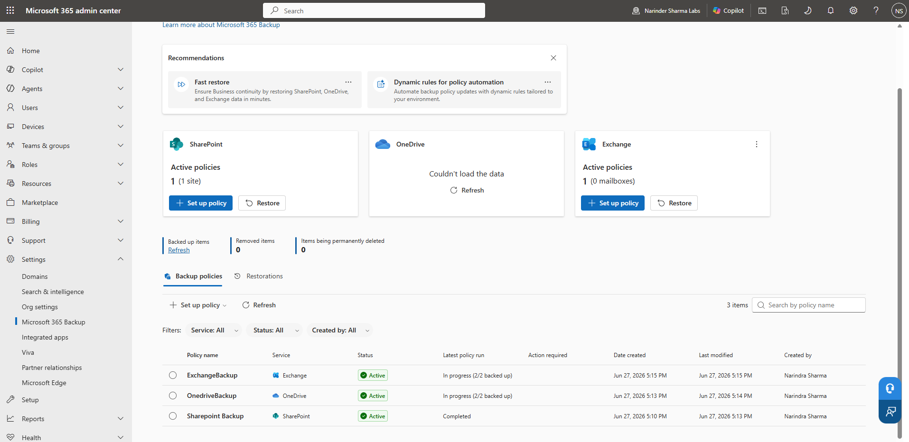

### 8. PowerShell & Microsoft Graph Administration

I used PowerShell and Microsoft Graph PowerShell for command discovery, tenant authentication, user and group administration, licensing review, CSV-based bulk provisioning, verification, and cleanup.

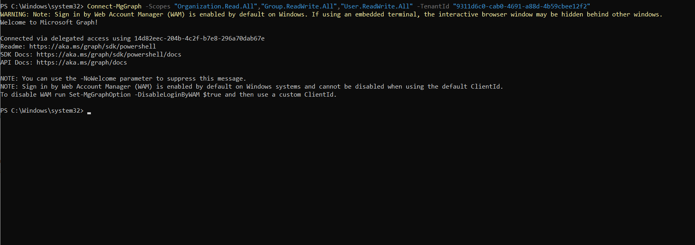

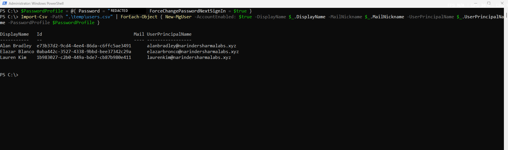

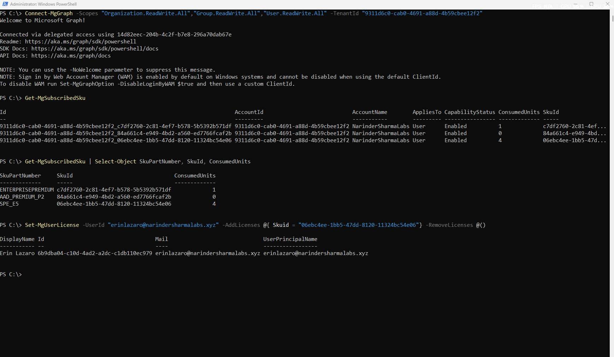

### 9. Role-Based Access & Delegated Administration

I reviewed role permissions, completed role assignment workflows, compared workload-specific permission surfaces, created administrative units for scoped delegation, and configured a PIM-style eligible assignment.

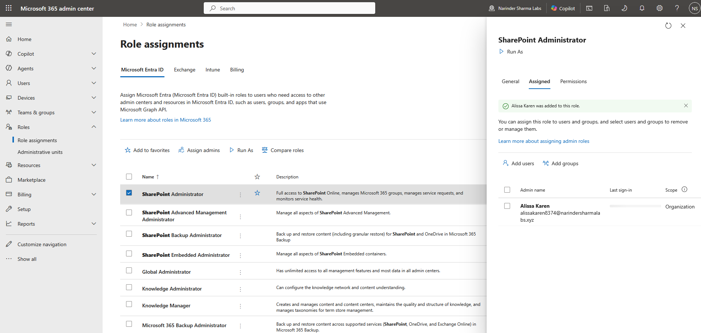

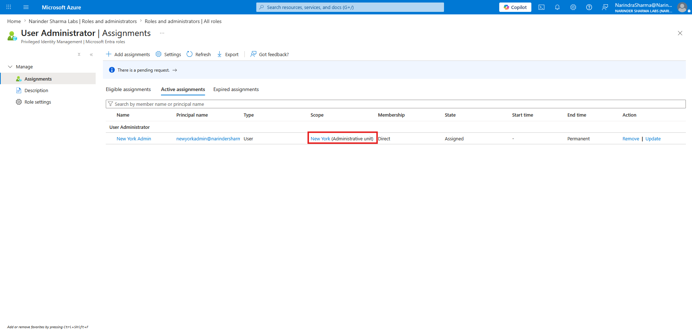

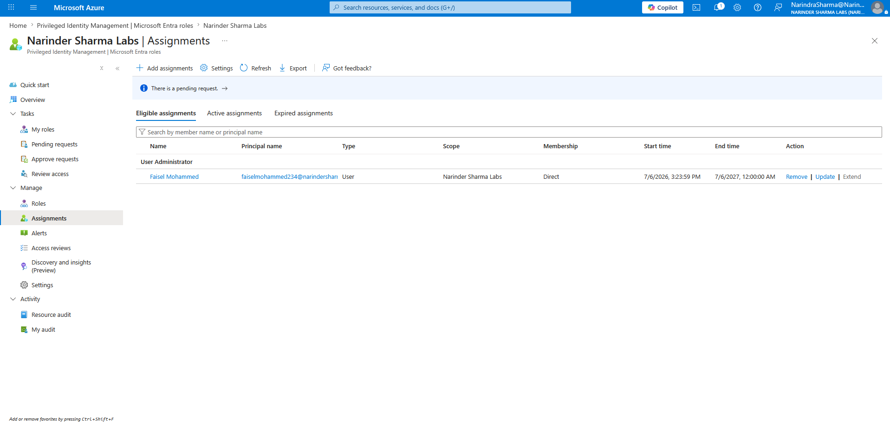

### 10. Hybrid Identity Synchronization & Health Monitoring

I prepared Active Directory objects for synchronization, corrected a directory attribute issue with IDFix, configured Microsoft Entra Connect Sync and Microsoft Entra Cloud Sync in separate lab forests, and verified synchronized identities in Microsoft Entra.

The health investigation included service-state checks, scheduler review, Microsoft endpoint connectivity testing, and Cloud Sync audit-log validation while the stale-health-data alert remained visible for follow-up.

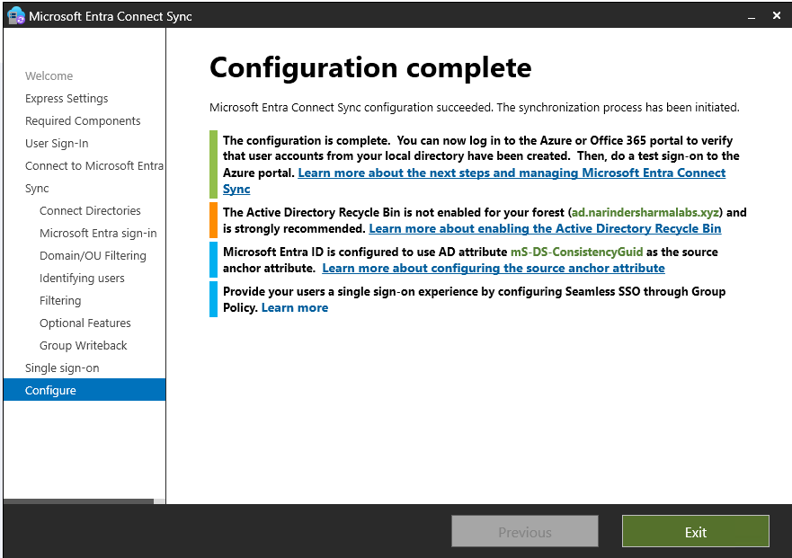

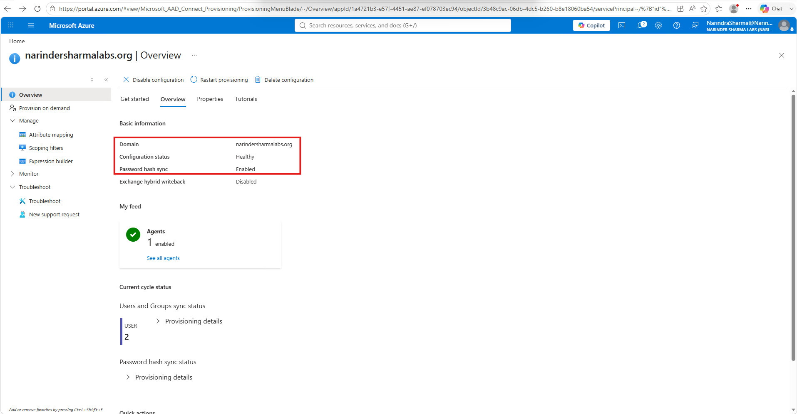

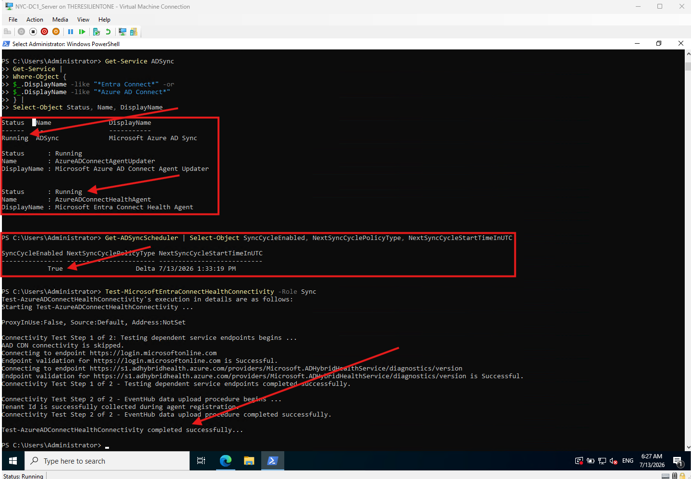

### 11. Authentication Methods, Password Reset & Password Protection

I enabled self-service password reset for the lab tenant, configured the available security-question and SMS method settings, saved password-writeback options, reviewed tenant password expiration, configured smart lockout and custom banned passwords, and set Windows Server AD password protection to Audit mode.

I also reviewed authentication registration capability, registered methods, user-level registration details, and registration and reset event reporting.

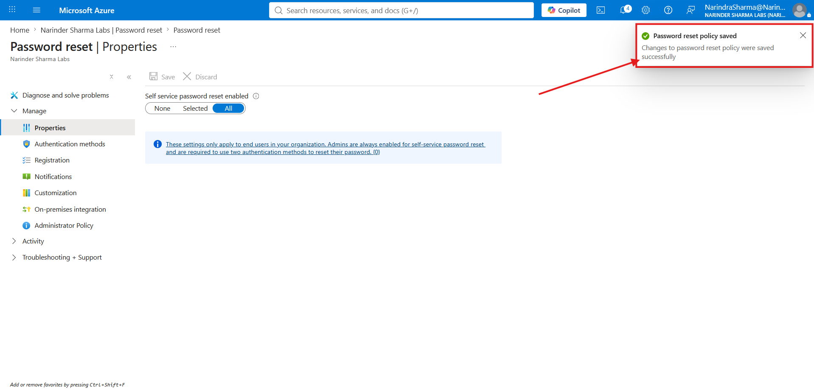

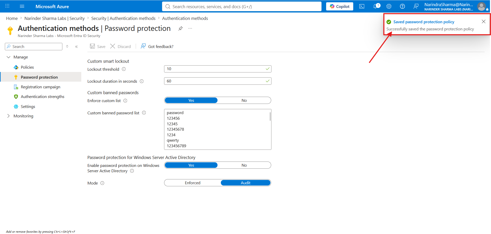

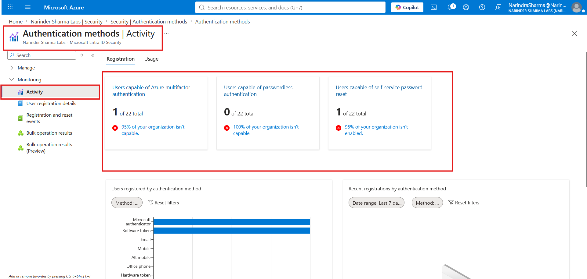

---

## Configuration Walkthrough & Evidence Map

| Workstream | Evidence Folder | Documentation |
|---|---|---|
| Tenant Foundation & Domain Readiness | [`screenshots/01-tenant-foundation`](screenshots/01-tenant-foundation) [`screenshots/02-domain-readiness`](screenshots/02-domain-readiness) | [`docs/tenant-foundation-domain-readiness.md`](docs/tenant-foundation-domain-readiness.md) |
| User Provisioning | [`screenshots/03-user-provisioning`](screenshots/03-user-provisioning) | [`docs/user-lifecycle-administration.md`](docs/user-lifecycle-administration.md) |
| External Collaboration & Contacts | [`screenshots/04-external-collaboration-contacts`](screenshots/04-external-collaboration-contacts) | [`docs/external-collaboration-contacts.md`](docs/external-collaboration-contacts.md) |
| Group Collaboration | [`screenshots/05-group-collaboration`](screenshots/05-group-collaboration) | [`docs/group-collaboration-management.md`](docs/group-collaboration-management.md) |
| Licensing & Service Access | [`screenshots/06-licensing-service-access`](screenshots/06-licensing-service-access) | [`docs/licensing-service-access-review.md`](docs/licensing-service-access-review.md) |
| Service Health & Network Insights | [`screenshots/07-service-health-network-insights`](screenshots/07-service-health-network-insights) | [`docs/service-health-backup-readiness.md`](docs/service-health-backup-readiness.md) |
| Backup Readiness | [`screenshots/08-operational-resilience-backup`](screenshots/08-operational-resilience-backup) | [`docs/service-health-backup-readiness.md`](docs/service-health-backup-readiness.md) |
| PowerShell Admin Tooling | [`screenshots/09-powershell-admin-tooling`](screenshots/09-powershell-admin-tooling) | [`docs/powershell-graph-administration.md`](docs/powershell-graph-administration.md) |
| Role-Based Access & Delegation | [`screenshots/10-role-based-access-delegation`](screenshots/10-role-based-access-delegation) | [`docs/role-based-access-delegated-administration.md`](docs/role-based-access-delegated-administration.md) |
| Hybrid Identity Synchronization | [`screenshots/11-hybrid-identity-synchronization`](screenshots/11-hybrid-identity-synchronization) | [`docs/hybrid-identity-synchronization.md`](docs/hybrid-identity-synchronization.md) |
| Authentication Methods & Password Protection | [`screenshots/12-authentication-password-protection`](screenshots/12-authentication-password-protection) | [`docs/authentication-password-protection.md`](docs/authentication-password-protection.md) |

The complete screenshot archive is available in the [`screenshots/`](screenshots/) directory. The [`evidence index`](docs/evidence-index.md) lists every published file by workstream.

---

## Core Competencies Demonstrated

* Built and validated a non-production Microsoft 365 tenant.
* Created and verified member users across Microsoft 365, Azure, and Microsoft Entra administration surfaces.
* Completed manual and CSV-based bulk user provisioning workflows.
* Created external contacts and completed Microsoft Entra B2B guest invitation workflows.
* Created and validated Microsoft 365 group properties, owners, members, and Entra-side group objects.
* Reviewed licensing and service access for account-readiness troubleshooting.
* Reviewed service health, network insights, software update visibility, Log Analytics, and Microsoft 365 Backup readiness.
* Used Microsoft Graph PowerShell for user, group, licensing, bulk provisioning, verification, and cleanup workflows.
* Administered role assignments, administrative units, scoped delegation, Purview role groups, and PIM-style eligible assignments.
* Prepared Windows Server AD DS objects for synchronization and corrected an invalid UPN attribute with IDFix.
* Configured Microsoft Entra Connect Sync and Microsoft Entra Cloud Sync in separate lab forests.
* Investigated Connect Health telemetry through service, scheduler, connectivity, and audit-log checks.
* Configured self-service password reset, authentication-method availability, password-writeback settings, smart lockout, custom banned passwords, and Windows Server AD password protection in Audit mode.
* Reviewed authentication capability, method registration, user registration, and reset-event reporting.
* Organized screenshots and Markdown documentation into an employer-facing GitHub portfolio.

---

## Intended Role Alignment

This portfolio supports entry-level and junior IT operations roles where Microsoft 365, Entra ID, user support, access administration, documentation, and troubleshooting are important:

* IT Support Technician
* Service Desk Analyst
* Help Desk Analyst
* Technical Support Analyst
* Desktop Support Technician
* Junior Systems Support Technician
* Junior Systems Administrator
* Junior Microsoft 365 Administrator
