# Microsoft 365 & Entra ID Administration Portfolio

## Project Overview

This repository documents a hands-on Microsoft 365 and Microsoft Entra ID administration environment focused on tenant readiness, identity administration, external collaboration, group-based collaboration, licensing review, service health visibility, and backup readiness.

I configured the environment in a dedicated non-production Microsoft 365 tenant using fictional users, lab-only contacts, and test objects. The repository is organized by administrative workstream rather than by training module so the evidence can be reviewed like a practical IT Support, Service Desk, Technical Support, or junior systems administration portfolio.

The objective is to show clear working knowledge of how Microsoft 365 admin center, Microsoft Entra admin center, and Azure portal workflows connect across tenant configuration, identity objects, access, licensing, collaboration, and operational visibility.

> **Data note:** Screenshots use fictional users and test objects. Temporary passwords and tenant-specific identifiers that do not add review value were redacted. No production customer data, private user data, or live business records are included.

---

## Core Technical Skills & Tools

* **Microsoft 365 Administration:** Tenant navigation, active user management, contacts, groups, licensing, service health, and service access review
* **Tenant & Domain Readiness:** Tenant overview validation, custom domain workflow review, primary domain awareness, and admin portal navigation
* **Microsoft Entra ID:** Member users, guest users, external collaboration, group objects, identity properties, and portal validation
* **Azure Portal:** Tenant and directory administration, resource group review, and Log Analytics workspace exposure
* **User Lifecycle Administration:** Manual provisioning, bulk provisioning, profile properties, account state review, license review, and cross-portal verification
* **External Collaboration:** B2B guest invitation workflow, external contacts, address book visibility concepts, and Outlook web access validation
* **Group Administration:** Microsoft 365 groups, owners, members, group properties, Entra group validation, and dynamic membership exposure
* **Operational Readiness:** Service health, network insights, software update visibility, and Microsoft 365 Backup readiness review
* **Documentation & Version Control:** Markdown documentation, screenshot evidence mapping, Git/GitHub portfolio structure, and technical portfolio publishing

---

## Functional Architecture & Evidence

### 1. Tenant Foundation & Domain Readiness

I established the tenant foundation used for the rest of the administrative work. This included tenant overview validation, administrative portal navigation, custom domain workflow review, and resource-backed service visibility through Azure.

This workstream provides the base layer for user identities, email addressing, licensing, collaboration, service health, and backup readiness.

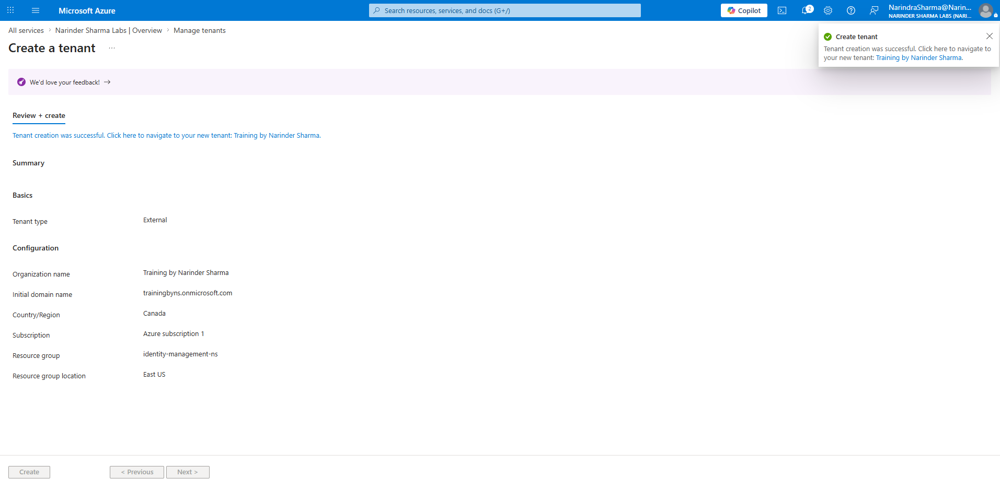

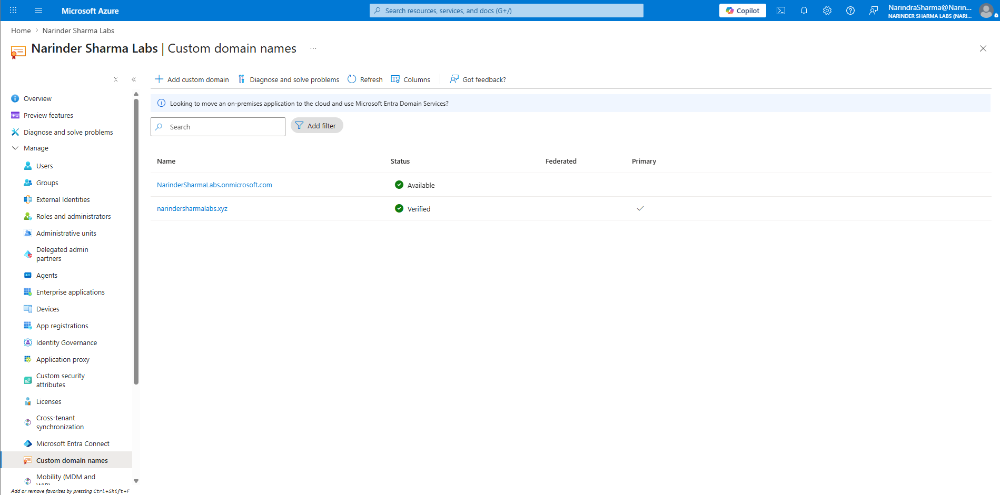

### 2. Identity & User Lifecycle Administration

I provisioned internal member users from multiple administrative surfaces and verified that user objects appeared correctly across Microsoft 365 admin center, Azure portal, and Microsoft Entra admin center.

This demonstrates the ability to separate the admin portal used for a task from the underlying identity object that exists in Microsoft Entra ID.

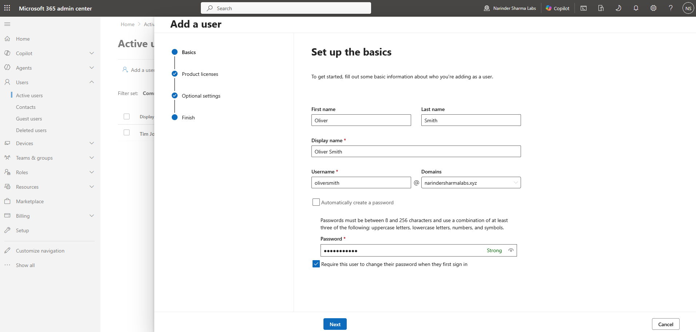

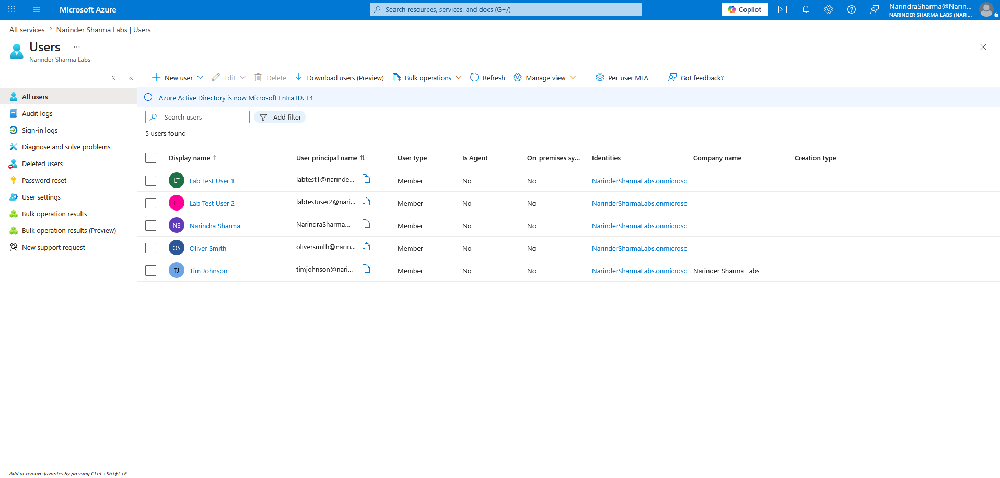

### 3. Bulk User Provisioning

I executed the bulk user creation workflow to validate CSV-based onboarding logic, generated account creation results, and reviewed post-creation verification in the active users list.

This workflow is relevant to onboarding scenarios where multiple accounts need to be staged consistently before service access and group membership are finalized.

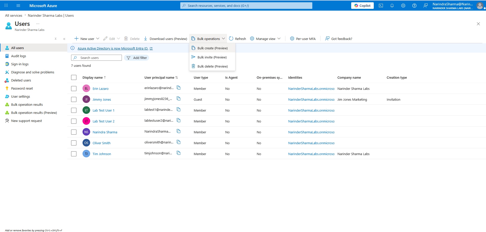

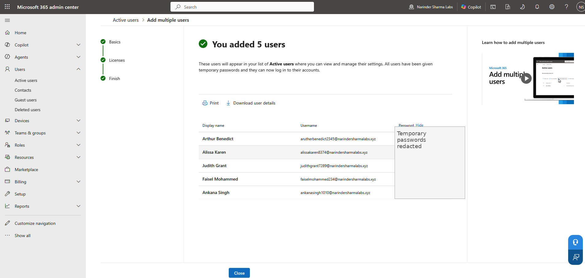

### 4. External Collaboration & Address Book Management

I configured external contacts for address book visibility and reviewed the external guest invitation workflow through Entra ID B2B collaboration.

This separates two common support cases: external contacts that support discoverability and communication, and guest users that can become tenant-visible collaboration identities after invitation.

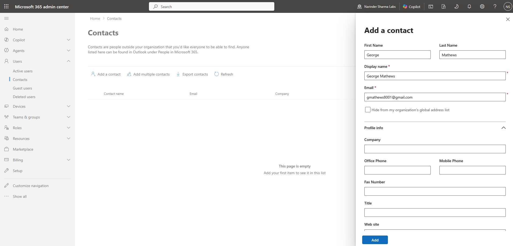

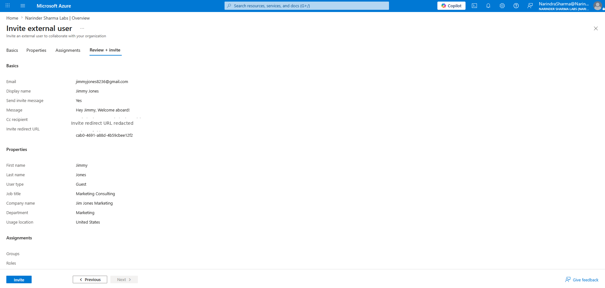

### 5. Group-Based Collaboration Management

I created and validated Microsoft 365 group configuration, including group properties, owners, members, and Entra-side object review.

This demonstrates administrative handling of collaboration containers used for membership, access, communication, and workload-backed collaboration.

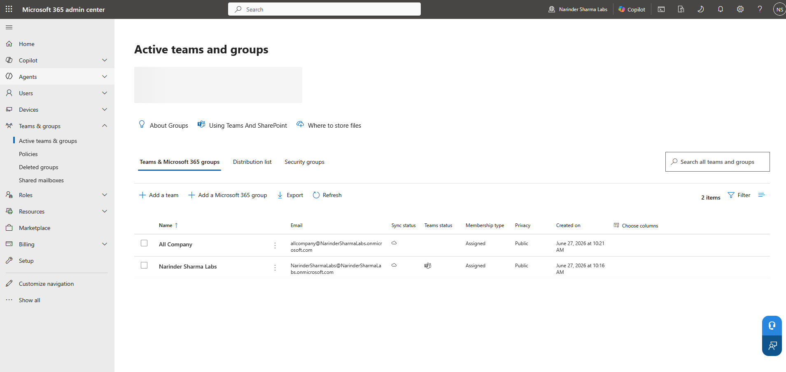

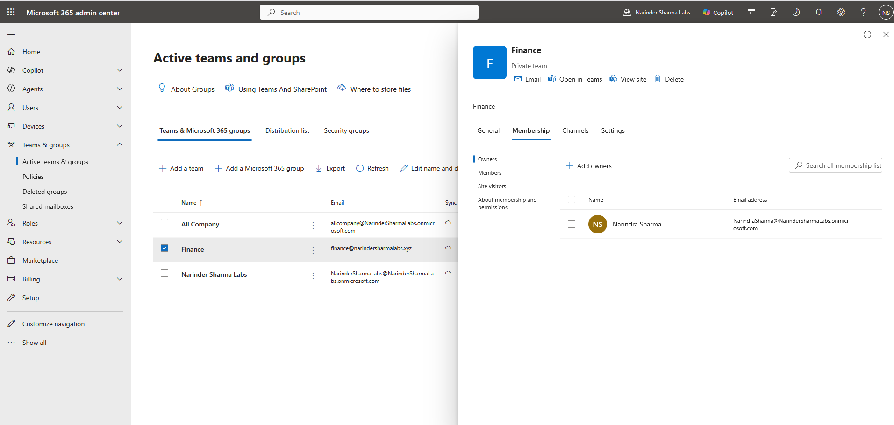

### 6. Licensing & Service Access Review

I reviewed license inventory, user assignment views, service access implications, and marketplace navigation without presenting the work as purchasing or billing administration.

The focus was administrative validation: what products are available, where assignments are reviewed, how licensing affects service access, and why license state matters during account troubleshooting.

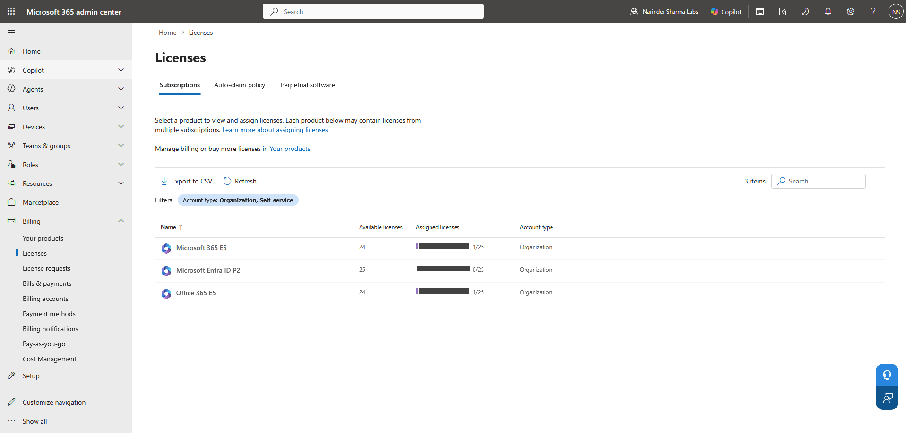

### 7. Operational Visibility & Backup Readiness

I reviewed service health, network insights, software update and Log Analytics exposure, and Microsoft 365 Backup readiness screens for Exchange, OneDrive, and SharePoint workflows.

These views support service desk triage by helping distinguish local workstation issues from tenant-level service issues, network readiness problems, service access configuration, or backup-readiness gaps.

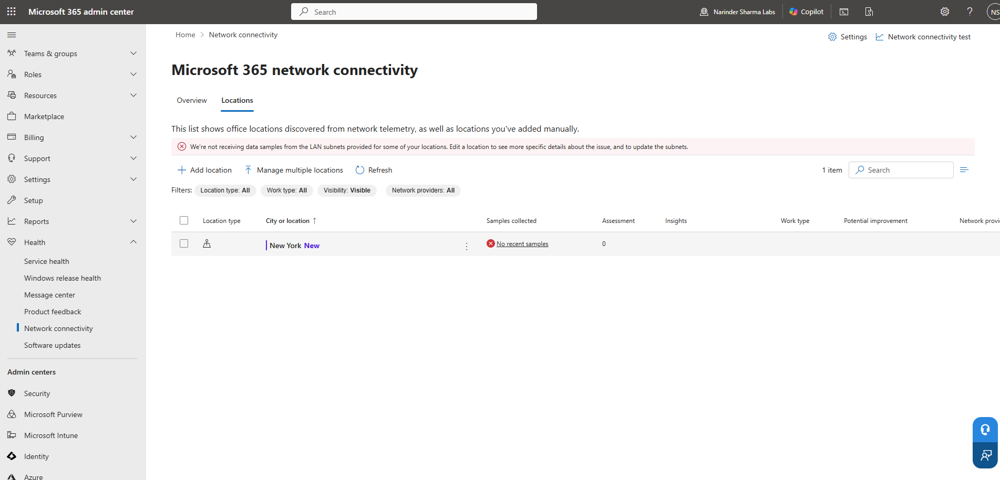

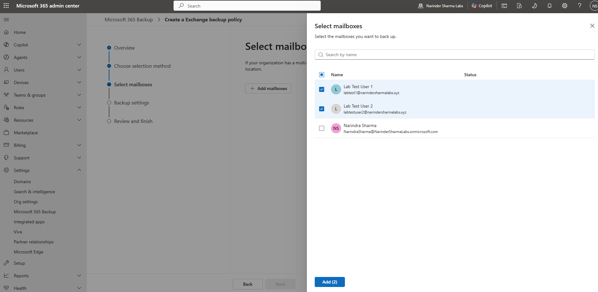

### 8. PowerShell & Microsoft Graph Administration Track

Initial PowerShell administration evidence is included as a separate track. PowerShell and Microsoft Graph administration will be expanded separately because command-driven administration is a different competency from portal-based configuration.

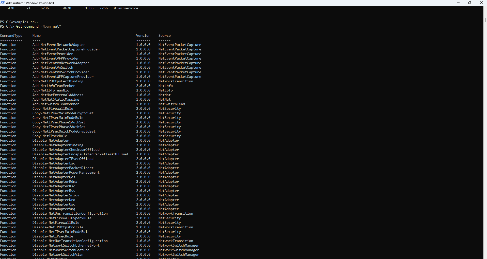

---

## Configuration Walkthrough & Evidence Map

Evidence is organized by operational workstream rather than by course section:

| Workstream | Evidence Folder | Documentation |
|---|---|---|
| Tenant Foundation | `screenshots/01-tenant-foundation` | [`docs/tenant-foundation-domain-readiness.md`](docs/tenant-foundation-domain-readiness.md) |
| Domain Readiness | `screenshots/02-domain-readiness` | [`docs/tenant-foundation-domain-readiness.md`](docs/tenant-foundation-domain-readiness.md) |
| User Provisioning | `screenshots/03-user-provisioning` | [`docs/user-lifecycle-administration.md`](docs/user-lifecycle-administration.md) |
| External Collaboration & Contacts | `screenshots/04-external-collaboration-contacts` | [`docs/external-collaboration-contacts.md`](docs/external-collaboration-contacts.md) |
| Group Collaboration | `screenshots/05-group-collaboration` | [`docs/group-collaboration-management.md`](docs/group-collaboration-management.md) |
| Licensing & Service Access | `screenshots/06-licensing-service-access` | [`docs/licensing-service-access-review.md`](docs/licensing-service-access-review.md) |
| Service Health & Network Insights | `screenshots/07-service-health-network-insights` | [`docs/service-health-backup-readiness.md`](docs/service-health-backup-readiness.md) |
| Backup Readiness | `screenshots/08-operational-resilience-backup` | [`docs/service-health-backup-readiness.md`](docs/service-health-backup-readiness.md) |
| PowerShell Admin Tooling | `screenshots/09-powershell-admin-tooling` | [`docs/powershell-graph-administration.md`](docs/powershell-graph-administration.md) |

---

## Core Competencies Demonstrated

* Built and validated a Microsoft 365 tenant administration environment using non-production test data.
* Provisioned and reviewed member users across Microsoft 365, Azure, and Entra administrative surfaces.
* Differentiated internal users, guest users, and external contacts from an administration and support perspective.
* Completed bulk provisioning workflow review with credential-sensitive output redacted.
* Configured and validated Microsoft 365 group properties, owners, and members.
* Reviewed licensing inventory and service access implications without overclaiming billing or purchase administration.
* Reviewed operational visibility areas including service health, network insights, software update exposure, and backup readiness.
* Organized technical evidence in a GitHub structure suitable for IT Support, Service Desk, Technical Support, and junior systems administration review.

---

## Project Documentation

Detailed documentation is located in the `docs` folder:

* [`Project Overview`](docs/project-overview.md)
* [`Tenant Foundation & Domain Readiness`](docs/tenant-foundation-domain-readiness.md)
* [`User Lifecycle Administration`](docs/user-lifecycle-administration.md)
* [`External Collaboration & Contacts`](docs/external-collaboration-contacts.md)
* [`Group Collaboration Management`](docs/group-collaboration-management.md)
* [`Licensing & Service Access Review`](docs/licensing-service-access-review.md)
* [`Service Health, Network Insights & Backup Readiness`](docs/service-health-backup-readiness.md)
* [`PowerShell & Microsoft Graph Administration Track`](docs/powershell-graph-administration.md)
* [`Evidence Index`](docs/evidence-index.md)
* [`Screenshot Publishing Notes`](docs/screenshot-publishing-notes.md)

---

## Repository Scope

This portfolio demonstrates hands-on administration in a controlled Microsoft 365 environment. It does not contain production customer data, production credentials, private user data, or live business records.
