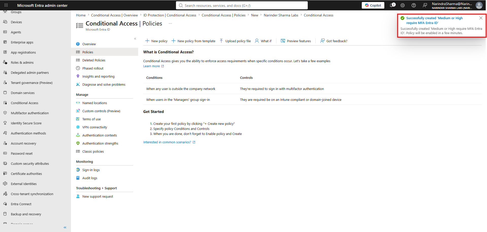
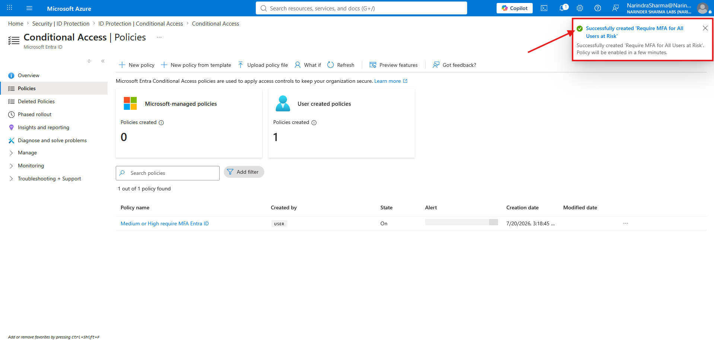

# Microsoft 365 & Entra ID Administration Portfolio

This repository documents hands-on Microsoft 365, Microsoft Entra ID, Windows Server Active Directory, and hybrid identity administration completed in dedicated non-production lab environments.

The main page provides a fast view of the workstreams and skills. Each detailed document groups related administration into technical phases and places selected evidence directly beneath the work it supports. The complete screenshot archive remains available for deeper review.

> Lab context: Screenshots use fictional users, test objects, sample guest accounts, and lab-only configuration. Fictional names, lab domains, and useful settings remain visible. Temporary passwords, secrets, and access-enabling values are not published.

---

## Portfolio Workstreams

| Workstream | Work completed | Documentation |
|---|---|---|
| Tenant & Domain Readiness | Created and validated the tenant, reviewed administrative portal visibility, and verified the custom domain. | [View workstream](docs/tenant-foundation-domain-readiness.md) |
| User Lifecycle Administration | Created users through Microsoft 365 and Microsoft Entra and completed CSV-based bulk provisioning. | [View workstream](docs/user-lifecycle-administration.md) |
| External Collaboration | Created an external contact and completed a Microsoft Entra B2B guest invitation workflow. | [View workstream](docs/external-collaboration-contacts.md) |
| Group Administration | Created Microsoft 365 groups, managed owners and members, and configured dynamic user and device membership rules. | [View workstream](docs/group-collaboration-management.md) |
| Licensing & Service Access | Reviewed license inventory, assigned Microsoft 365 E5, and confirmed the updated assignment count. | [View workstream](docs/licensing-service-access-review.md) |
| Operational Visibility & Backup | Configured network insights, worked with Log Analytics, and completed Microsoft 365 Backup policy and billing workflows. | [View workstream](docs/service-health-backup-readiness.md) |
| PowerShell & Microsoft Graph | Used Microsoft Graph PowerShell for user, group, licensing, bulk provisioning, verification, and cleanup workflows. | [View workstream](docs/powershell-graph-administration.md) |
| Role-Based Access & Delegation | Completed role assignments, administered Purview role groups, configured administrative-unit scope, and created an eligible PIM assignment. | [View workstream](docs/role-based-access-delegated-administration.md) |
| Hybrid Identity | Configured Microsoft Entra Connect Sync and Cloud Sync in separate lab forests, verified synchronized identities, and investigated Connect Health telemetry. | [View workstream](docs/hybrid-identity-synchronization.md) |
| Authentication & Password Security | Configured SSPR, authentication methods, password writeback, smart lockout, banned passwords, Windows Server AD password protection, and registration reporting. | [View workstream](docs/authentication-password-protection.md) |
| Secure Access & Conditional Access | Disabled Security Defaults, created risk-based and scoped MFA policies, configured emergency-access exclusion, and reviewed risk and sign-in reporting. | [View workstream](docs/secure-access-conditional-access.md) |

---

## Core Technical Skills & Tools

- **Microsoft 365 Administration:** Tenant navigation, active user management, contacts, groups, licensing, network insights, software-update reporting, backup policy workflows, and admin center validation.
- **Tenant & Domain Readiness:** Tenant creation, portal validation, custom-domain verification, and domain-status review.
- **Microsoft Entra ID:** Member and guest users, group objects, dynamic membership rules, administrative roles, administrative units, scoped delegation, synchronized identities, and authentication reporting.
- **Hybrid Identity:** IDFix remediation, Microsoft Entra Connect Sync, Microsoft Entra Cloud Sync, Password Hash Synchronization, OU and distinguished-name scoping, synchronized identity verification, and Connect Health troubleshooting.
- **Authentication & Password Security:** Self-service password reset, security-question controls, SMS method targeting, password-writeback settings, password expiration, smart lockout, custom banned passwords, Windows Server AD password protection in Audit mode, and registration reporting.
- **Secure Access & Conditional Access:** Security Defaults transition, user-risk and sign-in-risk conditions, MFA grant controls, emergency-access exclusions, target-resource scoping, client-app and device-platform conditions, policy state management, risky-user reporting, and sign-in log review.
- **Windows Server & Active Directory:** AD DS and DNS installation, forest promotion, OU and user preparation, directory attribute review, domain-controller validation, and synchronization scope preparation.
- **Azure Portal:** Virtual machine deployment, resource configuration, tenant and directory administration, and Log Analytics workspace deployment and cleanup.
- **Microsoft Graph PowerShell:** Module installation, delegated authentication, user retrieval and creation, group creation, subscribed SKU review, license assignment, CSV-based bulk provisioning, verification, and cleanup.
- **User Lifecycle Administration:** Manual and bulk provisioning, profile properties, account-state review, licensing options, and cross-portal verification.
- **External Collaboration:** External contacts, Microsoft Entra B2B guest invitations, invitation messaging, and redirect configuration.
- **Group Administration:** Microsoft 365 group creation, owners, members, Entra-side validation, and dynamic user and device membership rules.
- **Role-Based Access & Delegated Administration:** Microsoft Entra and Microsoft 365 role assignments, administrative units, scoped User Administrator delegation, Purview role groups, workload permission surfaces, and eligible PIM assignments.
- **Operational Readiness:** Network insights, software-update reporting, Log Analytics, Connect Health, and Microsoft 365 Backup workflows for Exchange, OneDrive, and SharePoint.
- **Documentation & Version Control:** Markdown documentation, phase-based evidence presentation, screenshot-to-workflow alignment, Git/GitHub structure, and technical writing.

---

## Selected Evidence

### Identity lifecycle and group automation

  
  

_Left: Five users were created through the bulk workflow and temporary passwords were redacted. Right: A dynamic rule targets Windows devices whose display names begin with NYC._

### Microsoft Graph and scoped administration

  
  

_Left: Microsoft Graph PowerShell created users from CSV input with the password value redacted. Right: The User Administrator assignment is limited to the New York administrative unit._

### Hybrid identity and password security

  
  

_Left: The Cloud Sync configuration is enabled with a healthy provisioning agent. Right: Smart lockout, custom banned passwords, and Audit mode settings are saved._

### Risk-based secure access

  
  

_Left: A risk-based MFA policy is enabled after configuring medium and high user and sign-in risk. Right: A second user-created MFA policy is successfully created with scoped conditions and an emergency-access exclusion._

---

## Repository Navigation

- [Project overview](docs/project-overview.md)
- [Complete evidence index](docs/evidence-index.md)
- [Screenshot archive](screenshots)
- [Screenshot publishing notes](docs/screenshot-publishing-notes.md)

## Intended Role Alignment

- IT Support Technician
- Service Desk Analyst
- Help Desk Analyst
- Technical Support Analyst
- Desktop Support Technician
- Junior Systems Support Technician
- Junior Systems Administrator
- Junior Microsoft 365 Administrator
