# Authentication Methods, Self-Service Password Reset & Password Protection

## Administrative Objective

Configure and review Microsoft Entra authentication methods, self-service password reset, password writeback, tenant password-expiration settings, smart lockout, custom banned passwords, Windows Server Active Directory password protection, and authentication reporting in a non-production tenant.

The work is documented as a support and administration workflow. A saved policy proves that the setting was configured in the portal; it does not automatically prove that an end user completed a password reset, that password writeback succeeded end to end, or that every user was registered for the method.

---

## Work Completed

- Enabled self-service password reset for all users in the lab tenant.
- Reviewed the security-question settings available for SSPR and the portal notice that security questions are retiring in March 2027.
- Configured the lab security-question policy with one authentication method required, five questions required for registration, three questions required for reset, ten predefined questions, and one custom question.
- Enabled the SMS authentication method for all users and confirmed that the policy saved.
- Enabled password writeback settings for synchronized users through Microsoft Entra Connect Sync and Microsoft Entra Cloud Sync.
- Reviewed the tenant-wide password-expiration control in Microsoft 365 admin center and saved a 60-day lab value while retaining the portal recommendation for non-expiring passwords in the evidence.
- Configured smart lockout with a threshold of 10 failed sign-ins and a 60-second lockout duration.
- Enabled a custom banned-password list using weak lab examples.
- Enabled password protection for Windows Server Active Directory in **Audit** mode.
- Reviewed authentication capability, registered-method, user-registration, and registration/reset-event reporting.

---

## Evidence Walkthrough

### 1. Enabled self-service password reset

I changed the SSPR scope from a limited selection to **All** users and saved the policy.

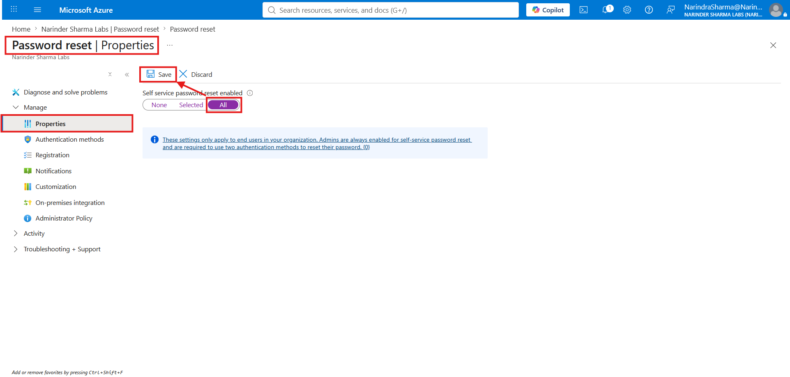

This confirms the tenant policy scope and save result. It does not show an end-user password-reset test.

### 2. Reviewed the SSPR security-question settings

The authentication-method page showed one method required for reset, five questions required for registration, and three questions required for reset. The same screen displayed Microsoft's notice that security questions are retiring in March 2027.

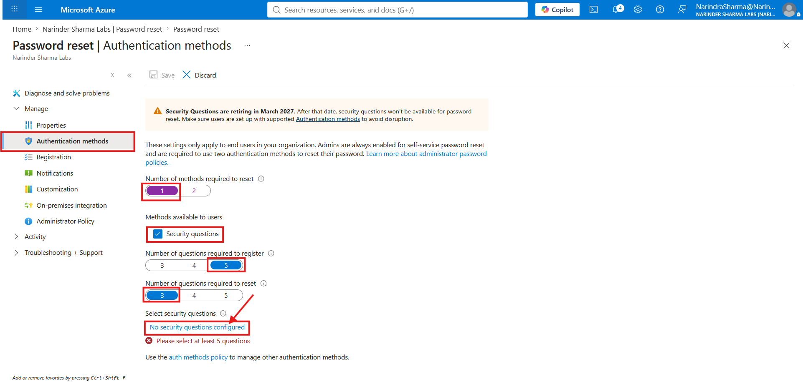

I reviewed the predefined list, added one custom question, and confirmed the combined selection.

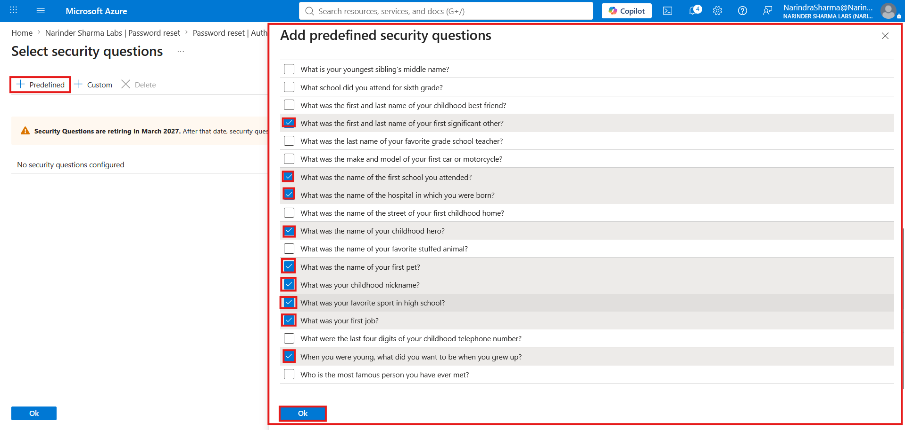

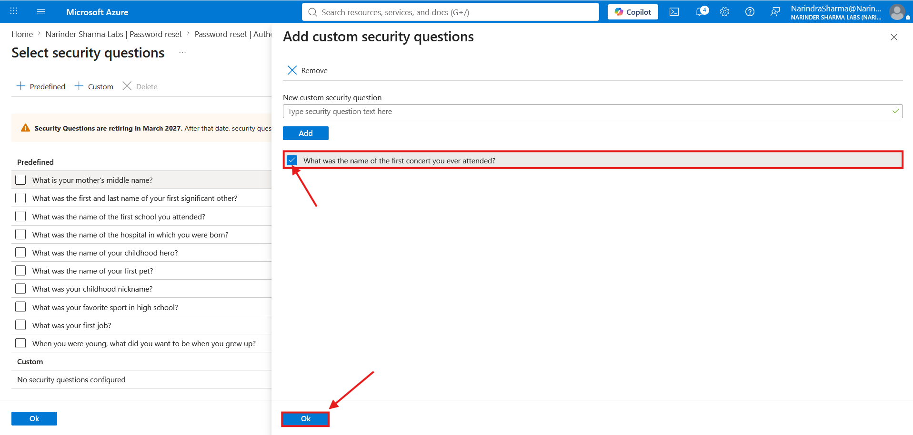

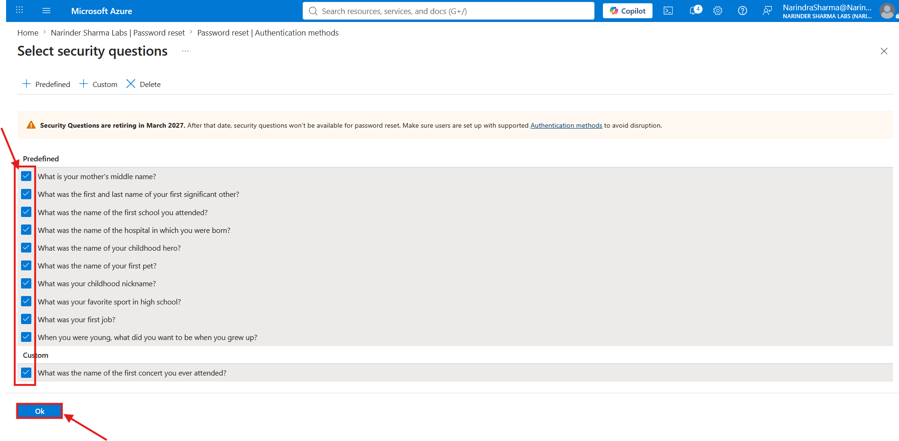

The final policy showed 11 selected questions and saved successfully.

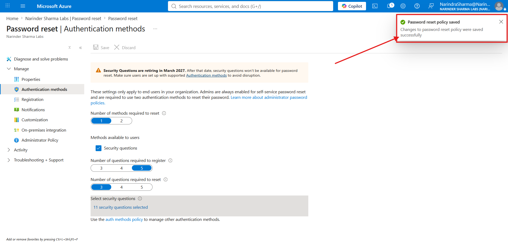

These screenshots document the legacy security-question controls exposed in the tenant. The portfolio does not present security questions as the preferred long-term authentication method.

### 3. Enabled the SMS authentication method

The authentication-method policy initially showed SMS as disabled.

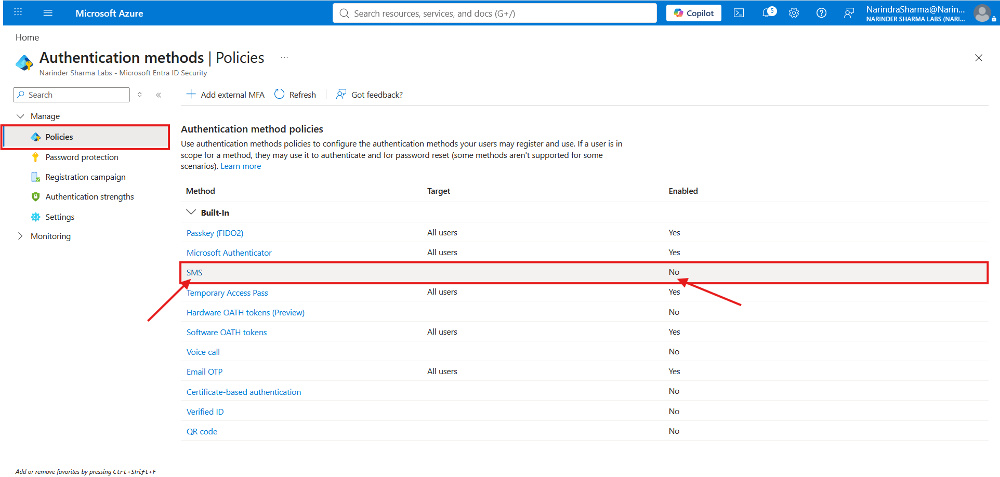

I enabled SMS and targeted the method to all users, then confirmed that the policy saved and the method list showed SMS as enabled.

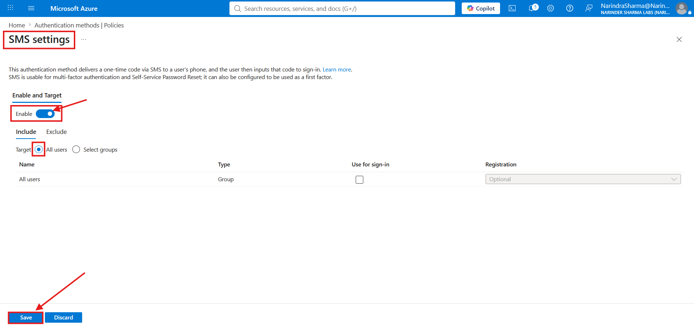

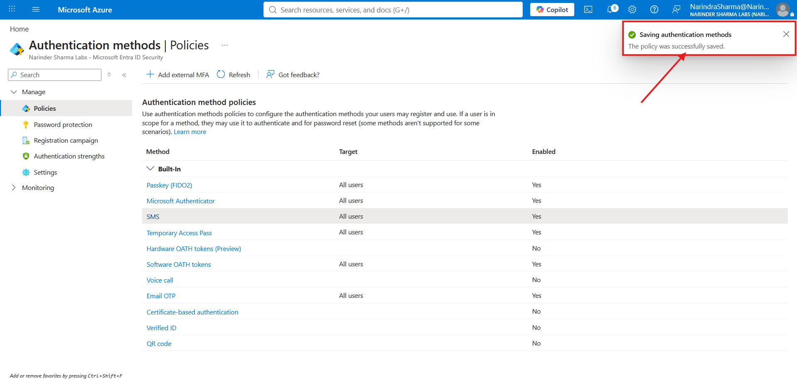

This makes SMS available as an authentication method. It does not enforce MFA by itself and does not prove that every user registered a phone number.

### 4. Configured password writeback settings

Under Password reset > On-premises integration, I enabled password writeback for synchronized users and selected the Cloud Sync writeback option.

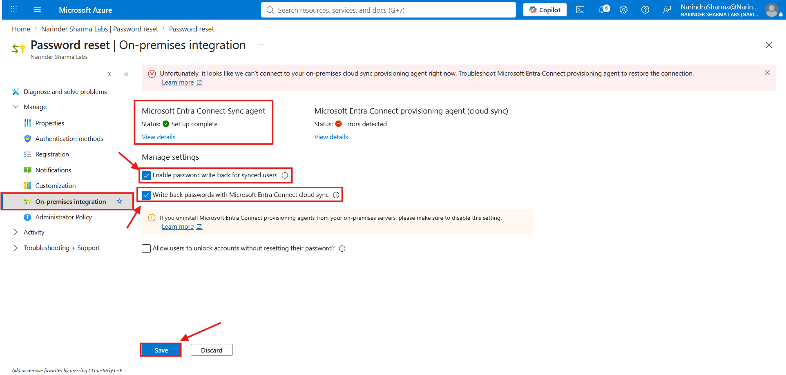

The settings saved successfully. The same screen still showed an error for the Cloud Sync provisioning agent, so the evidence is presented as a tenant-setting change rather than a successful end-to-end Cloud Sync password-writeback test.

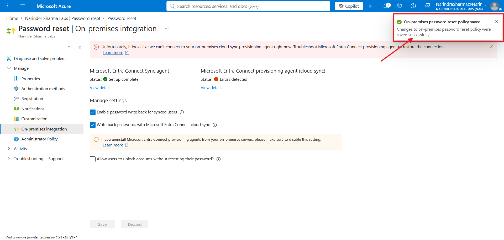

The option to unlock an account without resetting the password remained disabled.

### 5. Reviewed tenant password-expiration settings

In Microsoft 365 admin center, I set the tenant-wide password-expiration value to 60 days and saved it.

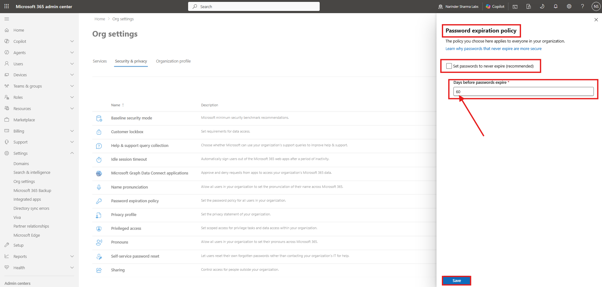

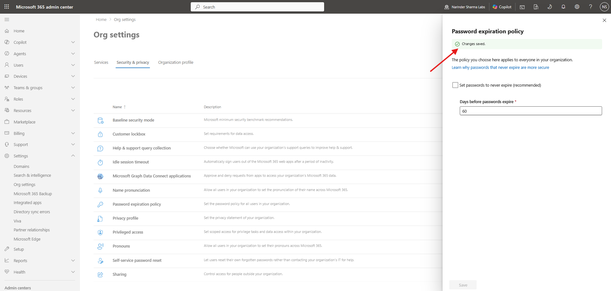

The portal also displayed its recommendation to set passwords to never expire. The 60-day value is documented as the lab configuration selected during this workflow, not as a general security recommendation.

### 6. Configured Microsoft Entra password protection

The smart-lockout settings were reviewed at:

- **Lockout threshold:** 10 failed sign-ins
- **Lockout duration:** 60 seconds

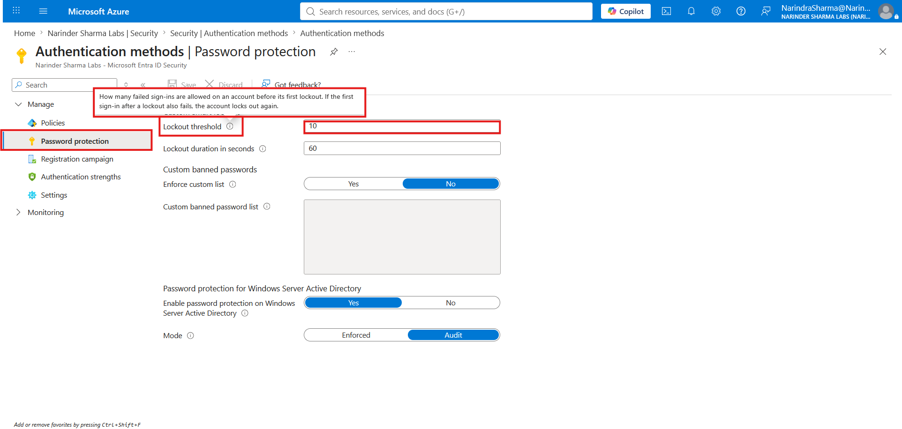

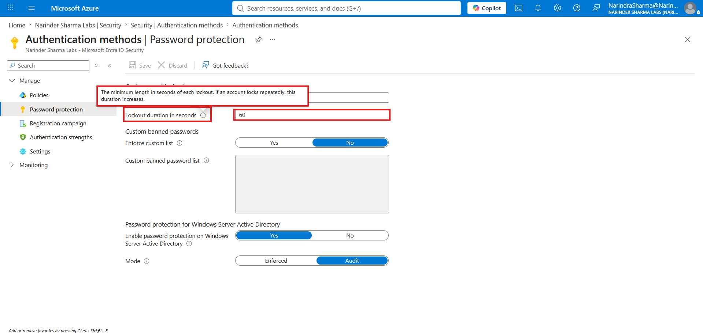

I enabled the custom banned-password list and entered weak lab examples so the control could be reviewed visibly.

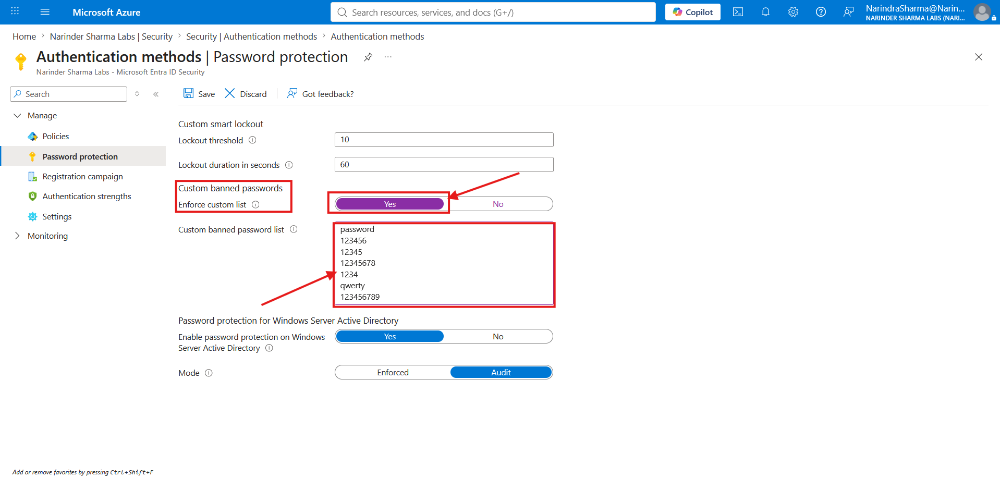

Password protection for Windows Server Active Directory was enabled in **Audit** mode. In this mode, attempts involving banned passwords are logged rather than blocked.

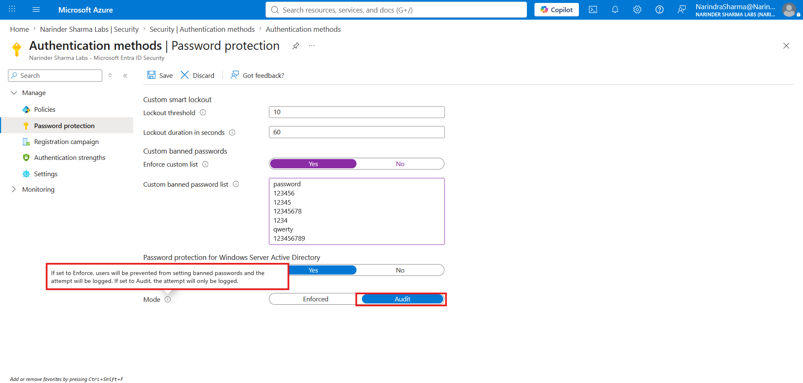

The completed configuration saved successfully.

The evidence does not present the on-premises policy as Enforced mode and does not include a password-change test against the banned-password list.

### 7. Reviewed authentication monitoring and reporting

The authentication activity page showed the tenant's current registration state:

- 1 of 22 users capable of multifactor authentication
- 0 of 22 users capable of passwordless authentication
- 1 of 22 users capable of self-service password reset

The registered-method chart showed two method registrations across Microsoft Authenticator and software token.

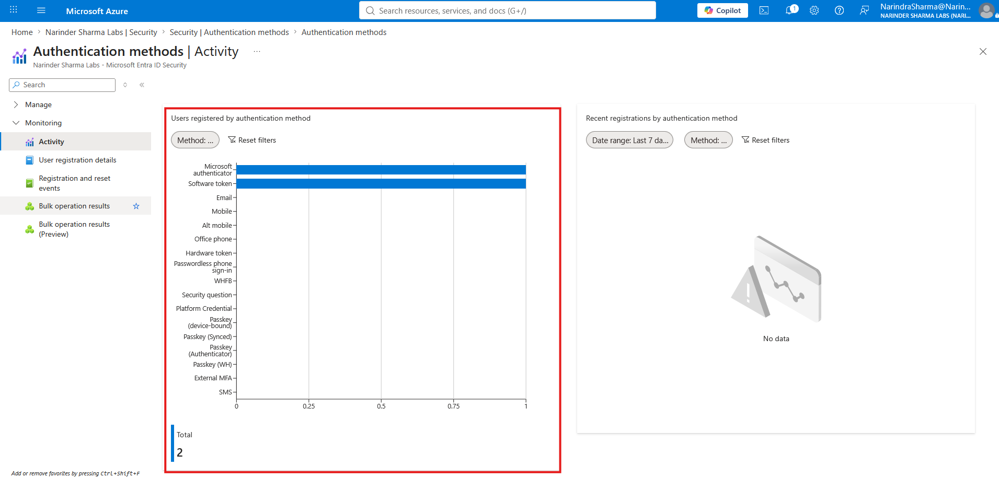

The user-registration detail view provided user-level MFA, passwordless, SSPR, default-method, and registered-method columns.

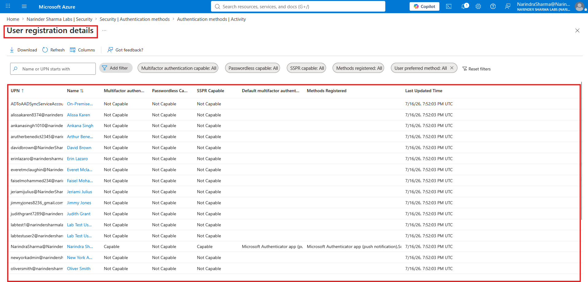

The registration and reset event page returned no results for the selected period.

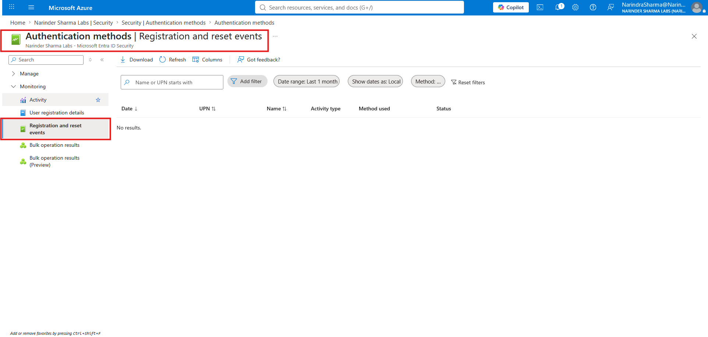

The reporting evidence records the tenant's current state. It does not claim that the policy changes automatically made all users MFA-capable, passwordless-capable, or SSPR-capable.

---

## Evidence Boundaries

| Configuration or observation | What the evidence proves | What it does not prove |
|---|---|---|
| SSPR set to All and saved | The tenant SSPR scope was configured and saved | A user completed a self-service reset |
| SMS enabled for All users | SMS was made available as an authentication method | MFA was enforced or every user registered SMS |
| Password writeback settings saved | The portal accepted the writeback configuration | A password was written back successfully to either forest |
| Cloud Sync agent showed an error | The agent was not healthy on the captured screen | That Connect Sync was also failing |
| Password expiration set to 60 days | The tenant-wide lab value was saved | That 60-day expiration is Microsoft's preferred practice |
| Windows Server AD protection set to Audit | Banned-password attempts would be logged for review | Banned passwords were actively blocked |
| Registration reports reviewed | The current user capability and method-registration state was visible | All tenant users were registered or protected by the methods |

---

## Skills Demonstrated

- Microsoft Entra self-service password reset administration
- Authentication-method policy configuration
- SMS authentication-method targeting
- Security-question policy review and retirement-awareness documentation
- Microsoft Entra Connect password-writeback setting review
- Microsoft 365 tenant password-expiration control review
- Microsoft Entra smart-lockout configuration
- Custom banned-password policy configuration
- Windows Server Active Directory password-protection Audit mode
- Authentication-method registration and capability reporting
- Evidence-based documentation that separates saved settings from end-to-end validation

---

## Support Relevance

Authentication issues often arrive as ordinary support requests: a user cannot reset a password, a registered method is missing, an account locks repeatedly, a synchronized password does not appear on-premises, or a policy is enabled but the user is not registered.

This work shows where those conditions are reviewed across Microsoft Entra authentication-method policies, SSPR settings, Microsoft 365 password controls, on-premises integration, password protection, and registration reporting.

The scope is appropriate for IT support and junior administration work. It demonstrates how to check policy scope, save results, method availability, agent health, reporting state, and the difference between a configured control and a verified user outcome.

---

## Outcome

The non-production tenant was configured with SSPR for all users, a reviewed legacy security-question policy, SMS method availability, password-writeback settings, a 60-day lab password-expiration value, smart-lockout controls, a custom banned-password list, and Windows Server AD password protection in Audit mode.

Authentication reports were reviewed to confirm the tenant's actual registration state. The documentation does not claim an end-user password reset, successful password writeback event, enforced on-premises banned-password blocking, or full-user registration where the screenshots do not show those results.
