# Defender for Office 365 Email & Collaboration Protection

## Administrative Objective

Configure and review Microsoft Defender for Office 365 protection policies used to reduce phishing, spam, malicious attachments, unsafe links, and email-based threats in a non-production Microsoft 365 tenant.

This workstream also documents threat-investigation and remediation surfaces used to review suspicious messages, submit remediation actions, monitor threat campaigns, and review restricted-entity workflows.

## Work Completed

- Reviewed Threat policies, preset Standard protection, and Configuration analyzer.
- Reviewed the default anti-phishing policy and created a custom anti-phishing policy with targeted users/groups/domains, impersonation controls, actions, and safety indicators.
- Reviewed connection-filter and inbound anti-spam settings and created a custom anti-spam policy.
- Reviewed anti-malware protection settings.
- Created Safe Attachments and Safe Links policies and validated successful policy creation.
- Reviewed Tenant Allow/Block Lists across domains/addresses, spoofed senders, URLs, files, IP addresses, and Teams senders.
- Created a custom quarantine policy with recipient-access and notification settings.
- Used Explorer to review email/threat details, create a remediation action, review the action, and confirm submission.
- Reviewed Threat Tracker views and the Restricted entities / unblock-user workflow.

## Phase 1 — Baseline Protection and Configuration Review

I started from the Defender Threat policies surface, reviewed preset Standard protection, and used Configuration analyzer to compare existing protection settings with Microsoft-recommended policy configurations.

  <a href="../screenshots/15-defender-email-collaboration-protection/01-threat-policies-overview.png">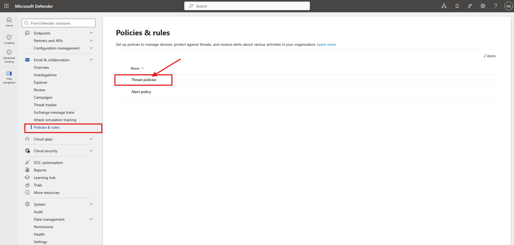</a>
  <a href="../screenshots/15-defender-email-collaboration-protection/10-configuration-analyzer.png">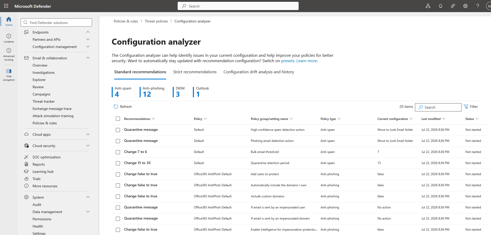</a>

_Left: Threat policies is the central policy-management surface for email and collaboration protection. Right: Configuration analyzer was reviewed for policy recommendations and configuration differences._

  <a href="../screenshots/15-defender-email-collaboration-protection/03-standard-protection-exchange-online-protection.png">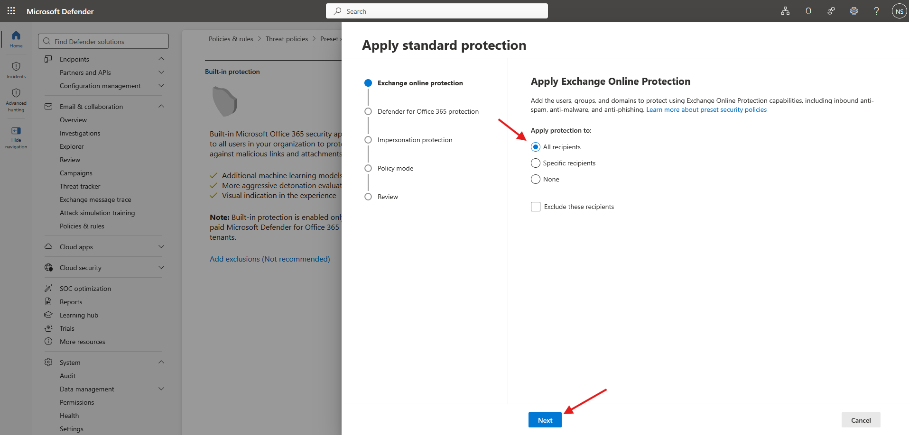</a>
  <a href="../screenshots/15-defender-email-collaboration-protection/09-standard-protection-review.png">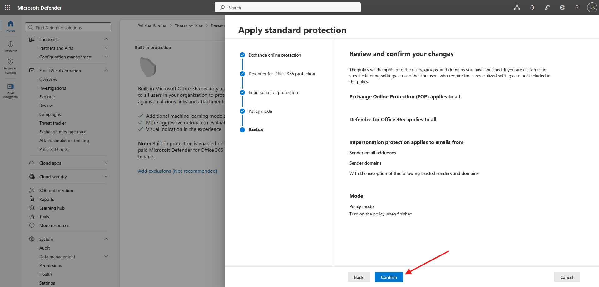</a>

_Left: Standard protection exposes Exchange Online Protection settings within the preset policy workflow. Right: The Standard protection configuration was reviewed before confirmation._

## Phase 2 — Anti-Phishing, Anti-Spam, and Anti-Malware

I reviewed the default anti-phishing configuration, then created a custom anti-phishing policy. The workflow covered policy naming, user/group/domain targeting, phishing threshold and impersonation protection, message actions, safety indicators, review, and successful creation.

I also reviewed inbound anti-spam and connection-filter surfaces, created a custom anti-spam policy with target scope and bulk/spam properties, and reviewed the default anti-malware protection settings.

  <a href="../screenshots/15-defender-email-collaboration-protection/12-anti-phishing-default-policy-details.png">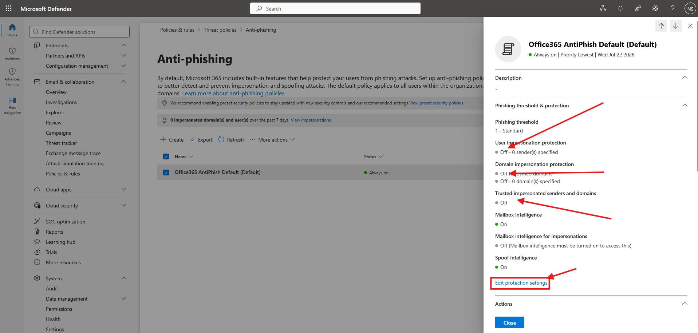</a>
  <a href="../screenshots/15-defender-email-collaboration-protection/22-anti-phishing-policy-created.png">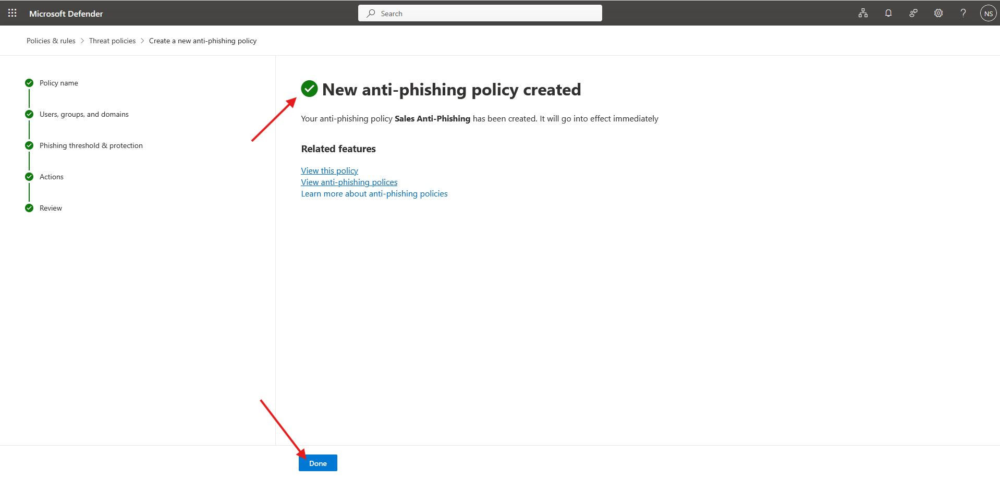</a>

_Left: The default anti-phishing policy was reviewed to understand existing protection behavior. Right: Defender confirmed creation of the custom anti-phishing policy after the targeting and action settings were completed._

  <a href="../screenshots/15-defender-email-collaboration-protection/29-anti-spam-bulk-threshold-and-properties.png">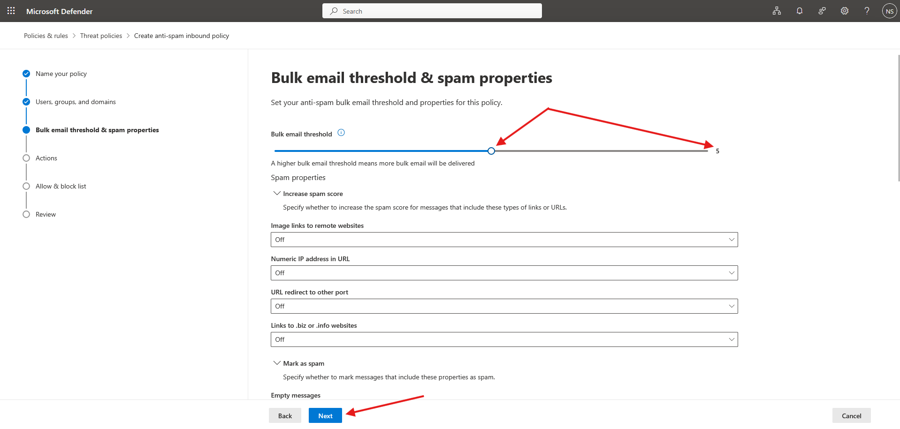</a>
  <a href="../screenshots/15-defender-email-collaboration-protection/30-anti-spam-policy-created.png">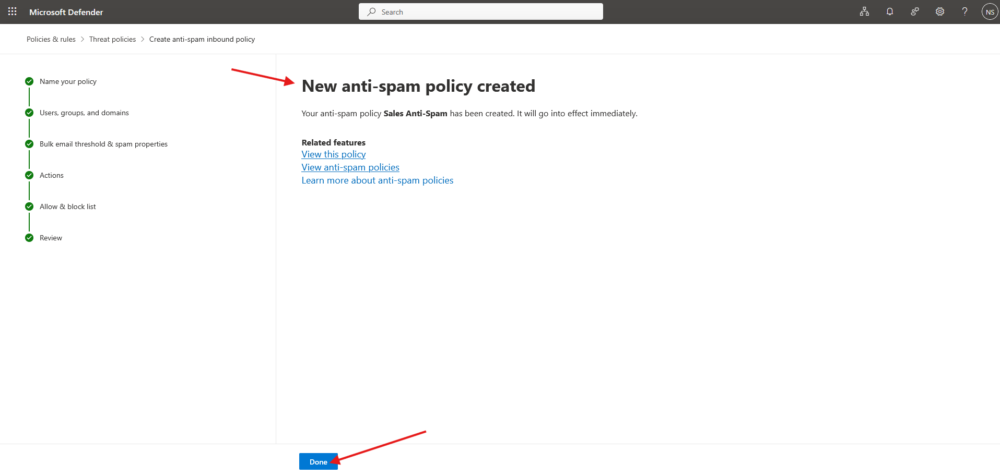</a>

_Left: The anti-spam workflow included bulk-email threshold and spam-property settings. Right: Defender confirmed successful creation of the custom anti-spam policy._

  <a href="../screenshots/15-defender-email-collaboration-protection/32-anti-malware-default-protection-settings.png">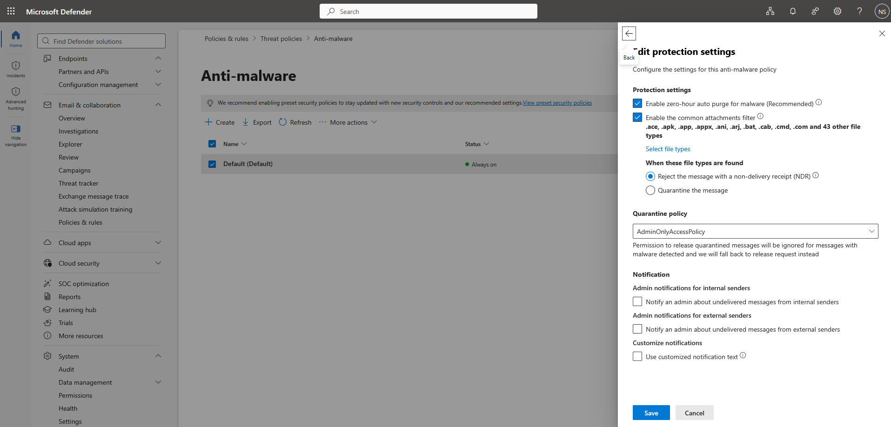</a>

_The default anti-malware protection settings were reviewed, including attachment filtering and notification-related controls._

## Phase 3 — Safe Attachments and Safe Links

I created a Safe Attachments policy, selected its target scope, configured attachment-handling behavior, reviewed the policy, and confirmed successful creation. I then created a Safe Links policy covering URL/click protection, rewrite exceptions, supported Microsoft 365 workloads, click-protection options, notifications, review, and successful creation.

  <a href="../screenshots/15-defender-email-collaboration-protection/36-safe-attachments-settings.png">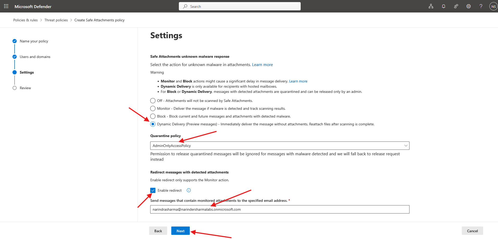</a>
  <a href="../screenshots/15-defender-email-collaboration-protection/38-safe-attachments-policy-created.png">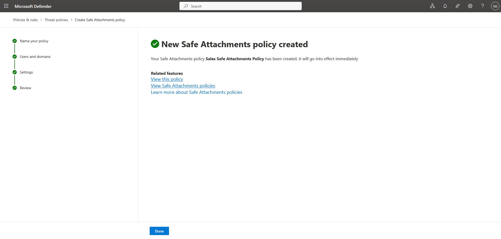</a>

_Left: Safe Attachments handling settings were configured for the custom policy. Right: Defender confirmed successful Safe Attachments policy creation._

  <a href="../screenshots/15-defender-email-collaboration-protection/42-safe-links-url-click-settings.png">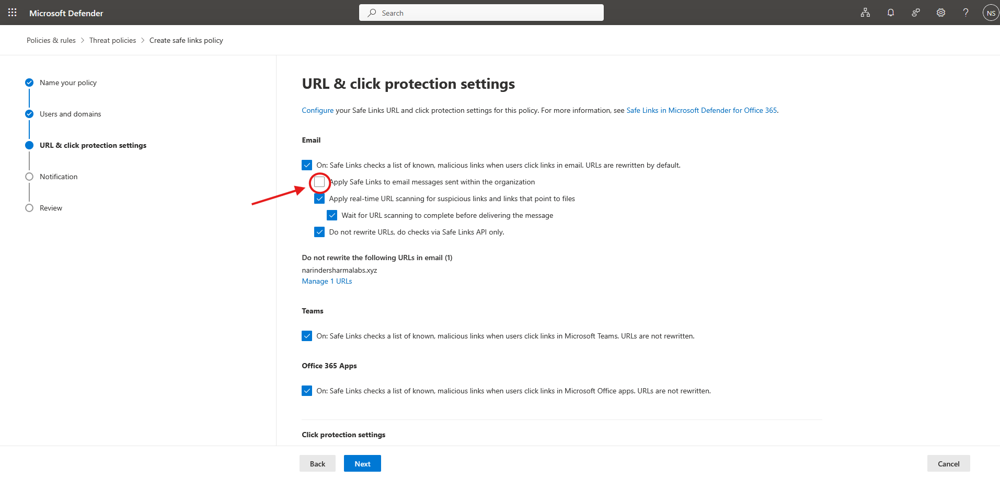</a>
  <a href="../screenshots/15-defender-email-collaboration-protection/46-safe-links-policy-created.png">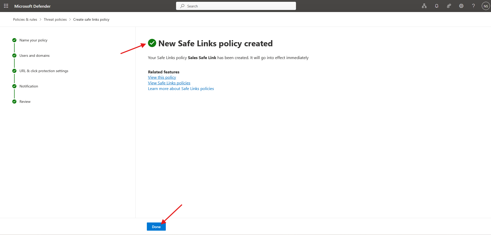</a>

_Left: URL and click-protection settings were configured in the Safe Links workflow. Right: Defender confirmed successful creation of the Safe Links policy._

## Phase 4 — Tenant Allow/Block Lists and Quarantine Policy

I reviewed the Tenant Allow/Block Lists across the available entity types to understand where administrators manage allowed and blocked senders, URLs, files, IP addresses, and Teams senders. I then created a custom quarantine policy, configured recipient message access and quarantine notifications, reviewed the policy, and confirmed successful creation.

  <a href="../screenshots/15-defender-email-collaboration-protection/47-tenant-allow-block-domains-addresses.png">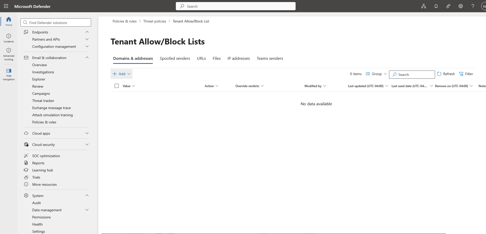</a>
  <a href="../screenshots/15-defender-email-collaboration-protection/52-tenant-allow-block-teams-senders.png">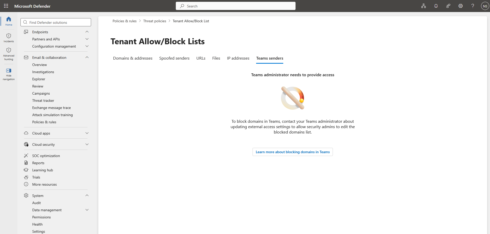</a>

_Left: The Tenant Allow/Block Lists were reviewed from the domains and addresses view. Right: The Teams senders tab was also reviewed as part of the cross-workload allow/block surface._

  <a href="../screenshots/15-defender-email-collaboration-protection/54-custom-quarantine-recipient-message-access.png">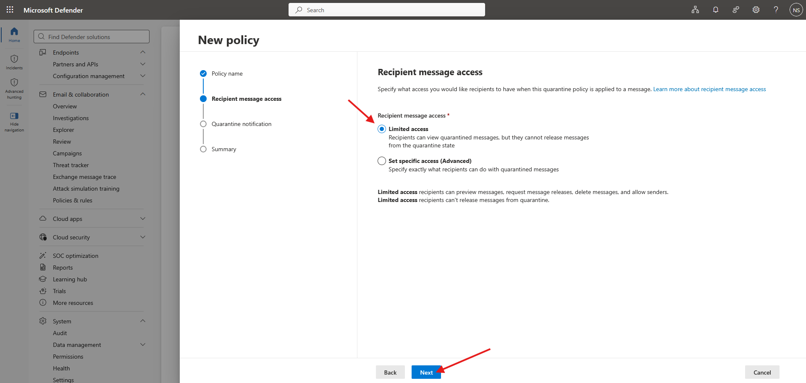</a>
  <a href="../screenshots/15-defender-email-collaboration-protection/57-custom-quarantine-policy-created.png">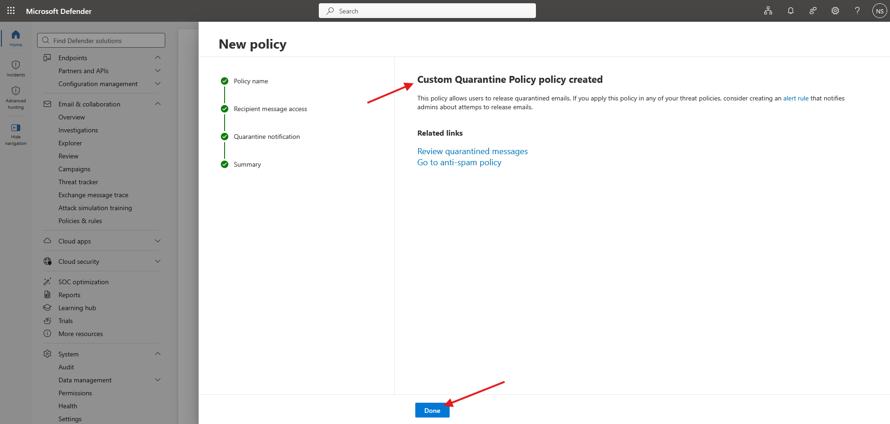</a>

_Left: Recipient message-access behavior was configured for the custom quarantine policy. Right: Defender confirmed successful creation of the custom quarantine policy._

## Phase 5 — Threat Explorer and Remediation

I used Explorer to review the email-threat activity view and inspect message/threat details. From the action workflow, I created a new remediation action, reviewed the remediation details and severity, submitted it, and confirmed that Defender recorded the action as submitted.

  <a href="../screenshots/15-defender-email-collaboration-protection/58-threat-explorer-overview.png">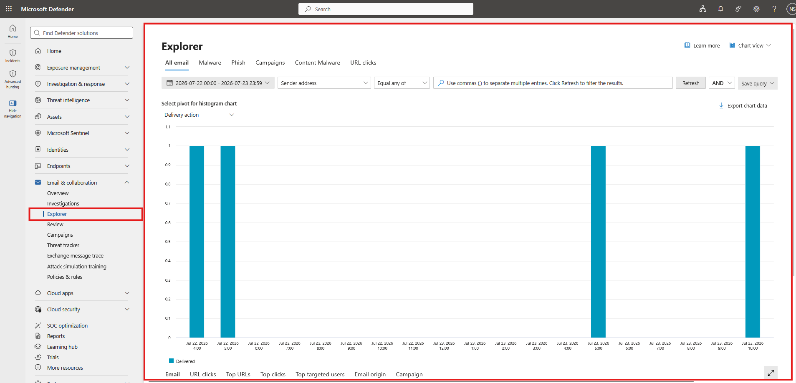</a>
  <a href="../screenshots/15-defender-email-collaboration-protection/61-threat-explorer-authentication-details.png">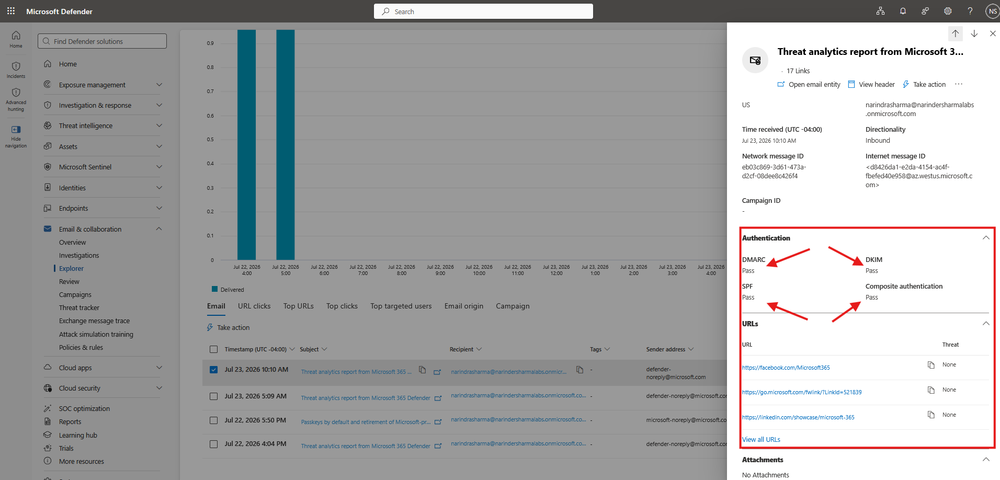</a>

_Left: Explorer was reviewed as the email-threat investigation surface. Right: Message-level details were inspected to review authentication and related threat information._

  <a href="../screenshots/15-defender-email-collaboration-protection/62-threat-explorer-create-remediation.png">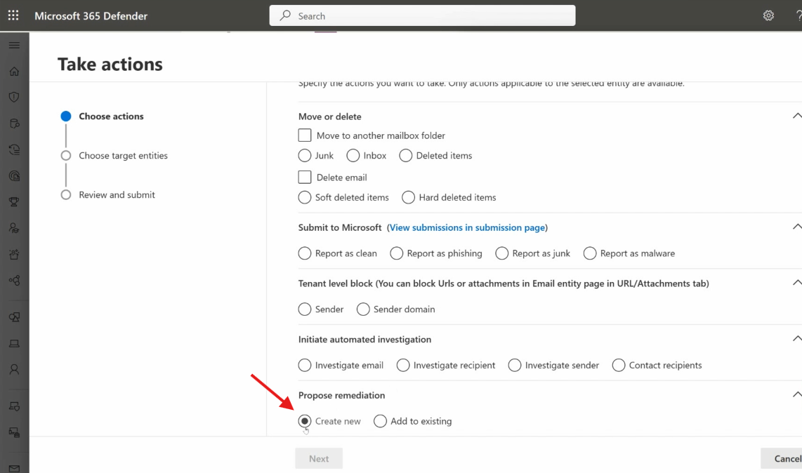</a>
  <a href="../screenshots/15-defender-email-collaboration-protection/64-threat-explorer-remediation-submitted.png">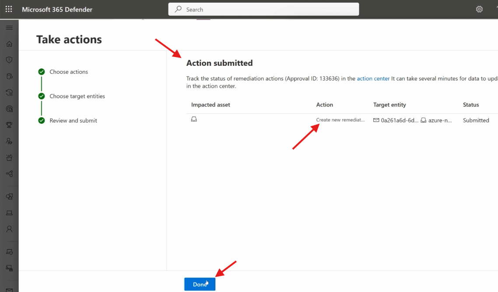</a>

_Left: A new remediation action was selected from the Explorer action workflow. Right: Defender confirmed that the remediation action was submitted._

## Phase 6 — Threat Tracker and Restricted Entities

Threat Tracker was reviewed across saved queries, tracked queries, and trending campaigns to understand how Defender for Office 365 organizes threat-campaign monitoring. I also reviewed the Restricted entities surface and Microsoft guidance for removing a user from the restricted-entities list when an account requires administrative recovery.

  <a href="../screenshots/15-defender-email-collaboration-protection/65-threat-tracker-saved-queries.png">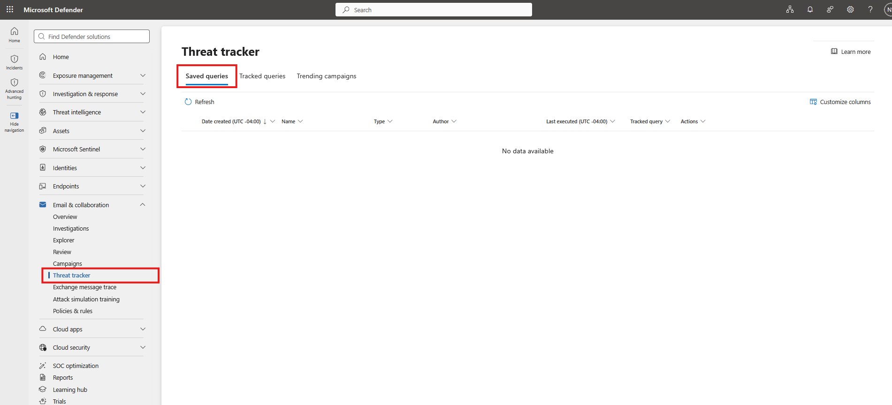</a>
  <a href="../screenshots/15-defender-email-collaboration-protection/67-threat-tracker-trending-campaigns.png">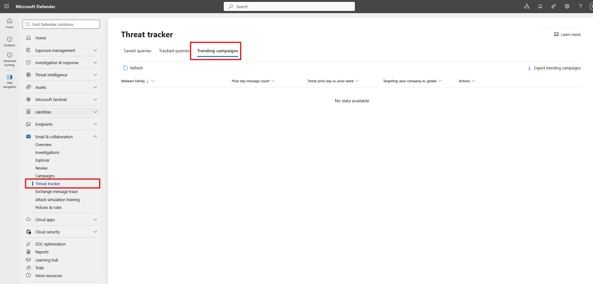</a>

_Left: Threat Tracker saved-query monitoring was reviewed. Right: Trending campaigns were reviewed as another threat-tracking view._

  <a href="../screenshots/15-defender-email-collaboration-protection/68-restricted-entities-review.png">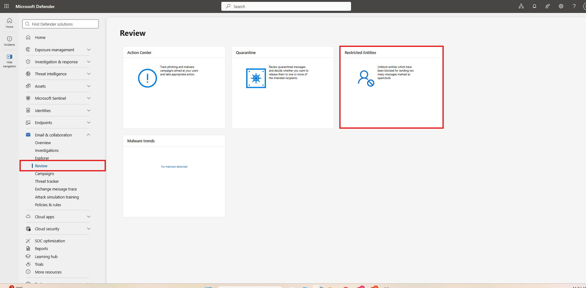</a>
  <a href="../screenshots/15-defender-email-collaboration-protection/69-restricted-entities-removal-reference.png">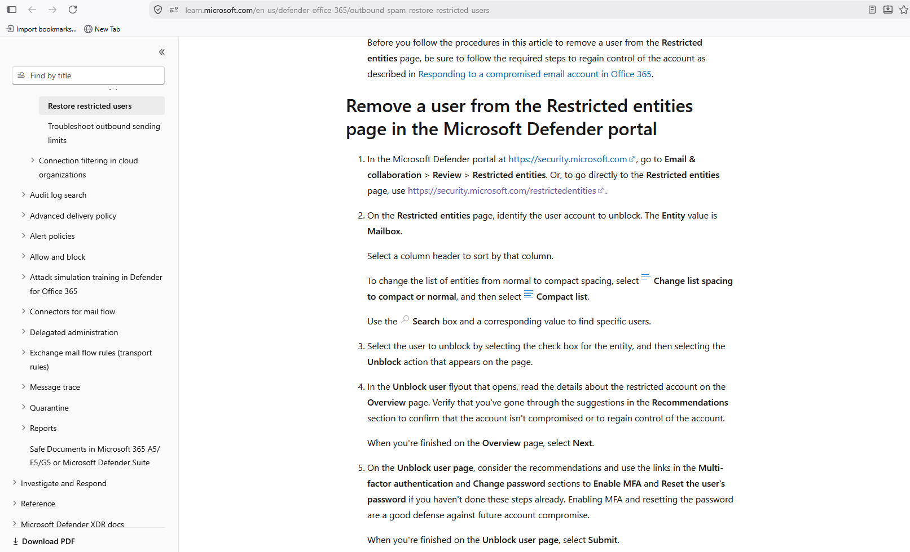</a>

_Left: The Defender restricted-entities entry point was reviewed. Right: Microsoft guidance was reviewed for the administrative user-removal workflow._

## Skills Demonstrated

- Microsoft Defender for Office 365 policy administration
- Preset security policies and Configuration analyzer
- Anti-phishing and impersonation protection
- Anti-spam and connection-filter policy administration
- Anti-malware policy review
- Safe Attachments and Safe Links
- Tenant Allow/Block Lists
- Quarantine policy administration
- Threat Explorer investigation and remediation actions
- Threat Tracker and restricted-entity workflow awareness
- Email and collaboration security documentation

## Support Relevance

Email-security requests commonly reach service desk and Microsoft 365 support teams as suspected phishing, blocked or quarantined messages, unsafe links, account restrictions, or requests that require escalation to messaging/security administrators. This workstream documents both the protection-policy side and the investigation/remediation surfaces that support those workflows.

## Outcome

Defender for Office 365 protection was documented across anti-phishing, anti-spam, anti-malware, Safe Attachments, Safe Links, allow/block, and quarantine workflows. Custom protection policies were created successfully, and Explorer was used to submit a remediation action, extending the portfolio from identity security into practical email and collaboration threat protection.
