# Defender Security Posture, Reports & Alerts

## Administrative Objective

Review Microsoft Defender security posture, incident and reporting surfaces, and threat analytics in a non-production Microsoft 365 tenant, then configure threat-analytics email notifications for ongoing security awareness.

This workstream focuses on how Microsoft Defender XDR surfaces security recommendations, incident investigation entry points, unified reporting, and threat intelligence for operational review.

## Work Completed

- Reviewed Microsoft Secure Score, category posture, recommended actions, recommendation details, implementation guidance, history, and comparative metrics.
- Inspected the Microsoft Defender XDR incidents queue and Microsoft incident-response reference material used to understand investigation flow and multi-stage incident visualization.
- Reviewed Defender reporting surfaces for security posture, protection, detection, investigation and response, email and collaboration, identities, and devices.
- Reviewed Threat analytics for current, high-impact, and high-exposure threat information.
- Configured a Threat analytics email-notification rule, including rule conditions, recipients, review, creation, and enabled-state validation.

## Phase 1 — Secure Score and Recommended Actions

I reviewed Microsoft Secure Score to understand the tenant security-posture view, then moved into recommended actions to inspect the available improvement items and their supporting details. I opened a specific recommendation to review its description, implementation guidance, history, and metrics/trends rather than treating the score as a single percentage.

  <a href="../screenshots/14-defender-security-reports-alerts/01-secure-score-overview.png">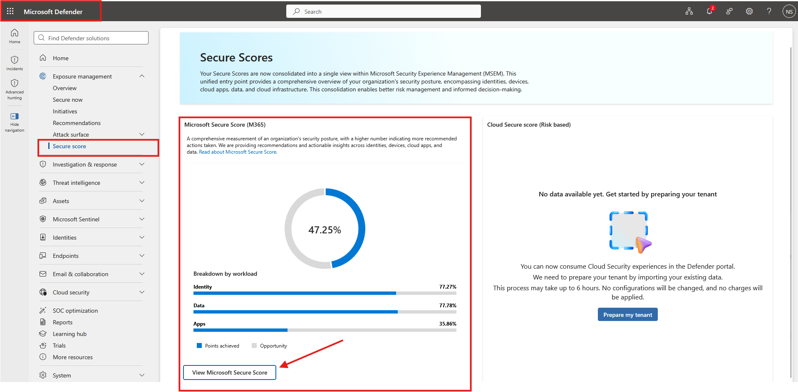</a>
  <a href="../screenshots/14-defender-security-reports-alerts/04-secure-score-recommended-actions-list.png">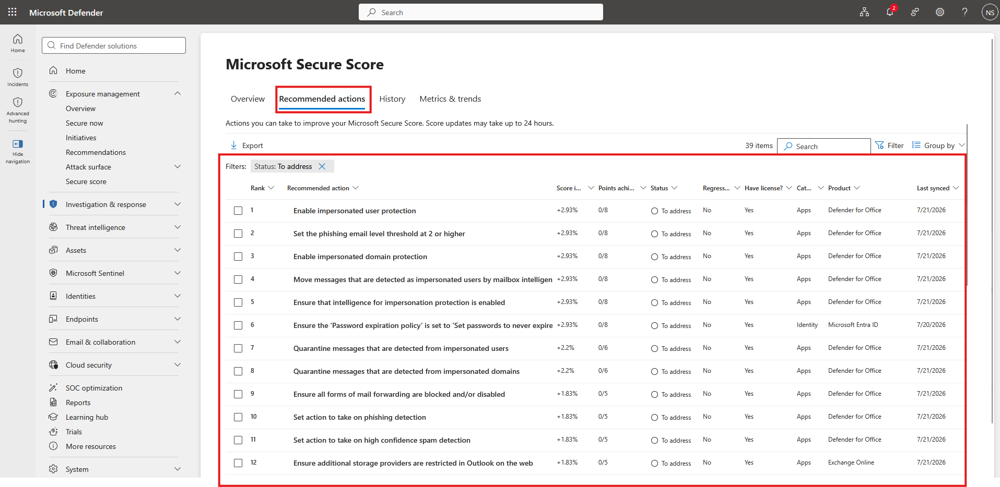</a>

_Left: Secure Score provides the tenant security-posture overview. Right: The recommended-actions view exposes the improvement work behind the score._

  <a href="../screenshots/14-defender-security-reports-alerts/05-secure-score-recommendation-details.png">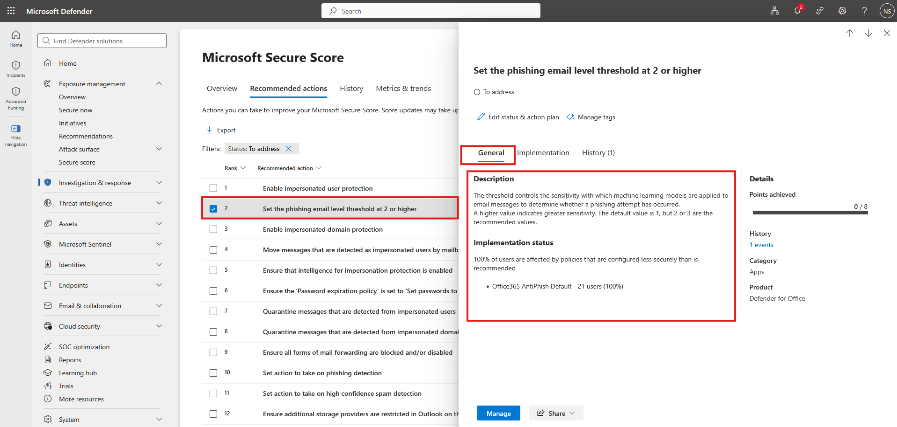</a>
  <a href="../screenshots/14-defender-security-reports-alerts/09-secure-score-metrics-and-trends.png">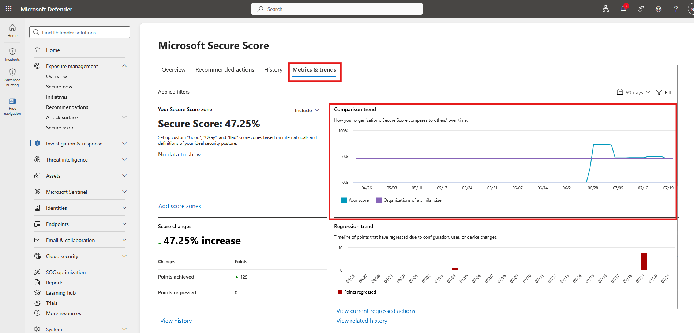</a>

_Left: A specific recommendation was opened for detailed review. Right: Metrics and trends were reviewed to understand score history and comparison data._

## Phase 2 — Incidents and Investigation Surfaces

I reviewed the Defender XDR incidents queue to understand where security incidents are triaged and investigated. The lab queue did not provide a tenant incident to work through, so I also reviewed Microsoft incident-response reference examples to understand the investigation layout and how a multi-stage incident can be visualized across related entities.

  <a href="../screenshots/14-defender-security-reports-alerts/10-defender-xdr-incidents-queue.png">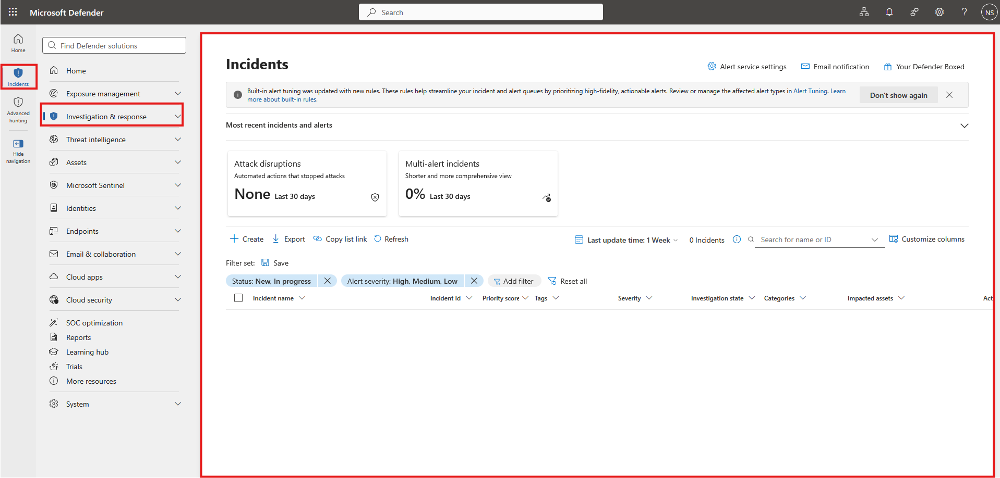</a>
  <a href="../screenshots/14-defender-security-reports-alerts/14-multistage-incident-attack-graph-reference.png">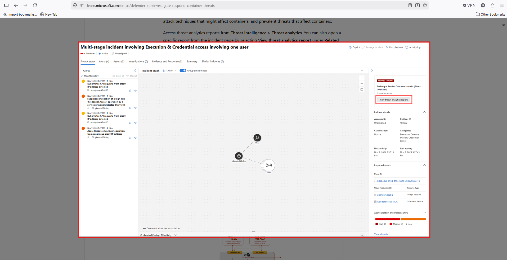</a>

_Left: The Defender XDR incidents queue was reviewed as the incident-triage entry point. Right: Microsoft reference material was used to study the relationship view for a multi-stage incident._

## Phase 3 — Unified Security Reporting

I reviewed the Defender reporting experience across posture, protection, detection, investigation and response, email and collaboration, identities, and devices. This provided a cross-workload view of where an administrator can monitor security signals and investigate operational trends.

  <a href="../screenshots/14-defender-security-reports-alerts/16-security-posture-report.png">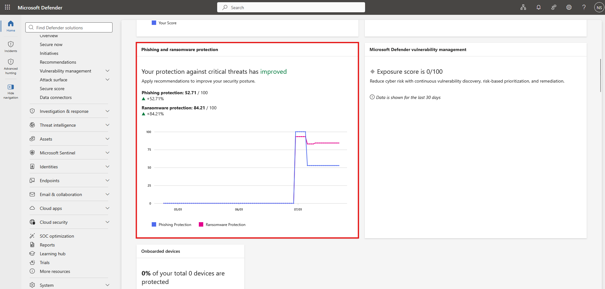</a>
  <a href="../screenshots/14-defender-security-reports-alerts/17-protection-report.png">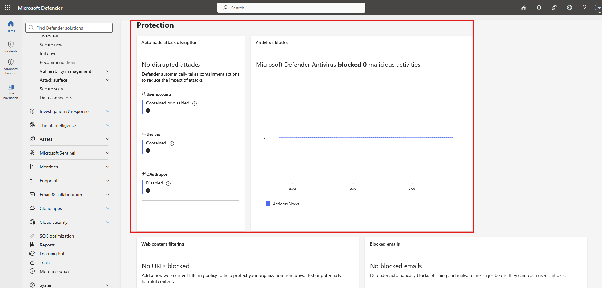</a>

_Left: Security-posture reporting summarizes exposure and improvement information. Right: Protection reporting summarizes blocked or detected activity across Defender workloads._

  <a href="../screenshots/14-defender-security-reports-alerts/19-investigation-and-response-report.png">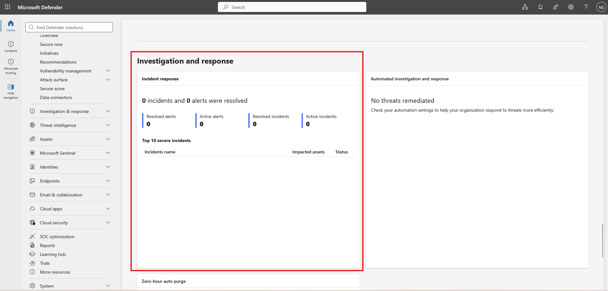</a>
  <a href="../screenshots/14-defender-security-reports-alerts/22-email-and-collaboration-reports.png">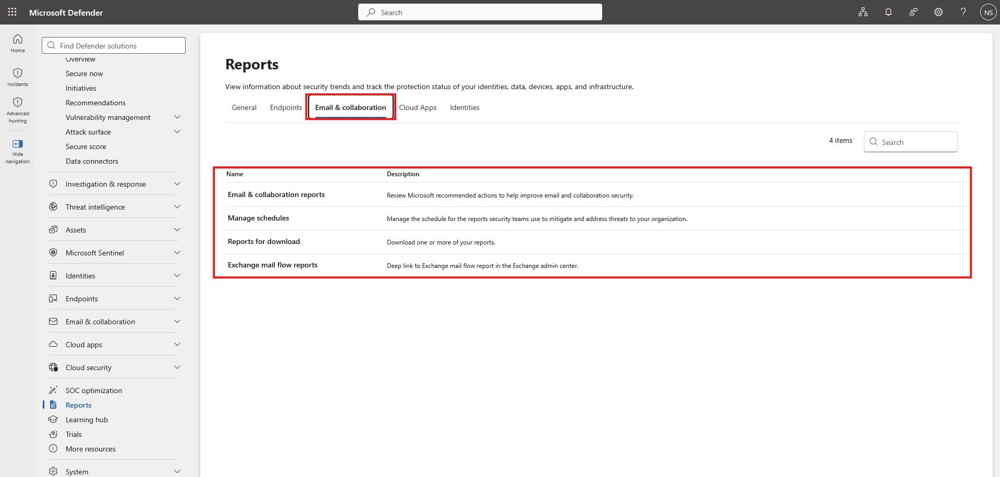</a>

_Left: Investigation and response reporting was reviewed for incident and alert activity. Right: Email and collaboration report categories were reviewed for messaging-security visibility._

## Phase 4 — Threat Analytics Review

Threat analytics was reviewed to identify how Microsoft surfaces current threat intelligence, including latest threats, high-impact threats, and exposure-focused information. I also located the Defender XDR email-notification settings used to turn threat intelligence into an administrator notification workflow.

  <a href="../screenshots/14-defender-security-reports-alerts/24-threat-analytics-overview.png">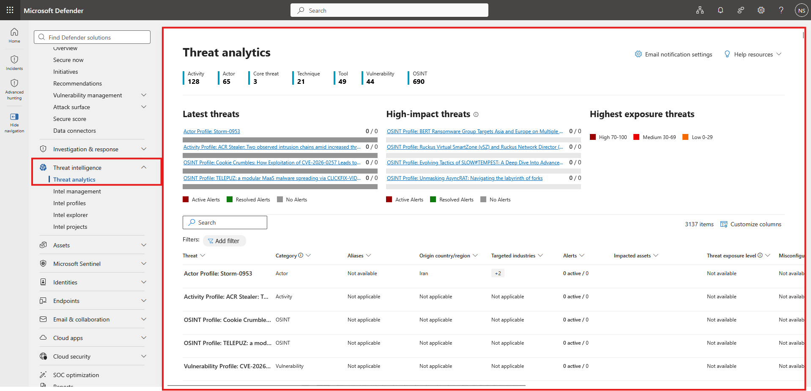</a>
  <a href="../screenshots/14-defender-security-reports-alerts/26-threat-analytics-email-notification-rules.png">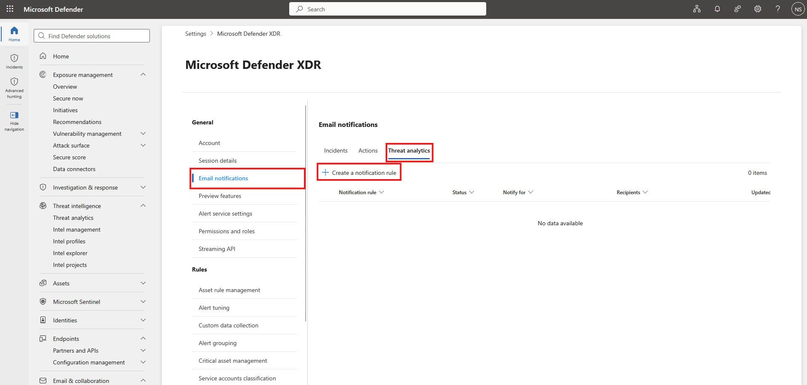</a>

_Left: Threat analytics organizes current and high-impact threat intelligence. Right: Defender XDR email-notification settings expose the Threat analytics notification-rule surface._

## Phase 5 — Threat Analytics Email Notification Rule

I created a Threat analytics notification rule, configured its notification conditions and recipient, reviewed the completed configuration, and confirmed that the rule was created and visible in the notification-rule list.

  <a href="../screenshots/14-defender-security-reports-alerts/27-threat-analytics-notification-rule-name.png">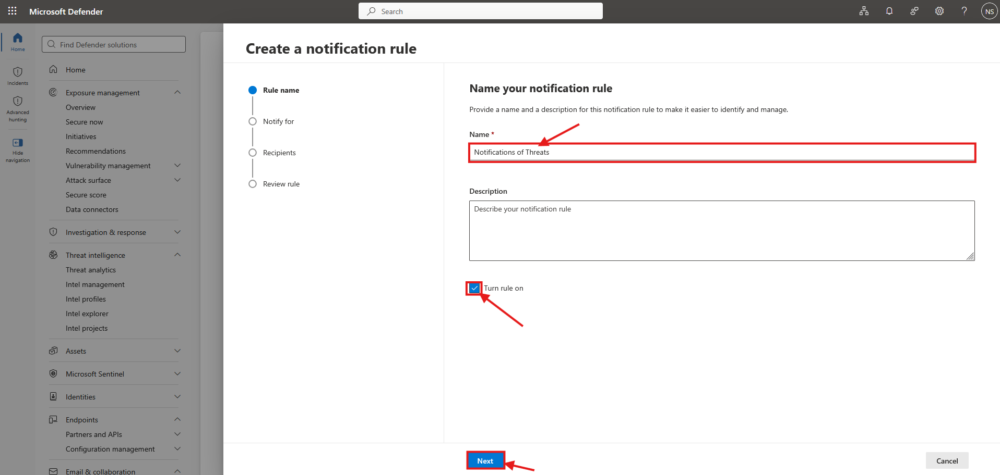</a>
  <a href="../screenshots/14-defender-security-reports-alerts/30-threat-analytics-notification-review.png">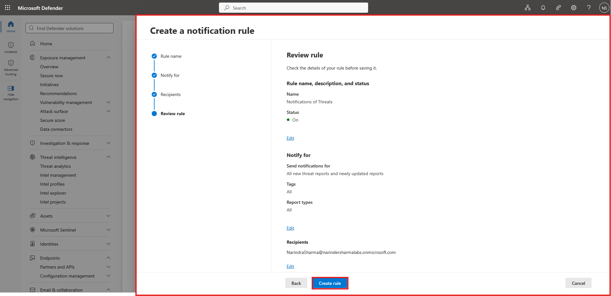</a>

_Left: The notification-rule workflow was started and named. Right: The completed conditions and recipient configuration were reviewed before creation._

  <a href="../screenshots/14-defender-security-reports-alerts/32-threat-analytics-notification-rule-created.png">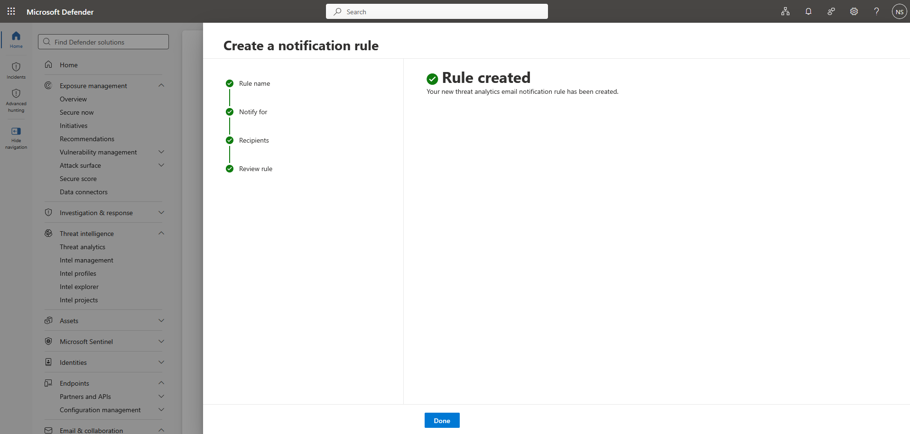</a>
  <a href="../screenshots/14-defender-security-reports-alerts/31-threat-analytics-notification-rule-enabled.png">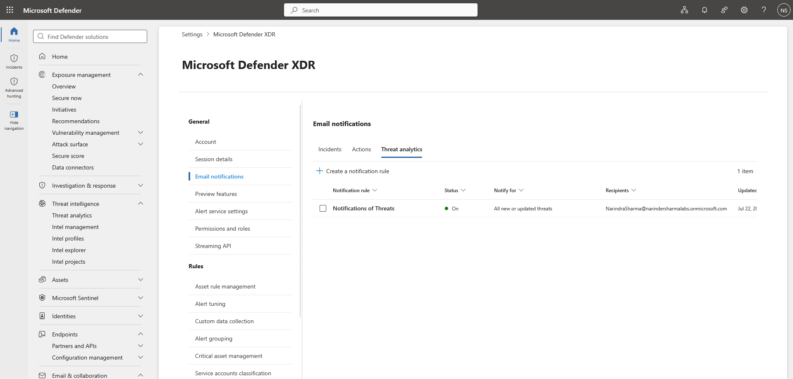</a>

_Left: Defender confirmed successful rule creation. Right: The new Threat analytics notification rule appears in the rule list with its enabled state visible._

## Skills Demonstrated

- Microsoft Defender XDR navigation and security-posture review
- Microsoft Secure Score and recommended-action analysis
- Security incident and investigation-surface awareness
- Microsoft Defender unified reporting
- Threat analytics and threat-intelligence review
- Threat analytics email-notification rule configuration
- Cross-workload security monitoring and technical documentation

## Support Relevance

These workflows are relevant to IT support, junior administration, and security-support roles that need to recognize where Defender surfaces posture recommendations, incident activity, messaging-security reports, and threat intelligence. The notification workflow also demonstrates how security information can be routed to administrators instead of relying on manual portal checks alone.

## Outcome

Microsoft Defender security posture, incident, reporting, and threat-analytics surfaces were reviewed and documented. A Threat analytics email-notification rule was configured and validated, adding a concrete alerting workflow to the security-operations portion of the portfolio.
