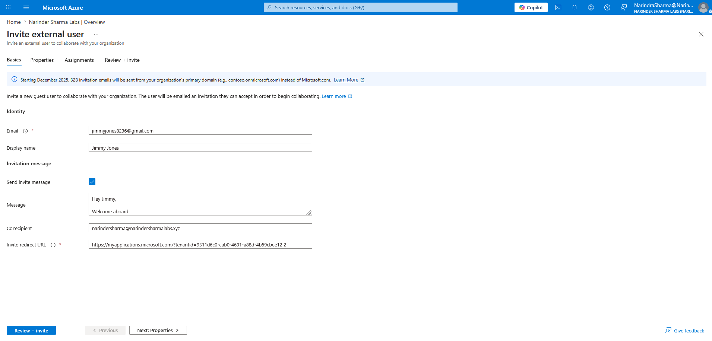
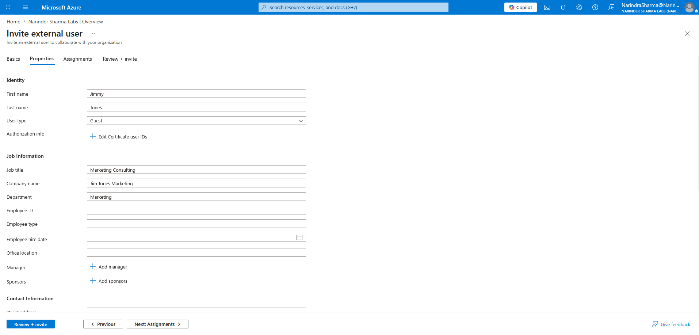

# External Collaboration & Contacts

## Administrative Objective

Demonstrate how external contacts and guest users are handled differently in Microsoft 365 and Microsoft Entra ID administration.

External contacts support address book visibility and communication workflows. Guest users are tenant-visible external identities used for collaboration scenarios after invitation.

This section documents the difference between contact-based communication objects and guest identity objects so support staff can avoid treating them as the same type of account.

---

## Work Completed

* Reviewed CSV-based bulk contact upload requirements for external contact administration.
* Created an external contact in the Microsoft 365 admin center.
* Confirmed the external contact was added successfully.
* Documented how external contacts support organization-wide address book visibility and communication workflows.
* Initiated an external guest invitation through Microsoft Entra ID B2B collaboration.
* Completed the guest invitation workflow, including guest profile details, invitation message, redirect URL handling, and review-before-invite validation.
* Confirmed Outlook web navigation was available in the Microsoft 365 tenant as a service access check.

---

## Evidence Walkthrough

### 1. Reviewed bulk contact upload requirements

The bulk contact upload page was reviewed to understand how Microsoft 365 supports CSV-based external contact creation for larger address book updates.

### 2. Created an external contact in Microsoft 365 admin center

An external contact was created through the Microsoft 365 admin center to demonstrate contact-based address book administration.

### 3. Confirmed the external contact was added

The completed contact creation screen confirmed that the external contact object was added successfully.

### 4. Started an external guest invitation in Microsoft Entra ID

An external guest invitation workflow was initiated through Microsoft Entra ID B2B collaboration to demonstrate how guest identities are invited into a tenant.

### 5. Entered guest user invitation details

Guest profile and invitation details were entered as part of the external collaboration workflow.

### 6. Configured invitation message and redirect URL options

The guest invitation workflow included message and redirect URL options, which are important when controlling how invited users receive and access collaboration resources.

### 7. Validated the review-before-invite step

The invitation was reviewed before submission to confirm the guest details and invitation settings before completing the workflow.

### 8. Confirmed Outlook web navigation

Outlook web navigation was checked as a tenant service access validation step after configuring external collaboration and contact-related objects.

---

## Support Relevance

Support teams need to identify whether a request involves an external mail contact, an invited guest identity, or a standard internal user.

Treating these object types as the same can lead to incorrect troubleshooting around mailbox visibility, address book behavior, collaboration access, licensing assumptions, and account management.

This workflow is relevant to service desk and junior administrator scenarios where users report issues such as:

* Missing external contacts in the address book.
* Confusion between contacts and guest users.
* Guest invitation or collaboration access problems.
* External users not appearing where staff expect them to appear.
* Incorrect assumptions about whether an external person has a tenant identity.

---

## Outcome

External contacts and guest users were handled as separate Microsoft 365 / Entra ID object types.

The external contact workflow demonstrated address book and communication visibility. The guest invitation workflow demonstrated the Microsoft Entra ID B2B collaboration path used for tenant-visible external identities.

Outlook web navigation was checked as a service access validation step. Full Global Address List lookup validation, guest invitation acceptance, or end-user collaboration testing would require separate follow-up testing.
