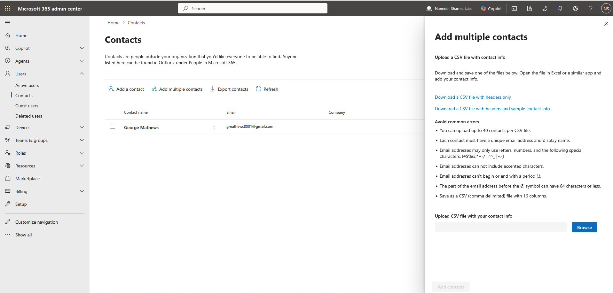
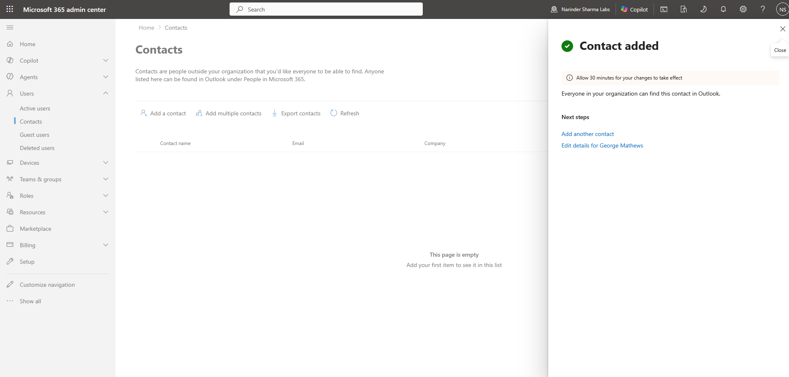
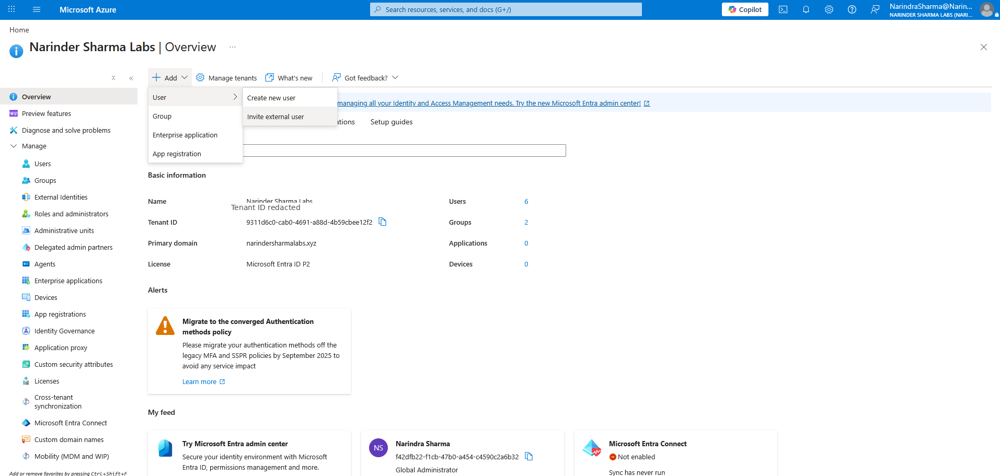
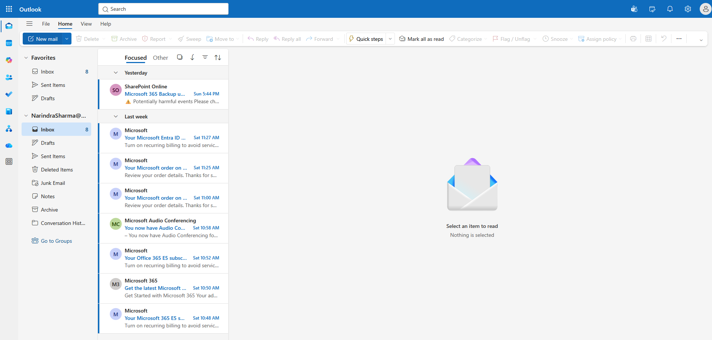

# External Collaboration & Contacts

## Administrative Objective

Review the difference between external contacts and guest users in Microsoft 365 / Entra ID administration.

External contacts support address book visibility and communication. Guest users are tenant-visible identities used for collaboration after invitation and acceptance.

## Work Completed

* Created an external contact in Microsoft 365 admin center.
* Reviewed CSV-based bulk contact upload requirements.
* Reviewed how contacts support organization-wide address book visibility.
* Invited an external guest user through Entra ID B2B collaboration.
* Reviewed guest profile properties, invitation message, redirect URL handling, and review-before-invite workflow.
* Confirmed Outlook web access/navigation was available in the Microsoft 365 tenant.

## Support Relevance

Support teams commonly need to understand whether a request is about an external mail contact, an invited guest identity, or a standard internal user. Treating those objects as the same can lead to access, licensing, mailbox, and collaboration troubleshooting mistakes.

## Evidence

## Outcome

External contacts and guest users were documented as separate administrative object types. Outlook web access was reviewed as a tenant service access check, while full address book search validation would require a separate Outlook People / GAL lookup test.
