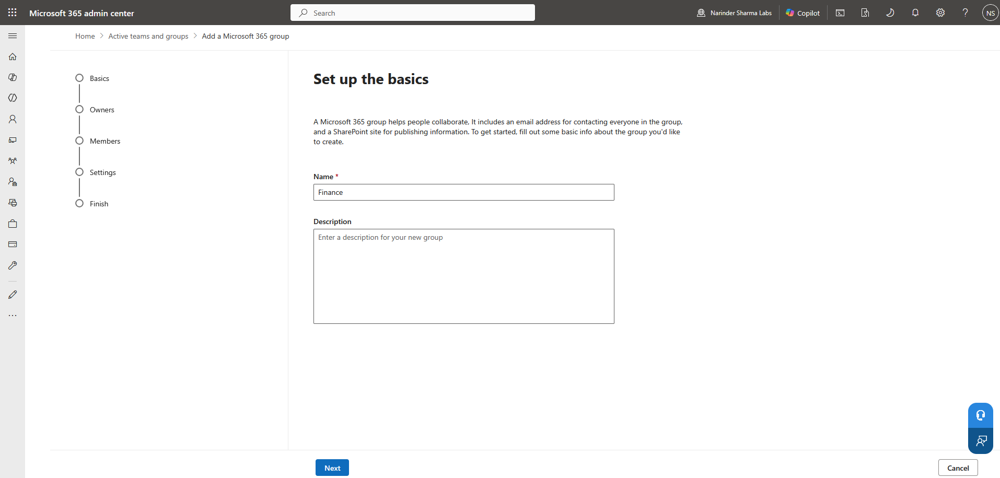
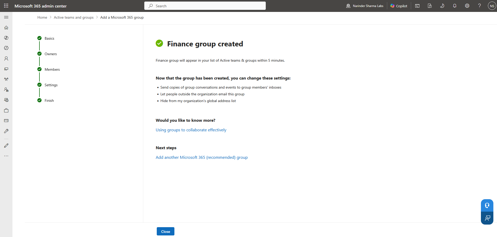
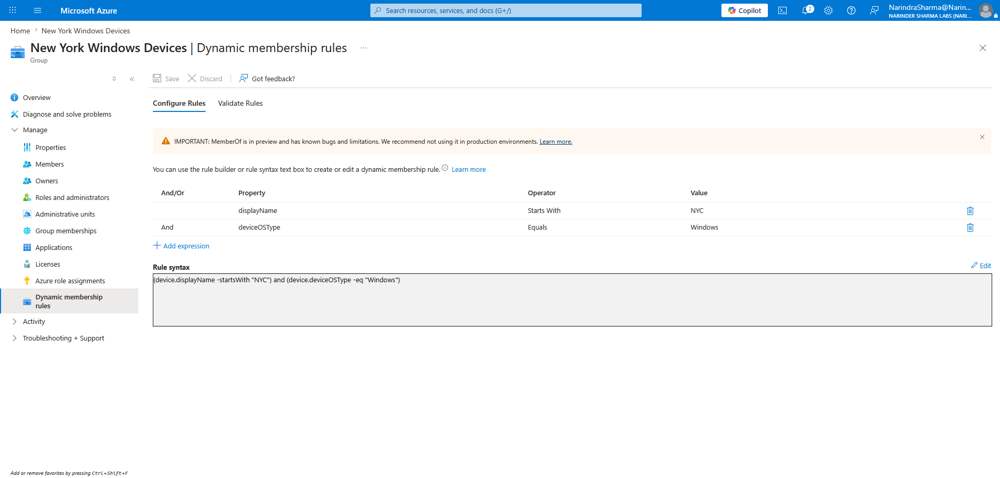
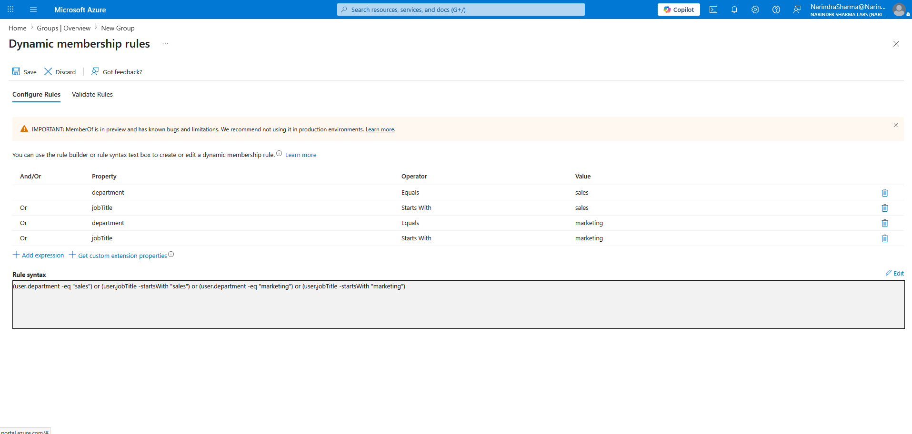
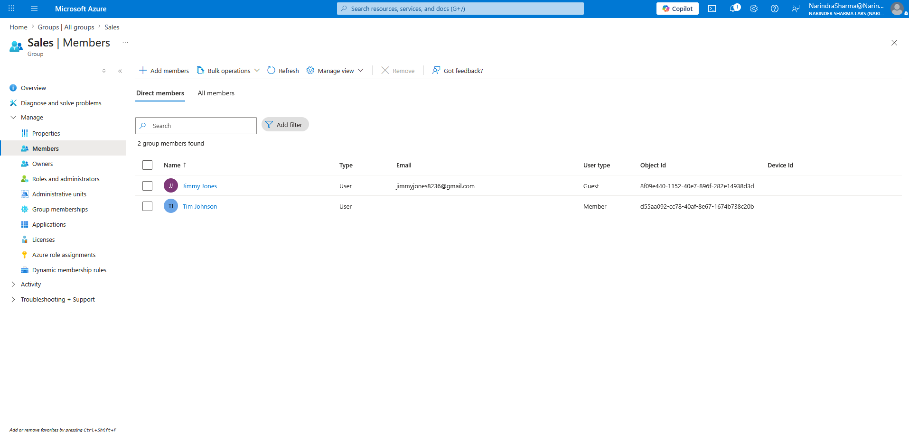

# Group-Based Collaboration Management

This work covers Microsoft 365 group creation, owner and member administration, Entra-side validation, and dynamic user and device membership rules.

## Work Completed

- Created a Microsoft 365 group and configured its collaboration settings.
- Added and verified group members and owners.
- Reviewed the resulting group object in Microsoft Entra.
- Configured dynamic membership logic for Windows devices and department or job-title based users.
- Verified the resulting Sales group membership.

## Phase 1 — Microsoft 365 Group Creation

I defined the group, configured its collaboration settings, and completed the creation workflow.

  
  

_Left: The Finance group name and description. Right: The Finance group creation confirmation._

## Phase 2 — Membership and Entra Validation

I confirmed the group membership and reviewed the resulting Microsoft 365 group object in Microsoft Entra.

  
  

_Left: The Finance group member list. Right: The group object and collaboration-resource links in Entra._

## Phase 3 — Dynamic Membership Rules

I configured a device rule for Windows devices whose display names begin with `NYC` and a user rule based on department and job-title values for sales and marketing.

  
  

_Left: The rule targets Windows devices with display names beginning with NYC. Right: The rule evaluates department and job-title values for sales and marketing._

  

_The members shown for the Sales group after the dynamic-user rule was configured._

## Skills Demonstrated

- Microsoft 365 group creation and configuration
- Group ownership and membership administration
- Microsoft Entra group-object validation
- Dynamic user and device membership rules
- Cross-portal group administration

## Result

The Microsoft 365 group was created and validated across both admin centers, and dynamic membership rules were configured for device and user-based group scenarios.

The complete screenshot sequence is available in [`screenshots/05-group-collaboration`](../screenshots/05-group-collaboration).
