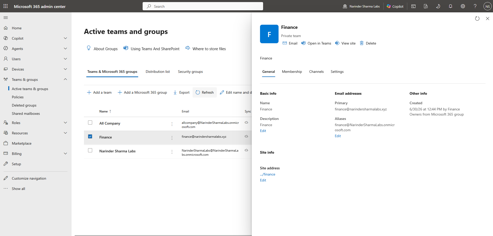
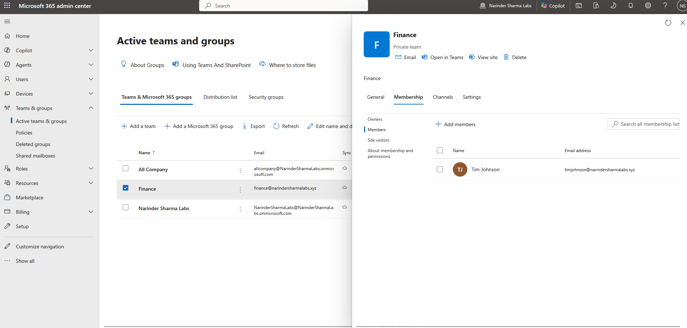
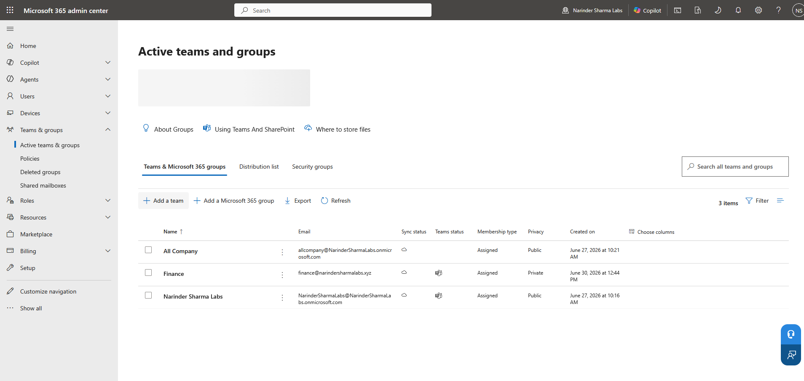
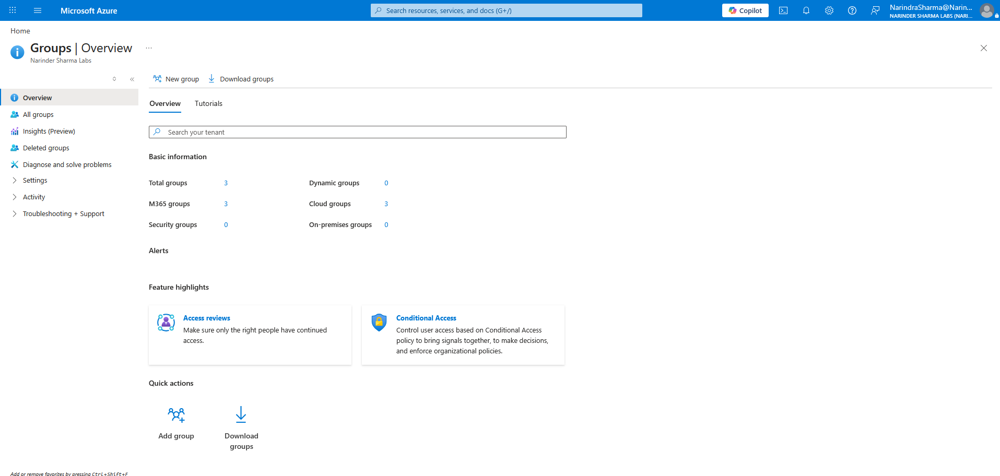

# Group-Based Collaboration Management

## Administrative Objective

Create and validate Microsoft 365 group configuration across Microsoft 365 admin center and Microsoft Entra admin center.

## Work Completed

* Created a Microsoft 365 group.
* Reviewed group properties and collaboration settings.
* Added and validated owners.
* Added and validated members.
* Reviewed the Entra ID group object view.
* Reviewed dynamic membership exposure as a future access management concept.

## Support Relevance

Groups are central to collaboration, access, ownership, and communication workflows. Support teams need to understand group type, membership, ownership, and where those properties are reviewed when troubleshooting access or collaboration issues.

## Evidence

## Outcome

Microsoft 365 group configuration was created, configured, and validated through owners, members, group properties, and Entra-side object validation. This supports practical collaboration and access troubleshooting scenarios.
