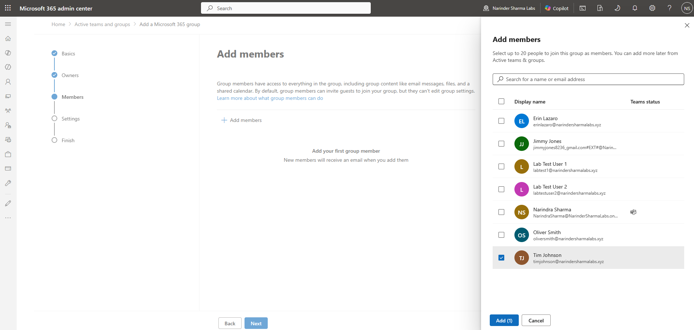
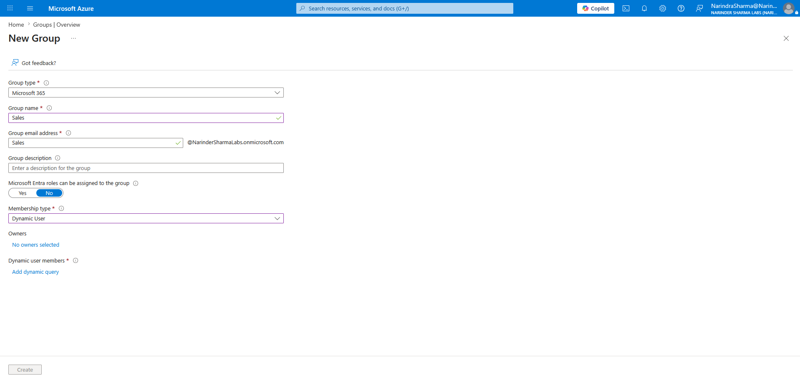

# Group-Based Collaboration Management

## Administrative Objective

Create, configure, and validate a Microsoft 365 group across Microsoft 365 admin center and Microsoft Entra admin center.

## Work Completed

* Created a Microsoft 365 group.
* Configured group properties and collaboration options.
* Added and validated members and owners.
* Confirmed the completed group and reviewed its Entra-side object.

## Evidence Walkthrough

### Group creation and configuration

I started the group workflow, completed the setup screens, and reviewed the configured properties before finishing the creation process.

### Membership, ownership, and completion

I added members and owners, verified each list, and confirmed the completed Microsoft 365 group.

### Microsoft Entra group validation

I reviewed the group object and its configuration from Microsoft Entra to confirm where the same group can be supported outside the Microsoft 365 admin center.

## Skills Demonstrated

* Microsoft 365 group creation
* Group property configuration
* Membership and ownership administration
* Microsoft Entra group-object validation
* Cross-portal group troubleshooting awareness

## Support Relevance

Group properties, members, and owners affect collaboration and access across Microsoft 365. Reviewing the same object from both admin centers helps when troubleshooting membership, ownership, Teams, SharePoint, or distribution-related requests.

## Outcome

The Microsoft 365 group was created, configured, populated with members and owners, and verified from Microsoft Entra.
