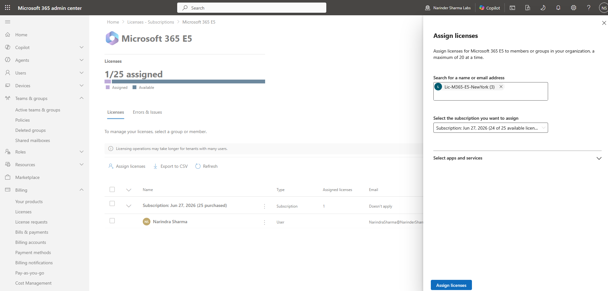
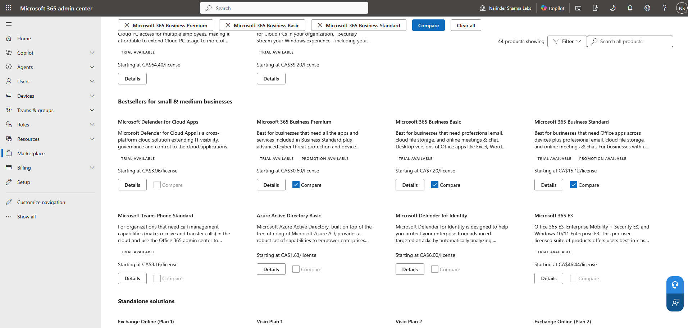

# Licensing & Service Access Review

## Administrative Objective

Review how Microsoft 365 licensing connects to user service access without presenting the work as purchasing, procurement, or billing administration.

## Work Completed

* Reviewed license inventory views.
* Reviewed assigned and available license counts.
* Reviewed service access implications during user creation.
* Reviewed marketplace and licensing navigation for awareness.
* Identified that user creation, license state, and service access must be verified separately.

## Support Relevance

A user can exist in Entra ID but still lack access to Microsoft 365 services if licensing or service plans are not assigned correctly. Licensing review is a common step in troubleshooting mailbox, Teams, Office app, SharePoint, OneDrive, and service access issues.

## Evidence

## Outcome

Licensing was reviewed as a service access control point rather than a billing exercise. This supports common Microsoft 365 troubleshooting scenarios where account creation, licensing, and service access must be verified separately.
