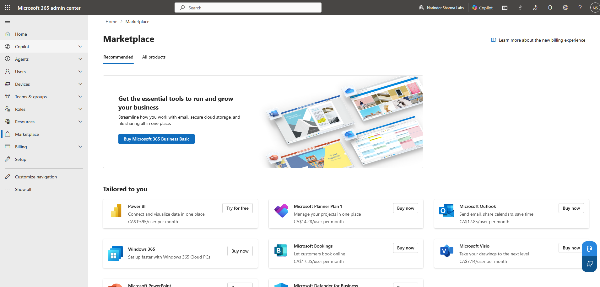

# Licensing & Service Access Review

## Administrative Objective

Review how Microsoft 365 licensing connects to user service access without presenting the work as purchasing, procurement, or billing administration.

This section focuses on license inventory awareness, assigned and available license counts, service access implications, and why licensing must be checked separately from account creation.

---

## Work Completed

* Reviewed Microsoft 365 license inventory views.
* Checked assigned and available license counts.
* Reviewed service access implications connected to user creation and account readiness.
* Checked marketplace and licensing navigation for administrative awareness.
* Identified that user creation, license assignment, and service access must be verified separately during troubleshooting.

---

## Evidence Walkthrough

### 1. Reviewed license inventory overview

The Microsoft 365 license inventory view was reviewed to understand available products and license visibility from the admin center.

### 2. Checked license inventory details

License details were checked to understand how assigned and available license counts appear during administrative review.

### 3. Reviewed marketplace navigation

Marketplace and licensing navigation were reviewed for awareness only, without presenting this work as purchasing or billing administration.

### 4. Checked additional licensing navigation view

An additional marketplace / license navigation view was checked to understand where license-related pages appear in the admin center.

---

## Support Relevance

A user can exist in Microsoft Entra ID but still lack access to Microsoft 365 services if licensing or service plans are not assigned correctly.

Licensing review is a common step in troubleshooting mailbox access, Teams access, Office app activation, SharePoint access, OneDrive access, and other service availability issues.

This section is intentionally framed as license and service access review, not procurement or billing ownership.

---

## Outcome

Licensing was reviewed as a service access control point rather than a billing exercise.

This supports common Microsoft 365 troubleshooting scenarios where account creation, licensing state, and service access must be verified separately.
