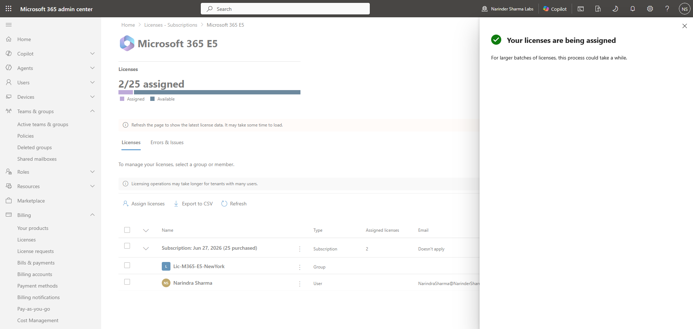
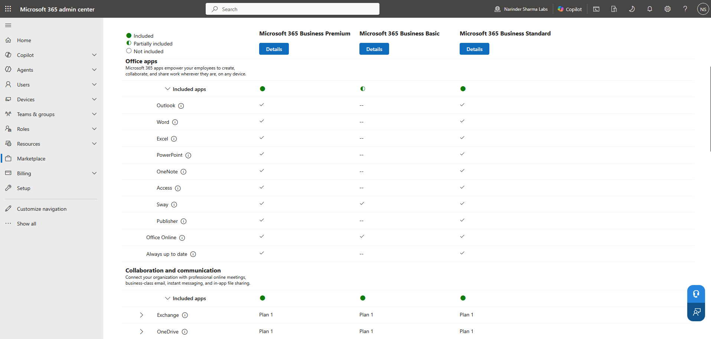

# Licensing & Service Access Review

This work covers license inventory, user assignment, and the Microsoft 365 admin center views used to review product and service availability.

## Work Completed

- Reviewed available Microsoft 365 license products and assignment counts.
- Assigned Microsoft 365 E5 to a lab user.
- Confirmed the updated assigned count.
- Reviewed product and service-plan comparison views.

## Phase 1 — License Inventory and Assignment

I reviewed the available products, selected the lab user, completed the Microsoft 365 E5 assignment, and confirmed the assigned count increased from 1 of 25 to 2 of 25.

  
  

_Left: The Microsoft 365 E5 assignment panel with the lab user selected. Right: The successful assignment notification and updated license count._

## Phase 2 — Product and Service-Plan Review

I used the marketplace comparison views to review Microsoft 365 products and their included services.

  
  

_Left: The marketplace comparison view for Microsoft 365 products. Right: The included service plans shown across the selected products._

## Skills Demonstrated

- Microsoft 365 license inventory review
- User license assignment
- Assigned and available count validation
- Product and service-plan comparison
- License-management portal navigation

## Result

Microsoft 365 E5 was assigned to the lab user and the updated assignment count was confirmed in the admin center.

The complete screenshot sequence is available in [`screenshots/06-licensing-service-access`](../screenshots/06-licensing-service-access).
