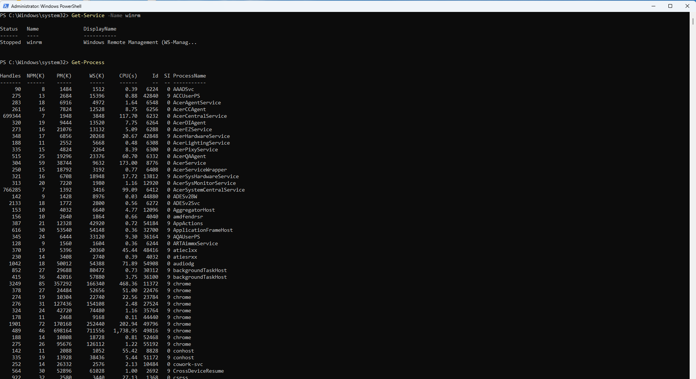
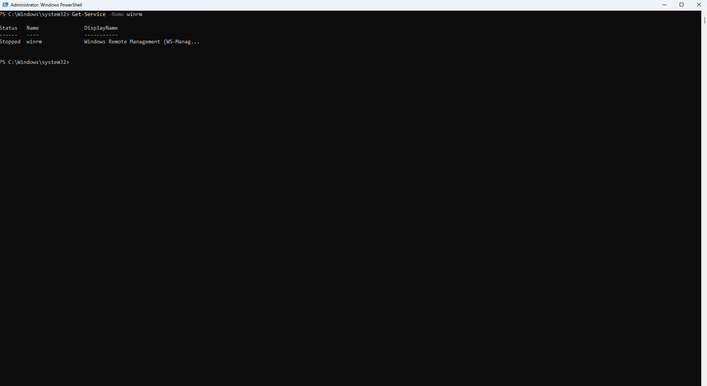
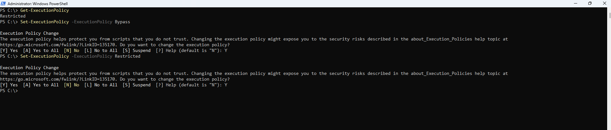

# PowerShell & Microsoft Graph Administration Track

## Administrative Objective

Separate command-line administration from portal-based Microsoft 365 and Entra administration so it can be documented cleanly as a dedicated follow-up track.

## Work Completed So Far

* Reviewed PowerShell command discovery using `Get-Command`.
* Reviewed common command output such as processes, services, and event logs.
* Reviewed output formatting and redirecting output to files.
* Reviewed execution policy behavior.
* Practiced variables and basic command-line workflow.

## Why This Is Separate

The portal-based Microsoft 365 and Entra administration work already demonstrates tenant, identity, contact, group, licensing, and operational visibility skills. PowerShell and Microsoft Graph should be documented separately because they support automation, reporting, and command-driven administration.

## Evidence

## Planned Next Step

Document Microsoft 365 / Entra-specific PowerShell or Microsoft Graph administration commands after completing that portion of the training, such as user retrieval, license reporting, group review, and guest user validation.
