# PowerShell & Microsoft Graph Administration Track

## Administrative Objective

Document command-line administration tasks that support Microsoft 365 and Microsoft Entra ID user, group, licensing, and cleanup workflows through PowerShell and Microsoft Graph.

This track is separated from the portal-based administration work because command-line administration supports repeatable provisioning, reporting, validation, and cleanup tasks that are common in service desk, technical support, and junior systems administration environments.

## Work Completed

  * Reviewed PowerShell command discovery, command output, execution policy behavior, variables, and basic command-line workflow.
  * Installed the Microsoft Graph PowerShell module from the PowerShell Gallery.
  * Completed Microsoft Graph sign-in using delegated access in a dedicated non-production Microsoft 365 tenant.
  * Connected with Graph permission scopes for organization review, user administration, and group administration.
  * Retrieved Microsoft 365 / Entra ID users through Microsoft Graph PowerShell.
  * Created a test user account through `New-MgUser` and verified the account in the Microsoft 365 admin center.
  * Created a Microsoft 365 group through `New-MgGroup` and verified the group object in the admin portal.
  * Reviewed subscribed SKU information and license consumption through `Get-MgSubscribedSku`.
  * Assigned a Microsoft 365 license to a test user through Microsoft Graph PowerShell.
  * Built a CSV-based bulk user provisioning workflow and verified created users in the admin portal.
  * Used CSV-based lookup logic to remove bulk-created test users after verification.
  * Documented troubleshooting observations around authentication, Graph scopes, CSV formatting, and public-safe screenshot handling.

## Support Relevance

Microsoft Graph PowerShell is useful for support and administration tasks where portal-only work becomes repetitive or difficult to audit. Examples include reviewing users, provisioning accounts, checking license availability, assigning licenses, creating groups, and cleaning up test or temporary accounts.

For service desk and junior systems support work, this reinforces the difference between manual portal administration and repeatable command-driven administration. It also shows why identity creation, license state, group membership, and post-change verification should be treated as separate checks instead of one combined assumption.

## Microsoft Graph Connection Workflow

The Microsoft Graph module was installed and tested from Windows PowerShell. After module installation, I connected to the Microsoft 365 tenant using delegated authentication and the required Graph scopes for the lab tasks.

The connection workflow included:

  * Reviewing execution policy behavior before module installation.
  * Installing the Microsoft Graph PowerShell module.
  * Completing interactive Microsoft sign-in.
  * Verifying successful connection to Microsoft Graph.
  * Reviewing Web Account Manager behavior during sign-in.
  * Reconnecting with corrected Graph permission scopes when additional write permissions were required.

Sensitive tenant identifiers, application identifiers, and sign-in details were redacted from public screenshots.

## User Administration Workflow

I used Microsoft Graph PowerShell to retrieve existing users, create a test user, and validate the account after creation.

The user workflow included:

  * Reviewing existing users with Microsoft Graph PowerShell.
  * Creating a test user account with account enabled state, display name, mail nickname, user principal name, and password profile values.
  * Setting the account to require password change at next sign-in.
  * Verifying the created account in the Microsoft 365 admin center.
  * Reviewing the created user through Graph commands before cleanup.

Temporary credentials and user principal names were treated as sensitive lab data and redacted from public evidence where appropriate.

## Group Administration Workflow

I created and verified a Microsoft 365 group through Microsoft Graph PowerShell.

The group workflow included:

  * Creating a Microsoft 365 group object through `New-MgGroup`.
  * Reviewing the returned group properties after creation.
  * Verifying the group from the Microsoft Entra / Microsoft 365 group listing.
  * Comparing command-line creation output with portal-side validation.

This supports group-based administration concepts used in Microsoft 365 collaboration, access assignment, and license or service targeting workflows.

## Licensing Review and Assignment Workflow

I reviewed subscribed license SKUs and license consumption through Microsoft Graph PowerShell, then assigned a license to a test user.

The licensing workflow included:

  * Reviewing subscribed SKUs with `Get-MgSubscribedSku`.
  * Checking SKU part numbers, SKU IDs, and consumed unit counts.
  * Assigning a license to a test user with `Set-MgUserLicense`.
  * Verifying that user creation, account visibility, and license assignment are separate administrative checks.

This is relevant to Microsoft 365 support because service access issues can be caused by user state, license assignment, service plan availability, or group-based access rather than the account object alone.

## CSV-Based Bulk User Provisioning

I created a CSV-based workflow for bulk user creation through Microsoft Graph PowerShell.

The CSV structure used the following fields:

```csv
DisplayName,MailNickname,UserPrincipalName
Sample User,sampleuser,sampleuser@example.com
```

The bulk workflow included:

  * Creating a CSV file with display names, mail nicknames, and user principal names.
  * Importing the CSV with `Import-Csv`.
  * Passing each row into `New-MgUser` through a `ForEach-Object` loop.
  * Applying a password profile consistently across created users.
  * Verifying the newly created users in the Microsoft 365 / Entra user listing.
  * Removing the bulk-created test users after verification.

The workflow was documented as a controlled lab exercise. Public screenshots use redaction for temporary passwords, user principal names, tenant identifiers, and object IDs.

## Troubleshooting and Controls Observed

  * Microsoft Graph PowerShell installation completed successfully after reviewing module installation and NuGet provider behavior.
  * Authentication was validated separately from module installation because module installation does not prove tenant sign-in access.
  * Graph permission scopes were reviewed and corrected before repeating write operations.
  * CSV-based provisioning was checked as a separate input-control step before account creation.
  * Temporary passwords were not published in public documentation.
  * Tenant IDs, object IDs, application IDs, and account identifiers were redacted where they did not add review value.
  * Created test users and groups were verified after creation instead of assuming success from command completion alone.
  * Test users created for bulk provisioning were removed after the workflow was validated.

## Evidence

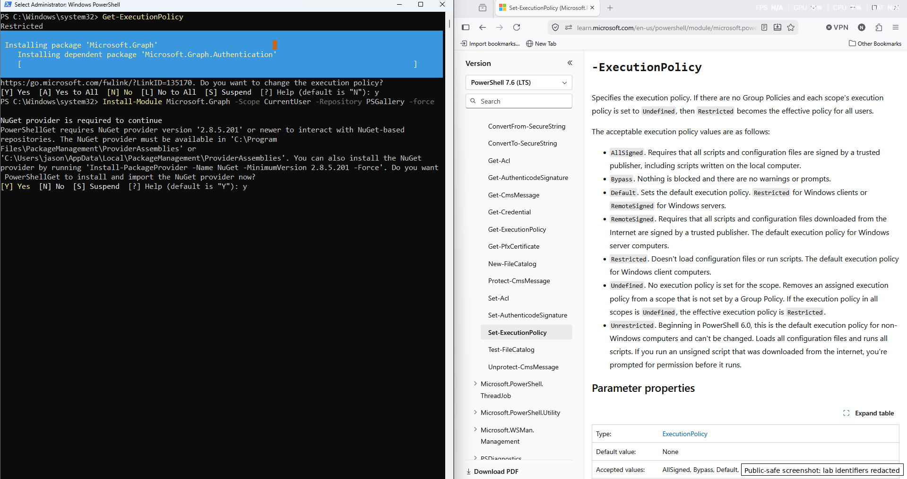

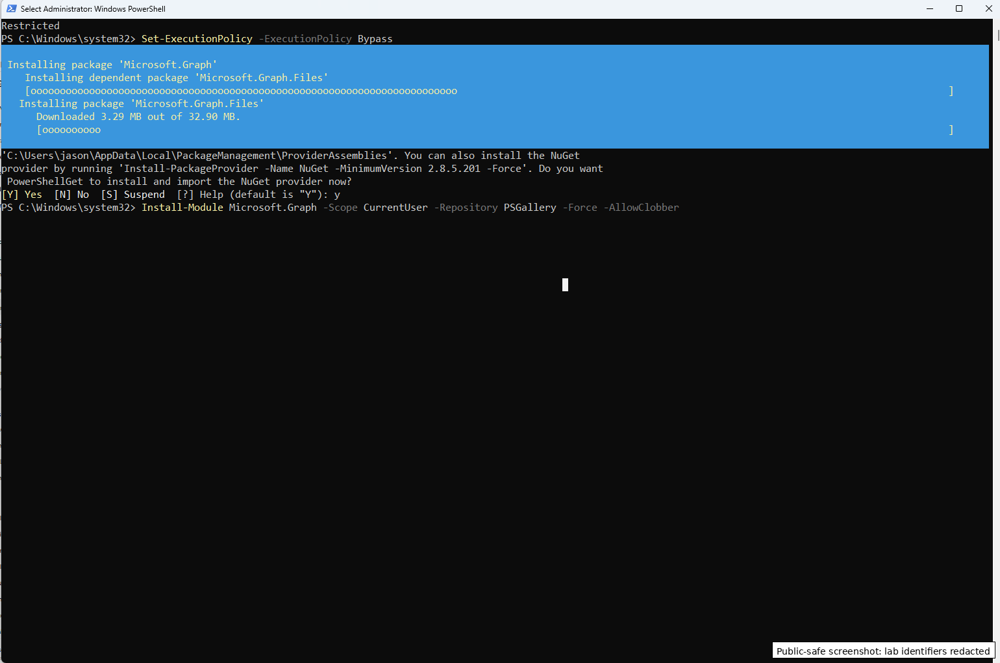

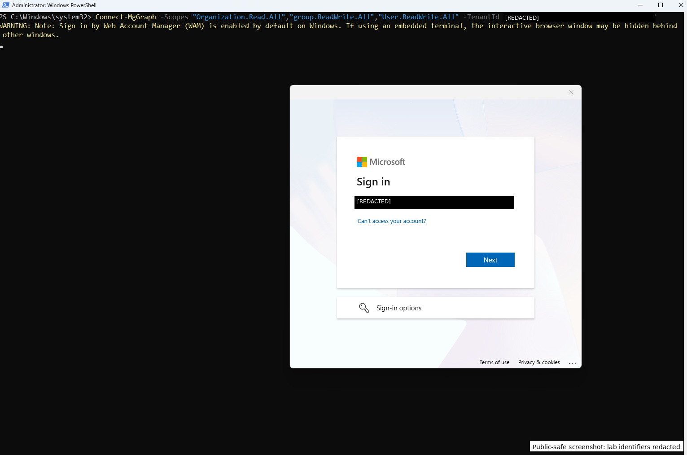

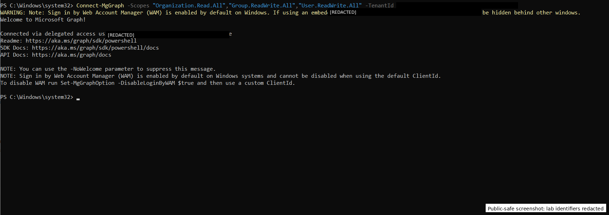

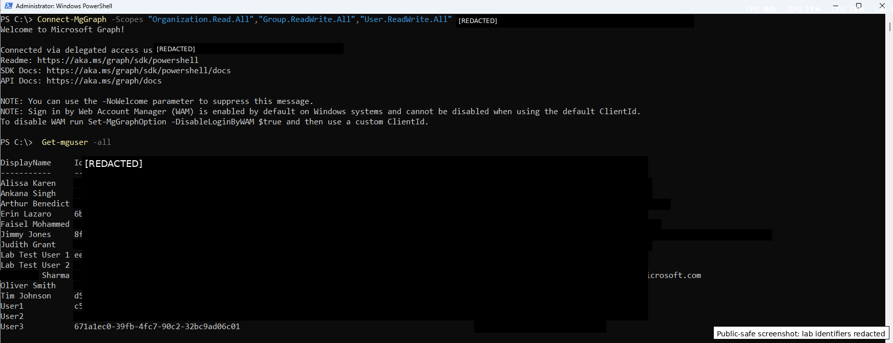

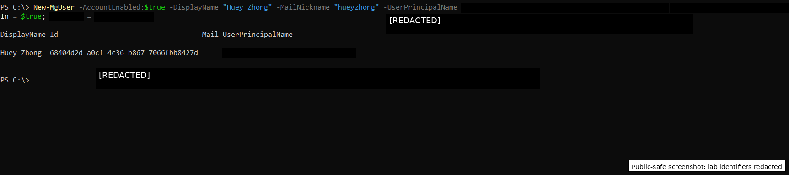

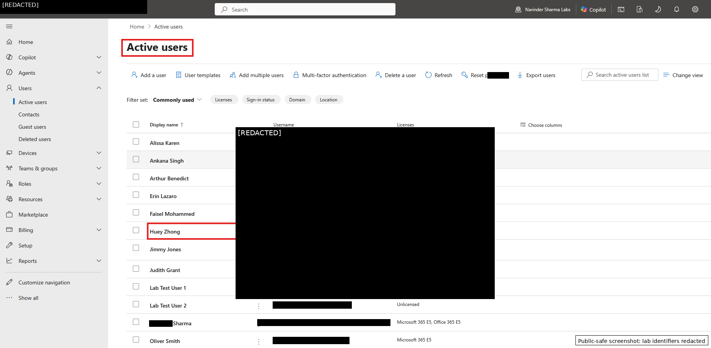

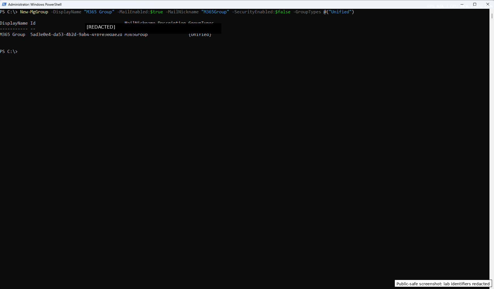

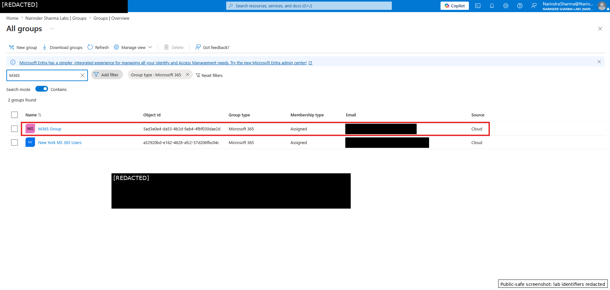

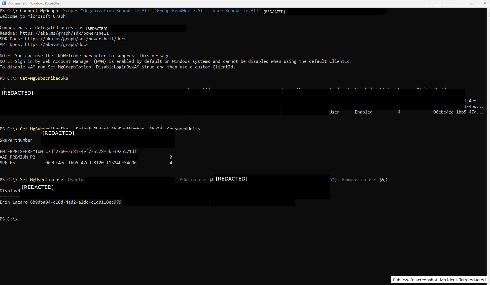

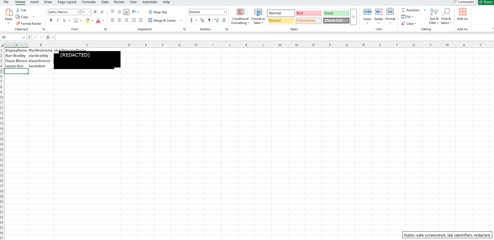

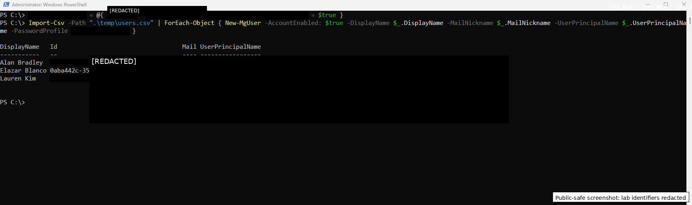

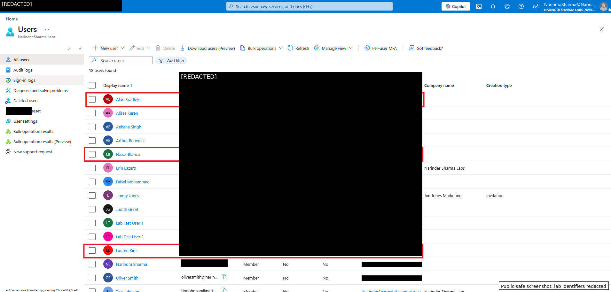

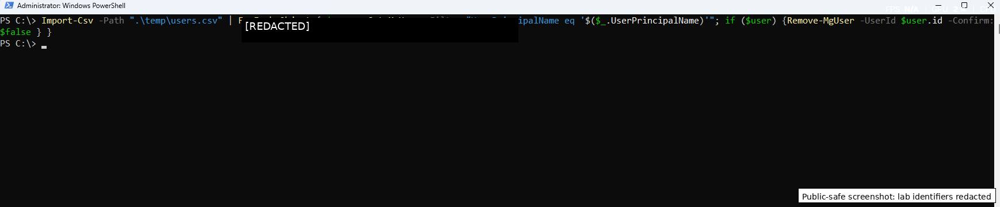

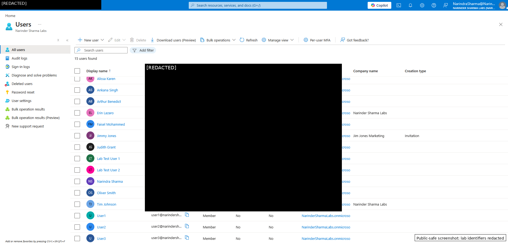

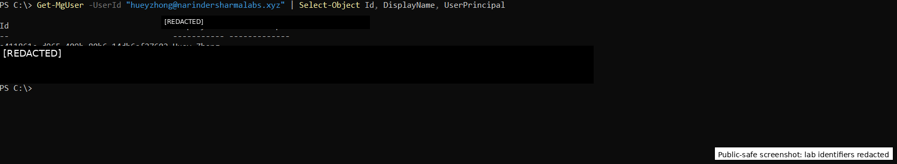

## Outcome

Microsoft Graph PowerShell was used to complete user, group, licensing, bulk provisioning, and cleanup workflows in a controlled Microsoft 365 / Entra ID lab tenant. The work demonstrates command-line administration awareness, repeatable provisioning concepts, license troubleshooting awareness, and verification discipline suitable for IT Support, Service Desk, Technical Support, and junior systems administration roles.
