# PowerShell & Microsoft Graph Administration

## Administrative Objective

Build and document a command-line administration track for Microsoft 365 and Microsoft Entra ID using PowerShell and Microsoft Graph PowerShell.

This section demonstrates repeatable administration workflows for command discovery, user review, user creation, group creation, license review, license assignment, CSV-based bulk provisioning, verification, and cleanup.

---

## Environment

* Microsoft 365 E5 trial tenant
* Microsoft Entra ID user and group objects
* Microsoft Graph PowerShell SDK
* Windows PowerShell
* Microsoft 365 admin center
* Microsoft Entra admin center
* CSV input for bulk user provisioning

---

## Work Completed

* Practiced PowerShell command discovery, process review, service review, formatting, variables, output handling, and execution policy awareness.
* Installed and validated Microsoft Graph PowerShell module usage.
* Connected to the Microsoft 365 tenant using delegated Microsoft Graph permissions.
* Retrieved existing tenant users from PowerShell.
* Created a test user through Microsoft Graph PowerShell.
* Verified the created user in the Microsoft 365 admin center.
* Created a Microsoft 365 group through Microsoft Graph PowerShell.
* Verified the group in the admin portal.
* Reviewed subscribed SKUs and consumed license units.
* Assigned a license to a test user through PowerShell.
* Created a CSV file for bulk user provisioning.
* Imported users from CSV using Microsoft Graph PowerShell.
* Verified bulk-created users in the admin center.
* Removed bulk-created test users through PowerShell after validation.
* Redacted temporary password values before publishing screenshots.

---

## Evidence Walkthrough

### 1. Practiced command discovery with PowerShell

PowerShell command discovery was practiced to understand how cmdlets can be found by noun and used for administration tasks.

### 2. Retrieved and formatted event log output

Event log output was retrieved and formatted for structured review of administrative results.

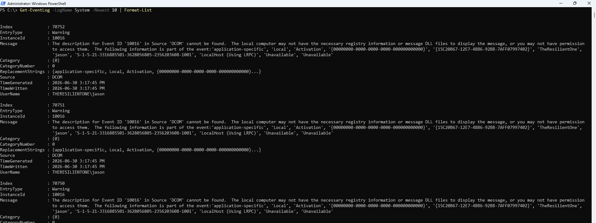

### 3. Retrieved process information

Process information was retrieved from PowerShell to review basic system activity.

### 4. Retrieved service information with parameters

Service information was retrieved with PowerShell parameters for a targeted system service review.

### 5. Exported process output to a file

Process output was redirected to a file to demonstrate command output handling and documentation-friendly evidence capture.

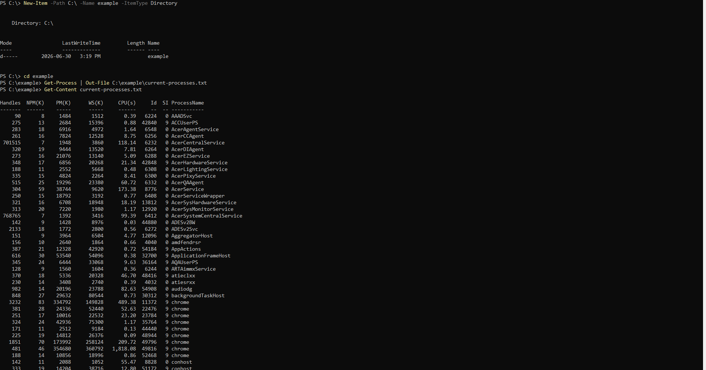

### 6. Checked execution policy behavior

Execution policy behavior was reviewed to understand script execution controls in a PowerShell environment.

### 7. Practiced variables and calculation output

Variables and calculation output were practiced to build command-line familiarity before moving into Microsoft Graph administration.

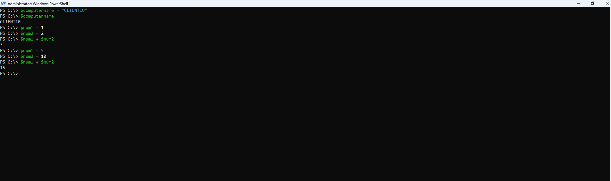

### 8. Installed and validated Microsoft Graph PowerShell

The Microsoft Graph PowerShell module was installed and validated for tenant administration work.

### 9. Confirmed Microsoft Graph module installation

The module installation completed successfully before connecting to the tenant.

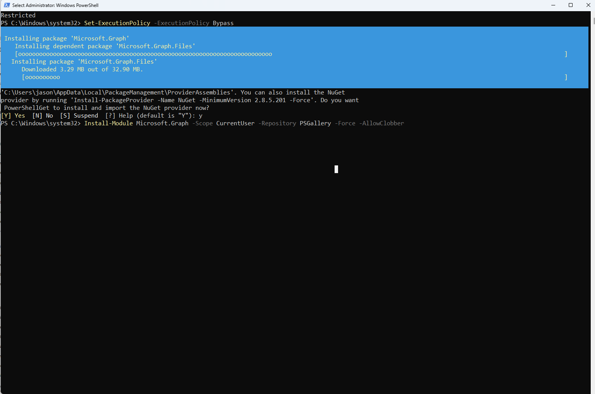

### 10. Started Microsoft Graph tenant sign-in

The tenant sign-in prompt was started for delegated Microsoft Graph authentication.

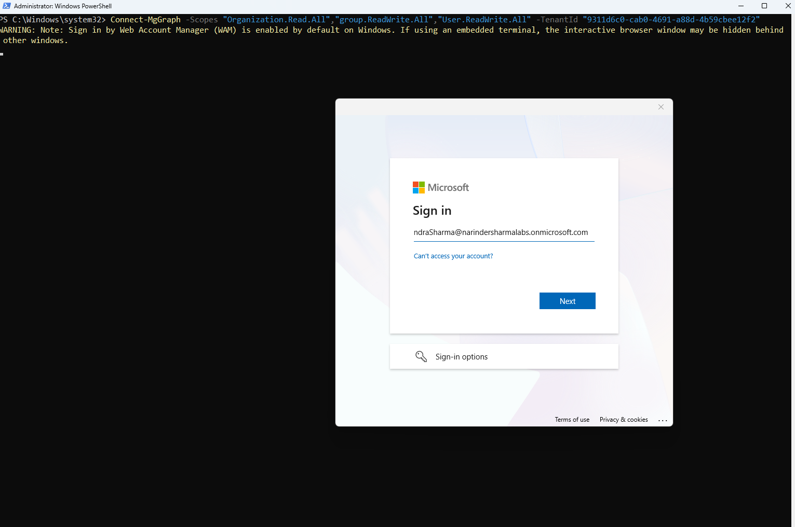

### 11. Confirmed successful Microsoft Graph sign-in

Microsoft Graph authentication completed successfully, confirming the command-line session was connected to the tenant.

### 12. Retrieved tenant users through Microsoft Graph PowerShell

Existing tenant users were retrieved through Microsoft Graph PowerShell to confirm read access and command output.

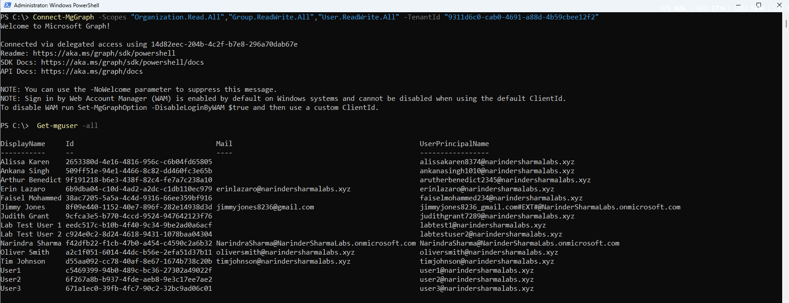

### 13. Created a test user through Microsoft Graph PowerShell

A test user was created from the command line using Microsoft Graph PowerShell. Temporary password values were redacted before publishing.

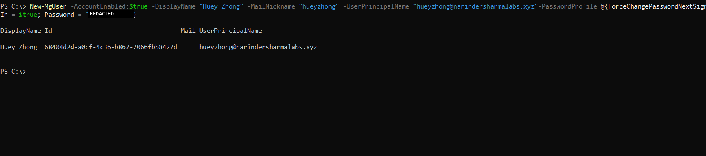

### 14. Verified the created user in Microsoft 365 admin center

The Graph-created user was verified from the Microsoft 365 admin center to confirm cross-portal validation.

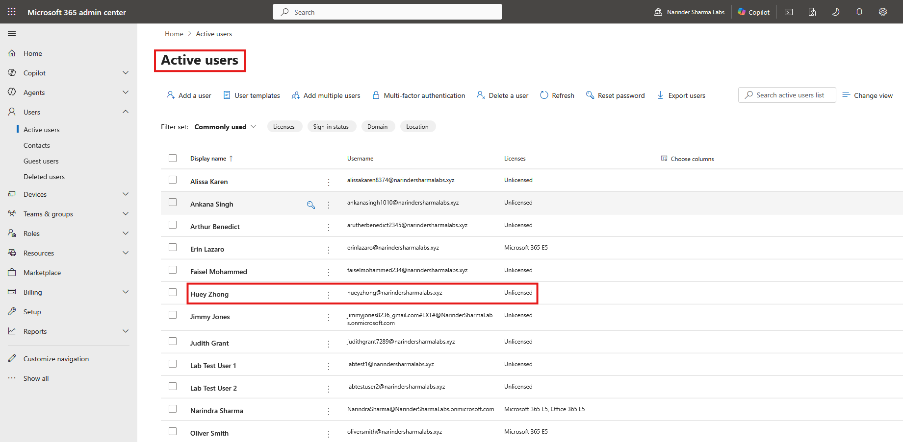

### 15. Created a Microsoft 365 group through Microsoft Graph PowerShell

A Microsoft 365 group was created using Microsoft Graph PowerShell to demonstrate command-line group administration.

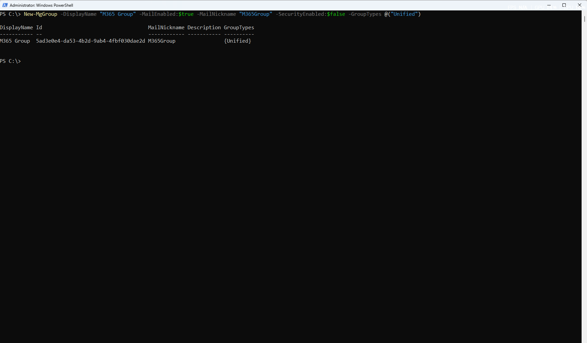

### 16. Verified the Graph-created group in the admin portal

The group created from PowerShell was verified in the Microsoft 365 admin portal.

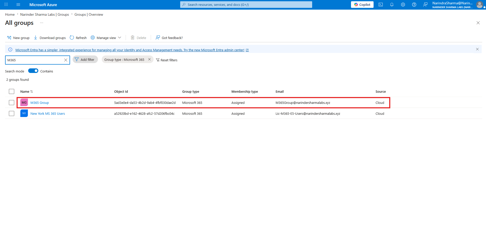

### 17. Reviewed licensing and assigned a license through PowerShell

Subscribed SKUs and consumed license units were reviewed, and a license assignment workflow was completed through PowerShell.

### 18. Prepared a CSV file for bulk user provisioning

A CSV input file was prepared with user attributes for repeatable bulk provisioning.

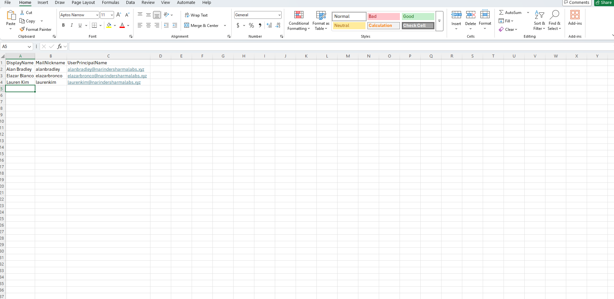

### 19. Imported users from CSV through Microsoft Graph PowerShell

The CSV file was imported through PowerShell to create multiple users with consistent attributes. Temporary password values were redacted before publishing.

### 20. Verified bulk-created users in the admin portal

Bulk-created users were verified in the Microsoft 365 admin center after the import completed.

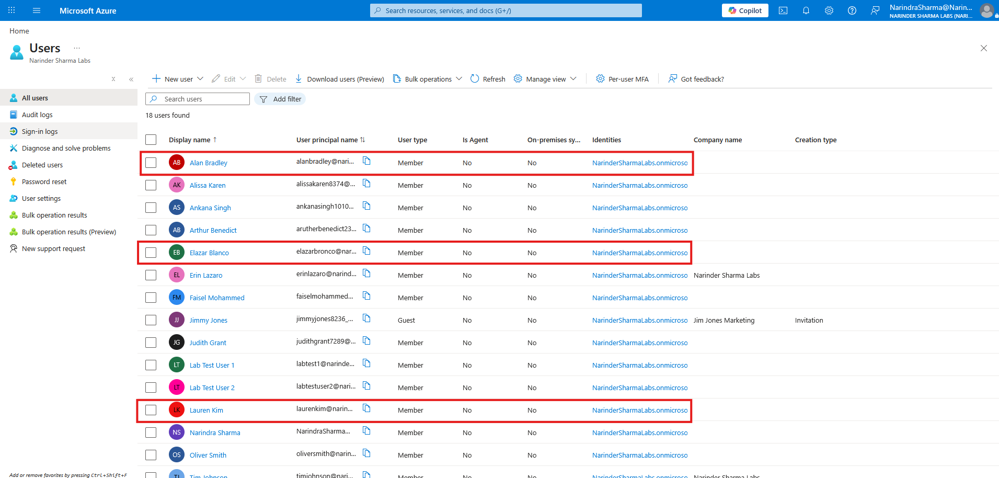

### 21. Removed bulk-created test users through PowerShell

The bulk-created test users were removed through PowerShell after validation to close the lab workflow cleanly.

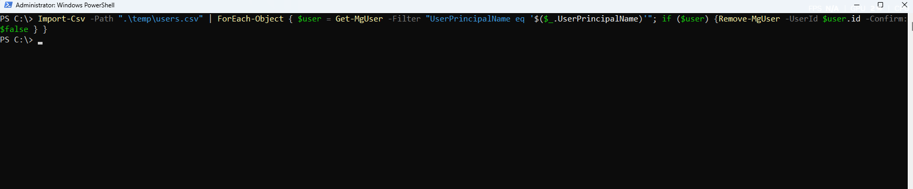

### 22. Verified bulk-created users were removed

The active user list was checked to confirm that bulk-created test accounts were removed after the cleanup workflow.

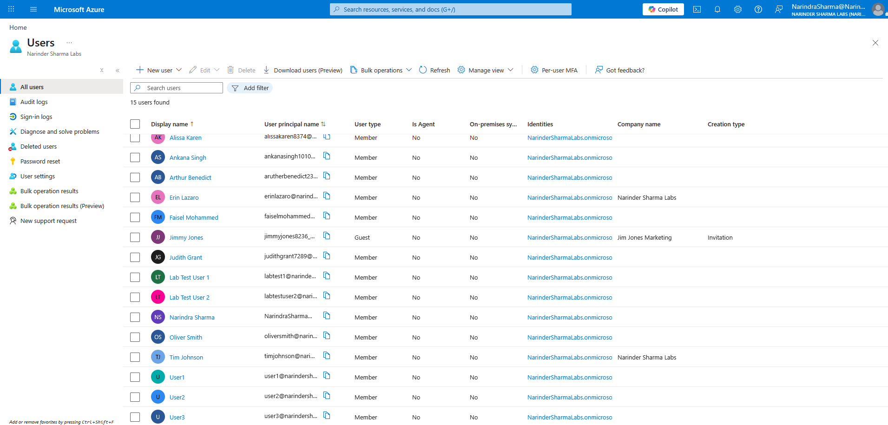

### 23. Reviewed final cleanup command output

Final command output was reviewed after cleanup to confirm the PowerShell workflow ended cleanly.

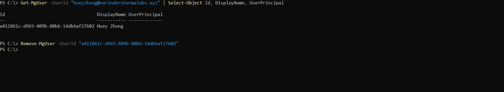

---

## Troubleshooting Notes

During the lab, realistic setup and execution issues were encountered and resolved:

* Tenant sign-in required the correct Microsoft 365 admin account and password reset before Graph authentication succeeded.
* Permission scopes needed to support write operations, not only read-only organization review.
* CSV input needed to be saved as a `.csv` file, not an Excel workbook, so `Import-Csv` could parse the headers correctly.
* A failed bulk user creation attempt was traced by checking the exact input columns being passed into `New-MgUser`.

---

## Security and Publishing Notes

* Temporary password values were redacted before publishing screenshots.
* No production customer data or live business records are included.
* Users, groups, and email addresses shown are lab-created objects for portfolio documentation.
* Test objects were removed after the workflow was validated.

---

## Support Relevance

PowerShell and Microsoft Graph are useful in support and junior administration work because they support repeatable provisioning, reporting, validation, licensing checks, and cleanup tasks.

This workflow connects portal-based Microsoft 365 administration with command-line administration while still showing verification in the graphical admin centers.

---

## Outcome

Microsoft Graph PowerShell was used to complete user, group, licensing, bulk provisioning, verification, and cleanup workflows in a controlled Microsoft 365 / Entra ID lab tenant.

The work demonstrates command-line administration awareness, repeatable provisioning concepts, license troubleshooting awareness, and verification discipline suitable for IT Support, Service Desk, Technical Support, and junior systems administration roles.
