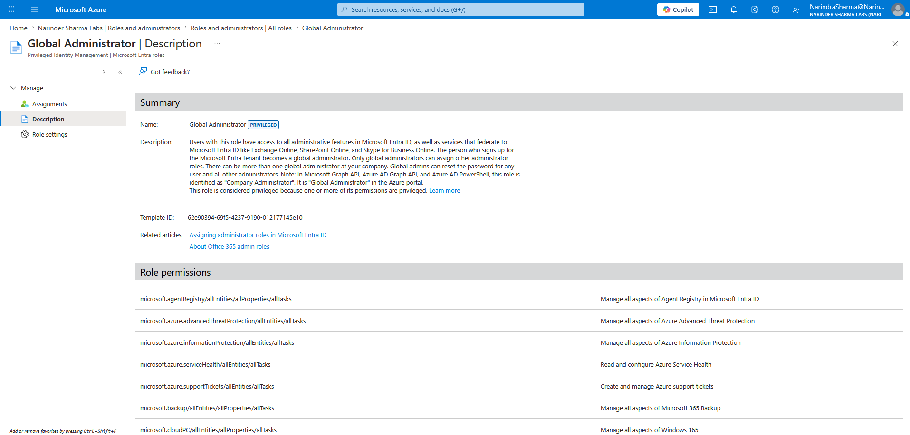
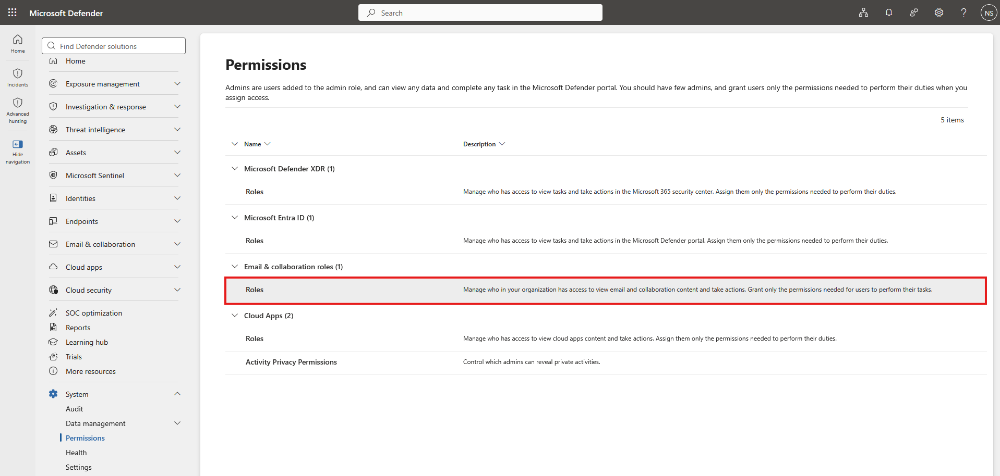
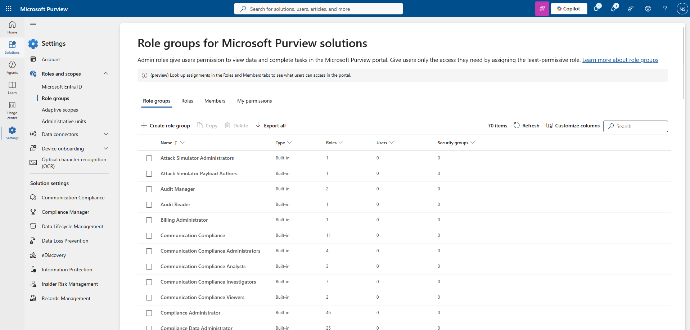
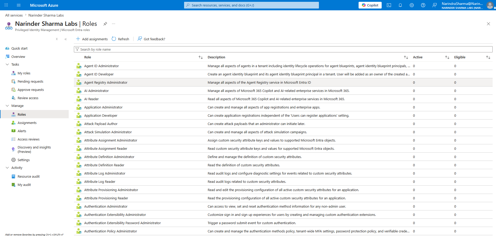

# Role-Based Access & Delegated Administration

## Administrative Objective
Review Microsoft 365 and Microsoft Entra role administration workflows used to control administrative access, scope responsibilities, and support least-privilege operations in a non-production tenant.

This section focuses on how admin permissions are reviewed and assigned across Microsoft 365 admin center, Microsoft Entra admin center, Microsoft Defender XDR, Microsoft Purview, administrative units, and Privileged Identity Management.

## Work Completed

* Reviewed Microsoft Entra role categories, role descriptions, permission details, and role settings.
* Reviewed common admin roles used in support and operations, including Helpdesk Administrator, Global Reader, Exchange Administrator, Intune Administrator, Teams Administrator, SharePoint Administrator, and Identity Governance Administrator.
* Assigned an administrative role to a lab user and validated the role assignment workflow.
* Reviewed Microsoft 365 admin center role assignment behavior and compared it with Entra role management.
* Reviewed role and permission areas across Microsoft Defender XDR and Microsoft Purview.
* Reviewed Microsoft Purview role groups, role group assignment, confirmation, and removal workflow.
* Created and reviewed administrative units for scoped delegation.
* Assigned a scoped User Administrator role through an administrative unit.
* Added lab users to an administrative unit and verified membership through Microsoft 365 admin center and Microsoft Entra admin center.
* Reviewed administrative unit scope behavior and dynamic membership query exposure.
* Reviewed Privileged Identity Management views for eligible roles, active roles, pending requests, expired roles, approval views, and role assignment management.
* Configured and validated a PIM-style eligible assignment workflow for temporary role access.

## Support Relevance
Role management is a core part of secure Microsoft 365 administration. Support and junior administration teams need to understand what an assigned role allows, where the role is managed, whether the assignment is tenant-wide or scoped, and how temporary access can be controlled.

This workflow is relevant to service desk and support scenarios where a user needs limited administrative rights for a defined support task, a team needs scoped access to a subset of users, or an administrator needs to confirm whether a role assignment is active, eligible, pending, expired, or limited by administrative unit scope.

## Workflow Evidence

### Microsoft Entra role review

### Role assignment workflow

### Microsoft 365 admin center role review

### Defender XDR and Purview role groups

### Administrative units and scoped delegation

### Privileged Identity Management

## Outcome
Role-based access workflows were reviewed across Microsoft 365, Microsoft Entra, Defender XDR, and Microsoft Purview. Administrative units were used to demonstrate scoped delegation, and Privileged Identity Management was reviewed as a controlled access model for eligible and temporary administrative access.

This strengthens the portfolio beyond basic user and group administration by showing awareness of least privilege, scoped administration, portal-specific role management, and just-in-time access concepts.
