# Secure Access with Microsoft Entra Conditional Access

This work covers Microsoft Entra ID Protection and Conditional Access configuration in a dedicated non-production tenant. The lab moved from Security Defaults to custom policy control, configured risk-based MFA requirements, reviewed identity-risk and sign-in reporting, and created a second scoped MFA policy with an emergency-access exclusion.

## Work Completed

- Disabled Security Defaults so custom Conditional Access policies could be enabled.
- Created a policy that targets all users and responds to medium or high user risk and sign-in risk.
- Configured the grant control to require multifactor authentication.
- Confirmed the risk-based policy was created and enabled.
- Reviewed the risky-users report after policy creation.
- Initiated a private-browser sign-in and reviewed the resulting sign-in log activity.
- Built a second policy targeting all users while excluding a designated emergency-access account.
- Scoped target resources, client-app conditions, device platforms, user-risk conditions, and the MFA grant control.
- Confirmed the second user-created Conditional Access policy was successfully created.

## Phase 1 — Replace Security Defaults with Conditional Access

Microsoft Entra does not allow Security Defaults and custom Conditional Access enforcement to operate as competing control models. I opened the tenant properties, changed Security Defaults from enabled to disabled, recorded the reason for the change, and saved the configuration before returning to Conditional Access.

  <a href="../screenshots/13-secure-access-conditional-access/01-security-defaults-management-navigation.png">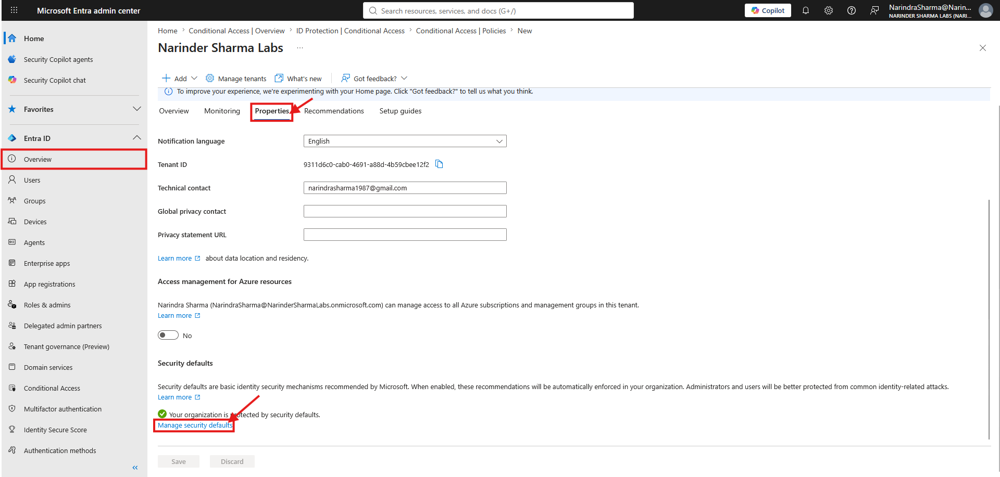</a>
  <a href="../screenshots/13-secure-access-conditional-access/02-security-defaults-disabled.png">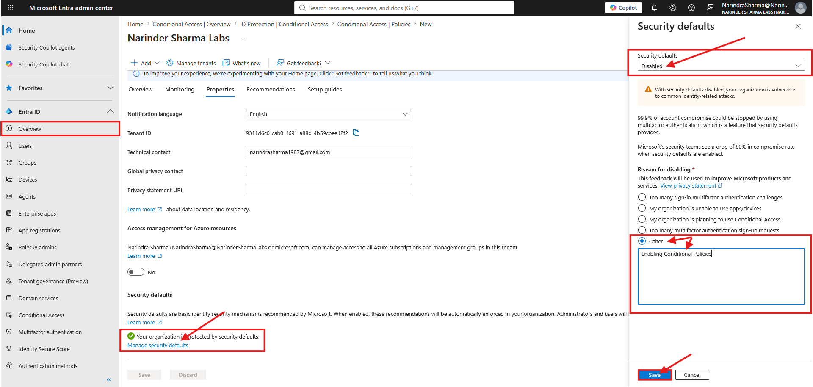</a>

_Left: Tenant properties showing the Security Defaults management entry point. Right: Security Defaults changed to disabled with an administrative reason entered before saving._

## Phase 2 — Configure Risk-Based MFA

I created a user-defined Conditional Access policy and selected medium and high levels for both user risk and sign-in risk. The assignment targeted all users, and the access grant required multifactor authentication.

  <a href="../screenshots/13-secure-access-conditional-access/04-user-risk-medium-high-selected.png">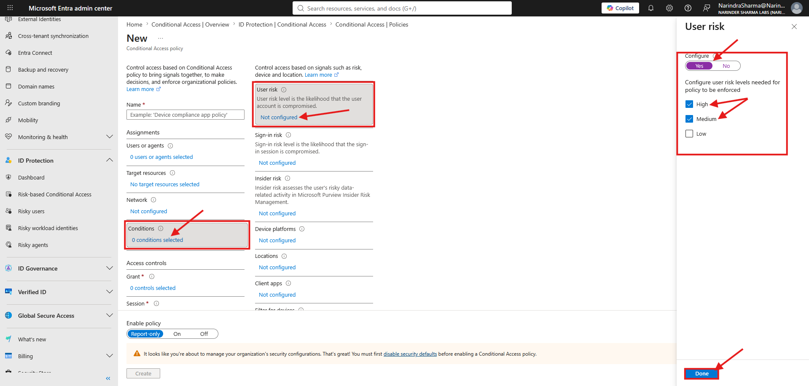</a>
  <a href="../screenshots/13-secure-access-conditional-access/05-sign-in-risk-medium-high-selected.png">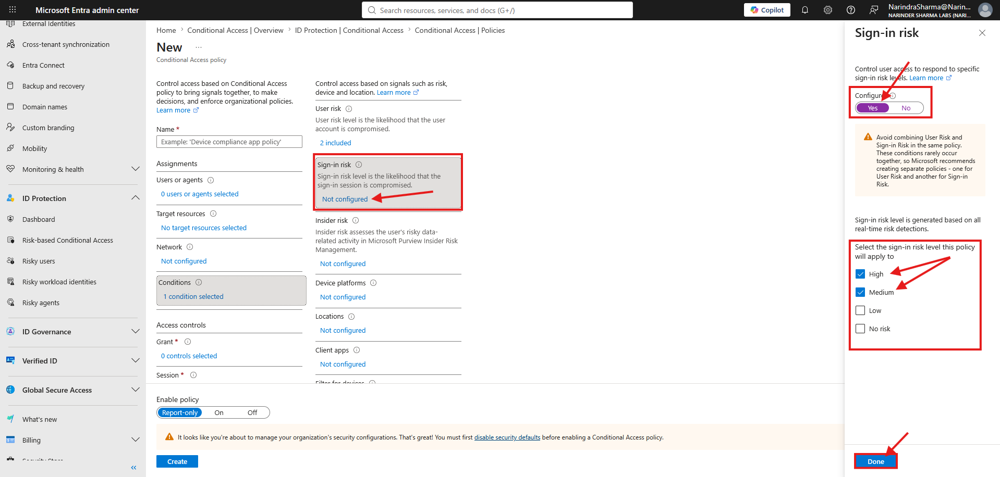</a>

_Left: Medium and high user-risk levels selected. Right: Medium and high sign-in-risk levels selected._

  <a href="../screenshots/13-secure-access-conditional-access/06-all-users-assignment-selected.png">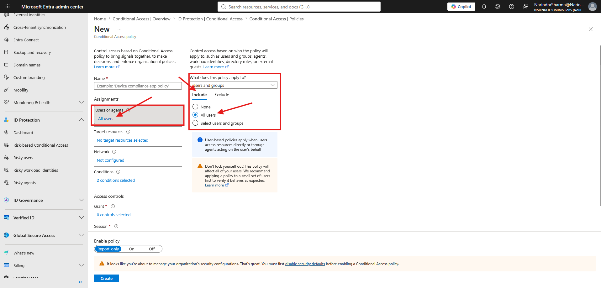</a>
  <a href="../screenshots/13-secure-access-conditional-access/07-require-mfa-grant-control.png">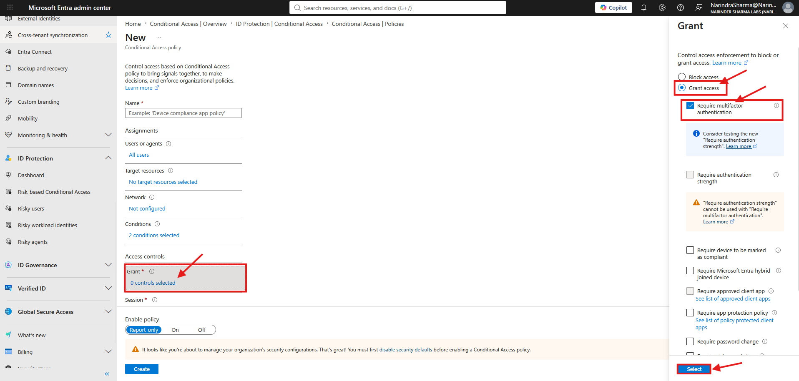</a>

_Left: The policy assignment includes all users. Right: Access is granted only after the multifactor authentication requirement is satisfied._

## Phase 3 — Create and Verify the Risk Policy

The policy was named, set to On, and submitted. The Conditional Access policy list then showed the user-created policy in the enabled state.

  <a href="../screenshots/13-secure-access-conditional-access/08-risk-policy-review-and-create.png">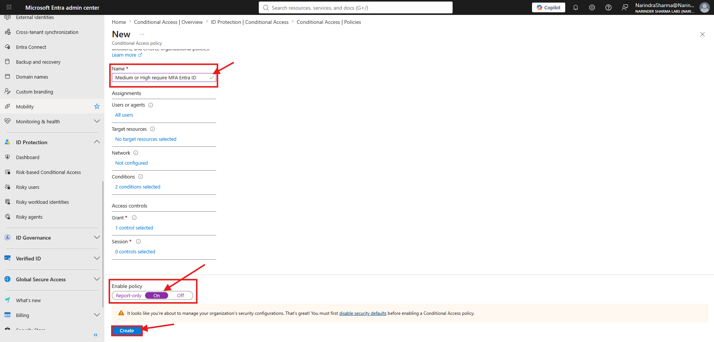</a>
  

_Left: Final policy summary before creation. Right: Successful creation notification with the enabled policy visible in the policy list._

## Phase 4 — Review Risk and Sign-In Activity

I reviewed the Identity Protection risky-users report, which showed no users currently classified with active risk in the lab tenant. I then initiated a private-browser sign-in to create authentication activity and reviewed sign-in logs, including failed entries. This evidence demonstrates report and log review; it does not claim that a real risky-user detection or successful MFA challenge was generated.

  <a href="../screenshots/13-secure-access-conditional-access/10-risky-users-report-reviewed.png">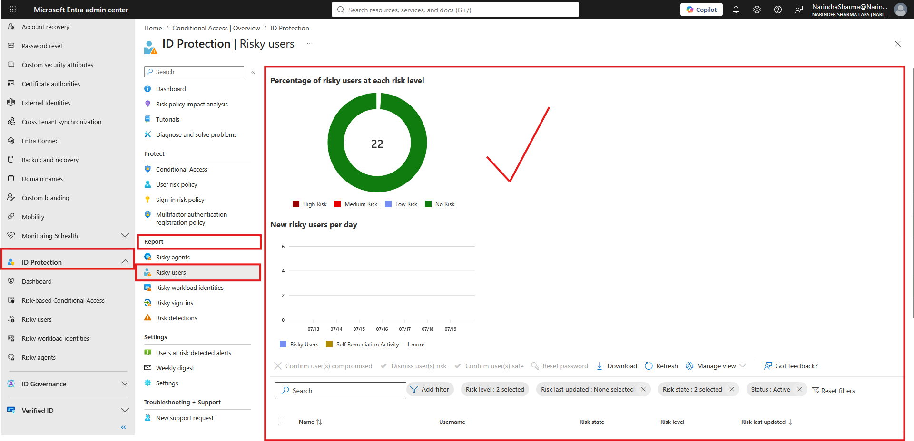</a>
  <a href="../screenshots/13-secure-access-conditional-access/12-sign-in-logs-reviewed.png">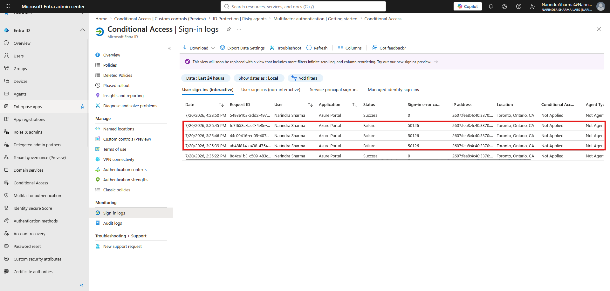</a>

_Left: Risky-users reporting reviewed with the lab accounts currently shown as safe. Right: Sign-in log entries reviewed for authentication result and failure details._

## Phase 5 — Build a Scoped MFA Policy

A second Conditional Access workflow targeted all users but excluded a designated emergency-access account to reduce tenant lockout risk. The policy selected target resources, client apps, device platforms, medium and high user risk, and a grant control requiring multifactor authentication.

  <a href="../screenshots/13-secure-access-conditional-access/13-break-glass-user-exclusion.png">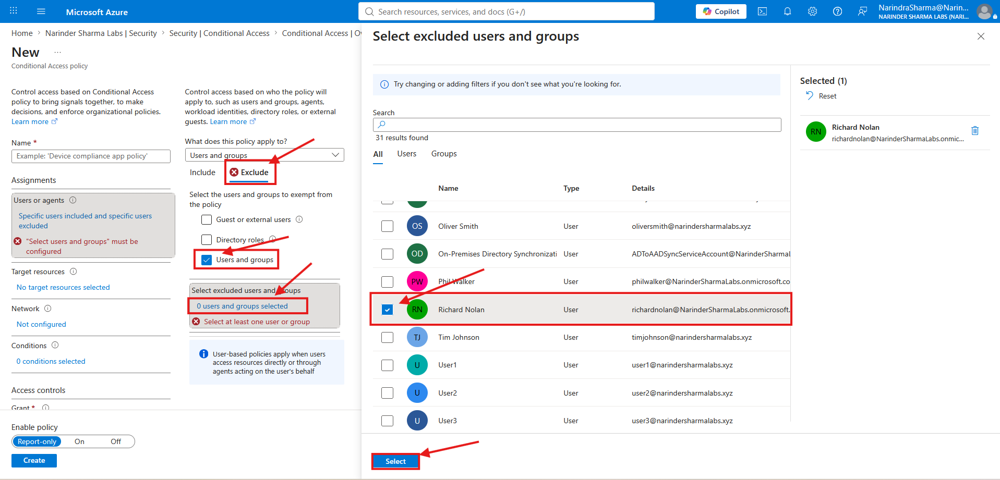</a>
  <a href="../screenshots/13-secure-access-conditional-access/15-target-resources-selected.png">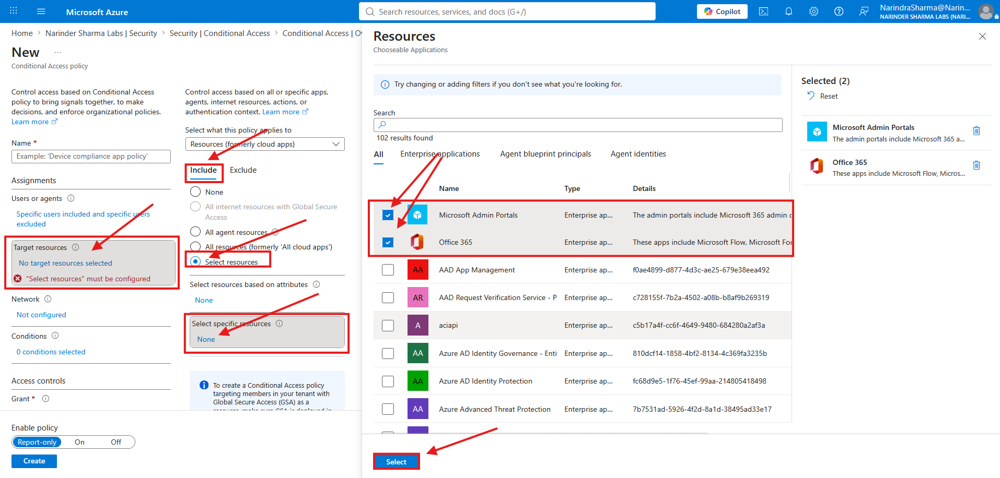</a>

_Left: A designated emergency-access account excluded from the all-users assignment. Right: Target resources selected for policy scope._

  <a href="../screenshots/13-secure-access-conditional-access/16-client-app-conditions-selected.png">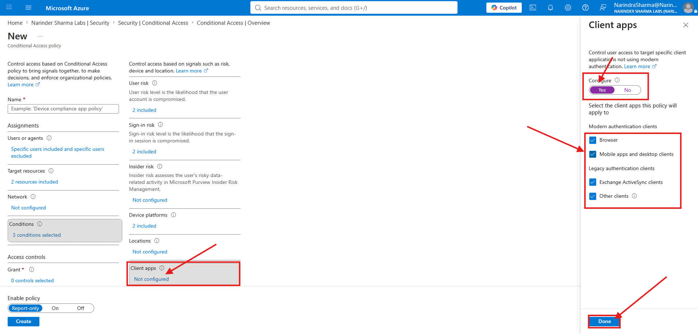</a>
  <a href="../screenshots/13-secure-access-conditional-access/17-device-platform-conditions-selected.png">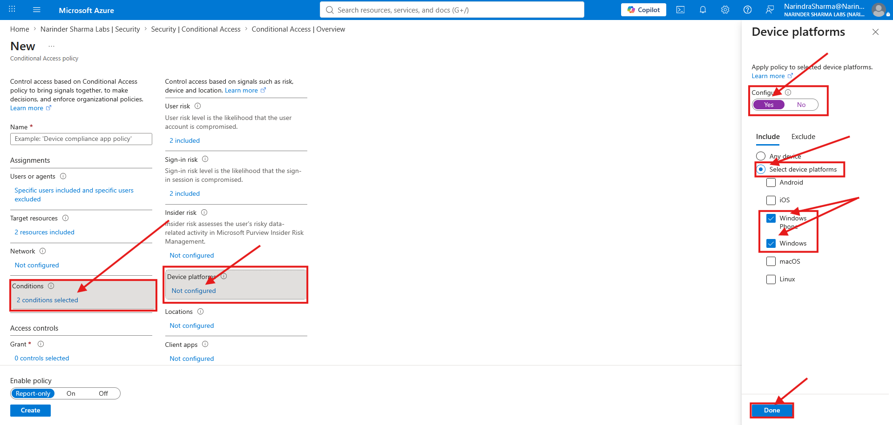</a>

_Left: Browser and mobile/desktop client-app categories included. Right: Selected device platforms included in the policy conditions._

  <a href="../screenshots/13-secure-access-conditional-access/18-mfa-grant-control-selected.png">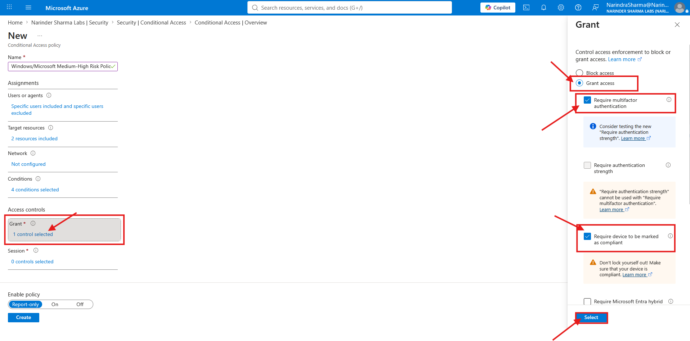</a>
  

_Left: Grant access configured with the multifactor authentication requirement. Right: Successful creation confirmation for the user-created MFA policy._

## Skills Demonstrated

- Microsoft Entra Conditional Access administration
- Microsoft Entra ID Protection
- Security Defaults transition planning
- User-risk and sign-in-risk conditions
- Multifactor authentication grant controls
- All-user assignments and emergency-access exclusions
- Target resource, client-app, and device-platform scoping
- Conditional Access policy state management
- Risky-user reporting and sign-in log review
- Evidence-based identity security documentation

## Result

The lab tenant moved from Security Defaults to custom Conditional Access control. Two user-created policy workflows were completed: a risk-based policy requiring MFA for medium or high user and sign-in risk, and a broader MFA policy with scoped resources, application and device conditions, and an emergency-access exclusion. Identity Protection and sign-in reports were reviewed to validate the available monitoring workflow without overstating the absence of real risk detections as a production test result.

The complete screenshot sequence is available in [`screenshots/13-secure-access-conditional-access`](../screenshots/13-secure-access-conditional-access).
