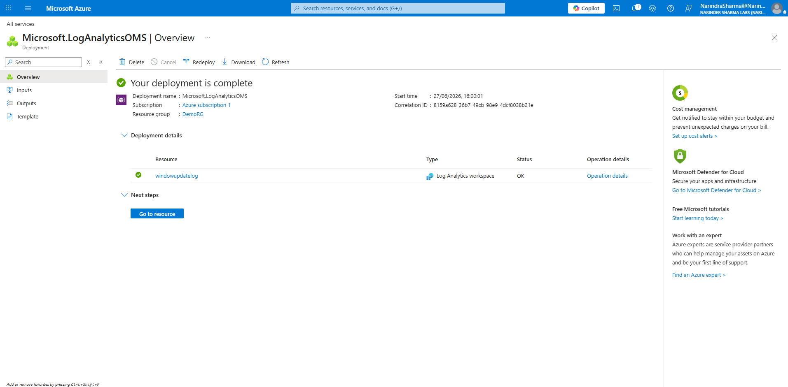
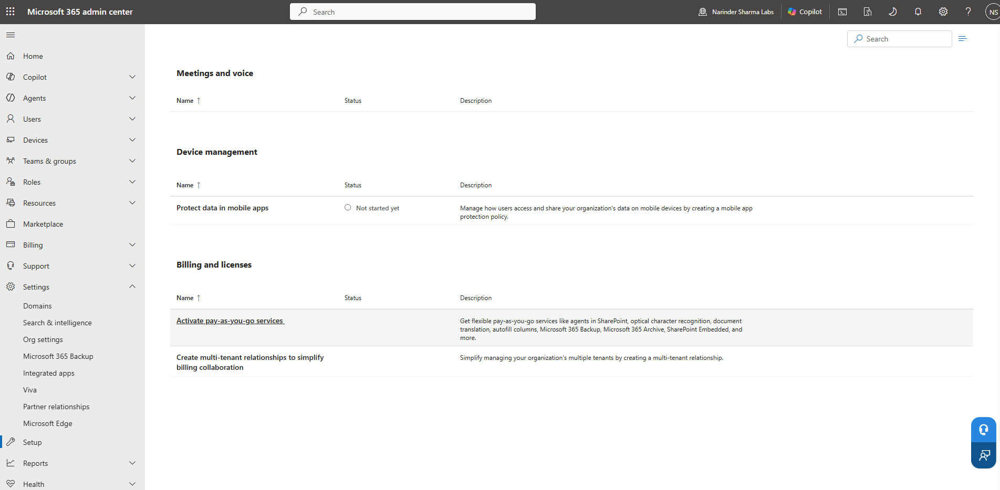
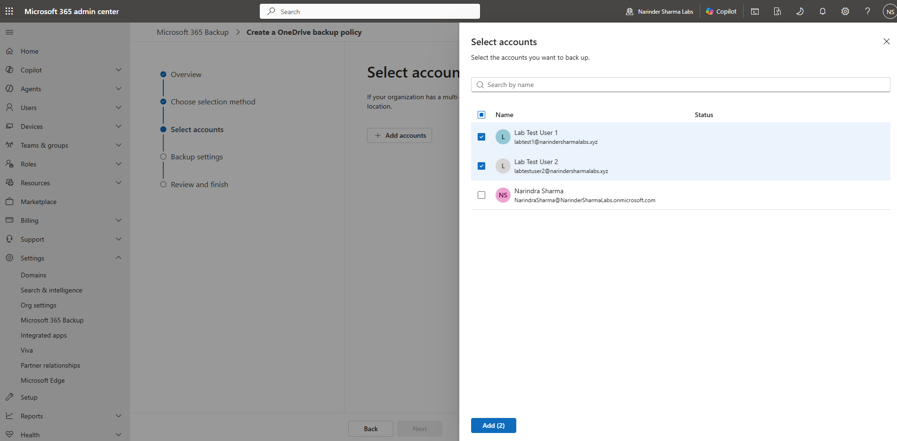

# Service Health, Network Insights & Backup Readiness

## Administrative Objective

Review Microsoft 365 operational visibility areas that support troubleshooting, service awareness, and continuity planning.

## Work Completed

* Reviewed service health and operational insight areas.
* Reviewed network insight location configuration.
* Reviewed Log Analytics workspace creation and deletion screens as part of software update / monitoring exposure.
* Configured and validated Microsoft 365 Backup readiness policy screens for Exchange, OneDrive, and SharePoint.
* Worked through the pay-as-you-go connection flow and backup policy readiness workflow.

## Support Relevance

Support teams need to know when a user issue may be tenant-wide, service-side, network-related, or tied to a configuration/readiness gap. These views help support staff avoid treating every incident as a local workstation issue.

## Evidence

## Outcome

Operational visibility areas were documented, and Microsoft 365 Backup readiness workflows were configured and validated. This strengthens the administration portfolio beyond user creation by showing awareness of service availability, network insight, monitoring exposure, and data protection administration points.
