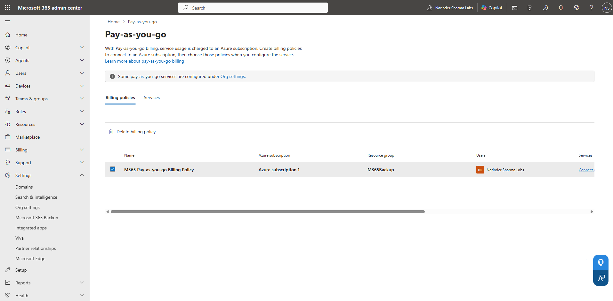
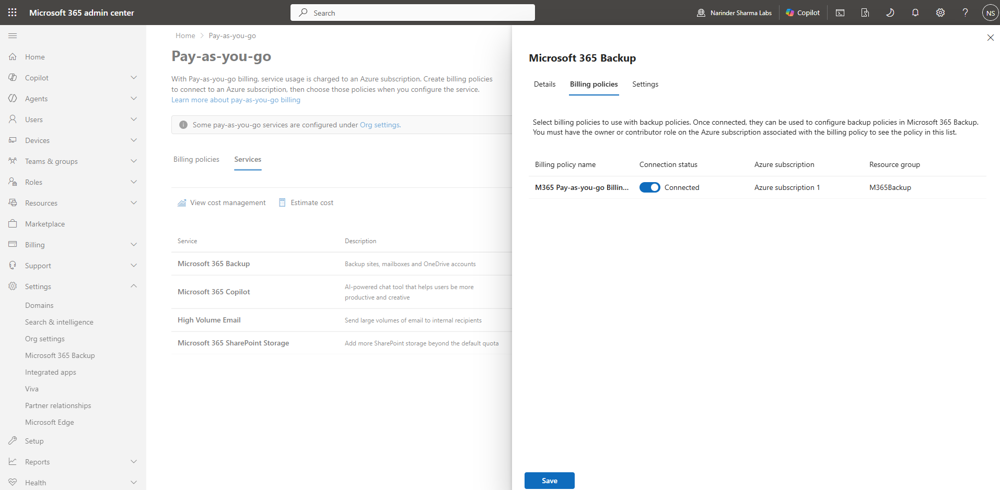

# Operational Visibility & Backup Readiness

This work covers Microsoft 365 network insights, software-update reporting exposure, Azure Log Analytics administration, Microsoft 365 Backup policies, and pay-as-you-go billing connection.

## Work Completed

- Added and reviewed a network insights location.
- Opened the software-update reporting workflow connected to Log Analytics.
- Deployed, validated, and removed a Log Analytics workspace.
- Completed Exchange, OneDrive, and SharePoint backup policy workflows.
- Connected Microsoft 365 Backup to the Azure pay-as-you-go billing policy.

## Phase 1 — Network Insights

I added an office location and confirmed it in the Microsoft 365 network connectivity view.

  
  

_Left: The office location and network details entered for the lab. Right: The completed New York location in the connectivity view._

## Phase 2 — Software Update Reporting and Log Analytics

I opened the Windows Update for Business reporting setup, deployed the Log Analytics workspace, validated the resource, and completed the cleanup workflow after review.

  
  

_Left: The Windows Update for Business reporting connection to Log Analytics. Right: The completed Log Analytics workspace deployment._

  

_The Azure resource-group deletion workflow used for lab cleanup._

## Phase 3 — Microsoft 365 Backup Policies

I completed the Exchange, OneDrive, and SharePoint policy workflows and confirmed all three workloads in the backup-policy list.

  
  

_Left: The SharePoint backup policy review and creation screen. Right: Exchange, OneDrive, and SharePoint policies listed in the admin center._

## Phase 4 — Pay-As-You-Go Billing Connection

I created the pay-as-you-go billing policy and connected Microsoft 365 Backup to the Azure billing account.

  
  

_Left: The completed Azure pay-as-you-go billing policy. Right: Microsoft 365 Backup connected to the billing policy._

## Skills Demonstrated

- Microsoft 365 network insights configuration
- Windows Update for Business reporting exposure
- Azure Log Analytics workspace deployment and cleanup
- Microsoft 365 Backup policy administration
- Exchange, OneDrive, and SharePoint backup configuration
- Pay-as-you-go billing connection

## Result

The network and reporting workflows were completed, and Microsoft 365 Backup was configured for Exchange, OneDrive, and SharePoint with the Azure billing connection in place.

The complete screenshot sequence is available in [`screenshots/07-service-health-network-insights`](../screenshots/07-service-health-network-insights) and [`screenshots/08-operational-resilience-backup`](../screenshots/08-operational-resilience-backup).
