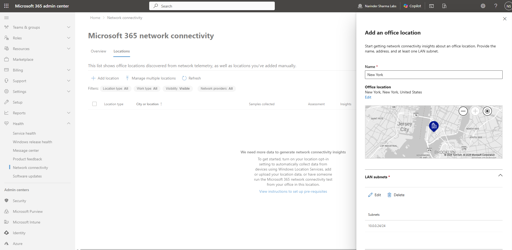
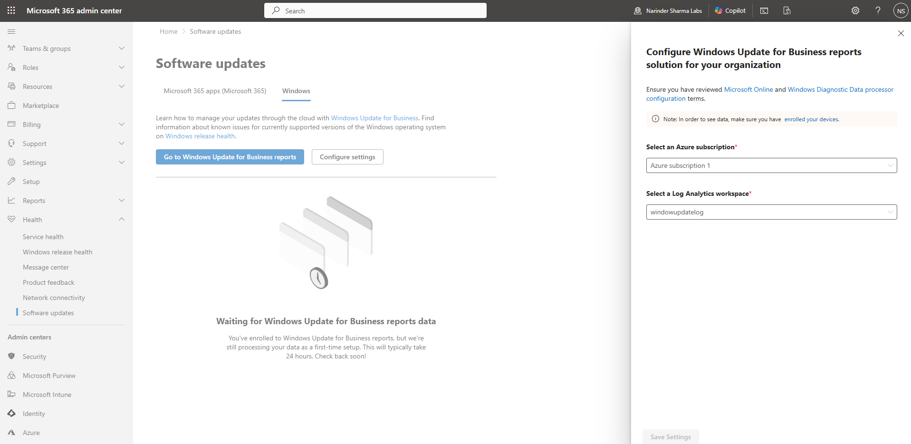
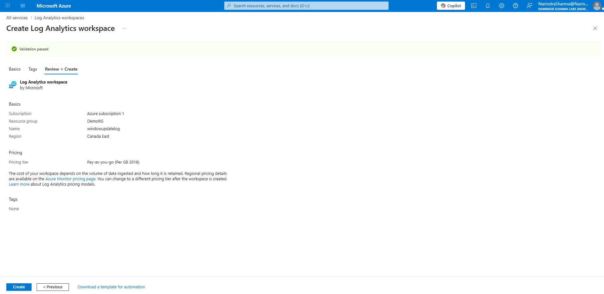
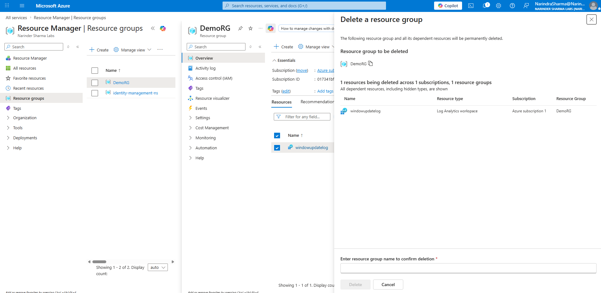
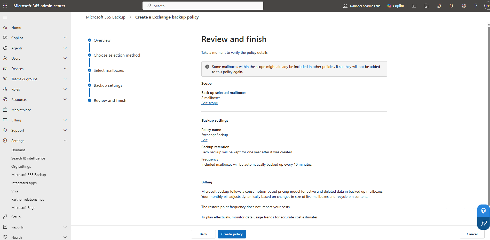
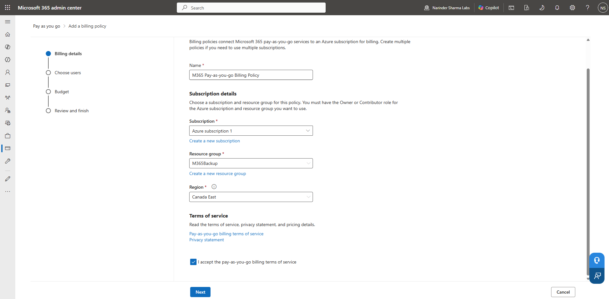

# Service Health, Network Insights & Backup Readiness

## Administrative Objective

Validate Microsoft 365 operational visibility and backup readiness areas that support troubleshooting, service awareness, monitoring exposure, and continuity planning.

This document combines two related workstreams:

* Service health, network insights, software update visibility, and Log Analytics exposure.
* Microsoft 365 Backup readiness workflows for Exchange, OneDrive, and SharePoint.

---

## Work Completed

* Reviewed Microsoft 365 service health and operational insight areas for support triage awareness.
* Configured and validated a network insights location entry.
* Worked through Log Analytics workspace deployment, validation, and deletion screens as part of monitoring / software update visibility exposure.
* Configured and validated Microsoft 365 Backup policy readiness workflows for Exchange, OneDrive, and SharePoint.
* Reviewed the pay-as-you-go connection and billing connection flow as part of backup readiness awareness.
* Documented the difference between visibility/review screens and hands-on backup readiness configuration steps.

---

## Evidence Walkthrough

### 1. Configured and confirmed network insights location

A network insights location configuration was completed and confirmed to support Microsoft 365 network readiness awareness.

### 2. Reviewed network insights location view

The network insights location view was reviewed to understand where network readiness information appears for support and administrator triage.

### 3. Checked software update / Log Analytics exposure

The Microsoft 365 admin center software update area was checked to understand Log Analytics exposure connected to monitoring and update visibility.

### 4. Deployed a Log Analytics workspace

A Log Analytics workspace deployment screen was completed as part of exploring monitoring-related administrative exposure.

### 5. Validated Log Analytics workspace deployment

The workspace validation pass screen confirmed that the deployment workflow reached a successful validation state.

### 6. Reviewed Log Analytics deletion workflow

The deletion workflow was reviewed to understand cleanup and resource lifecycle behavior for monitoring-related Azure resources.

### 7. Started Microsoft 365 Backup pay-as-you-go setup

The Microsoft 365 Backup pay-as-you-go setup page was reviewed as part of understanding backup readiness prerequisites.

### 8. Configured Exchange backup policy readiness

The Exchange backup policy workflow was worked through as part of Microsoft 365 Backup readiness.

### 9. Continued Exchange backup policy configuration

The Exchange backup policy workflow was continued to validate the workload-level backup policy path.

### 10. Configured OneDrive backup policy readiness

The OneDrive backup policy workflow was worked through to validate OneDrive backup readiness administration.

### 11. Continued OneDrive backup policy configuration

The OneDrive backup policy workflow was continued as part of workload-level backup readiness validation.

### 12. Configured SharePoint backup policy readiness

The SharePoint backup policy workflow was worked through and validated from the review-and-finish screen before policy creation.

### 13. Confirmed backup policies completed

The backup policies completed screen confirmed that Exchange, OneDrive, and SharePoint backup readiness workflows were completed in the lab environment.

### 14. Reviewed billing connection flow for backup readiness

The pay-as-you-go billing connection flow was reviewed to understand prerequisite steps connected to Microsoft 365 Backup readiness.

---

## Support Relevance

Support teams need to know when a reported user issue may be local, tenant-wide, service-side, network-related, monitoring-related, or tied to a backup/readiness gap.

Service health and network insight views help prevent every incident from being treated as a workstation issue. Backup readiness awareness helps administrators understand where Exchange, OneDrive, and SharePoint protection workflows are checked.

---

## Outcome

Operational visibility areas were reviewed for service desk and administrator triage awareness.

Microsoft 365 Backup readiness workflows were configured and validated for Exchange, OneDrive, and SharePoint in a non-production lab context. This strengthens the portfolio beyond user creation by showing awareness of service availability, network readiness, monitoring exposure, and data protection administration points.
