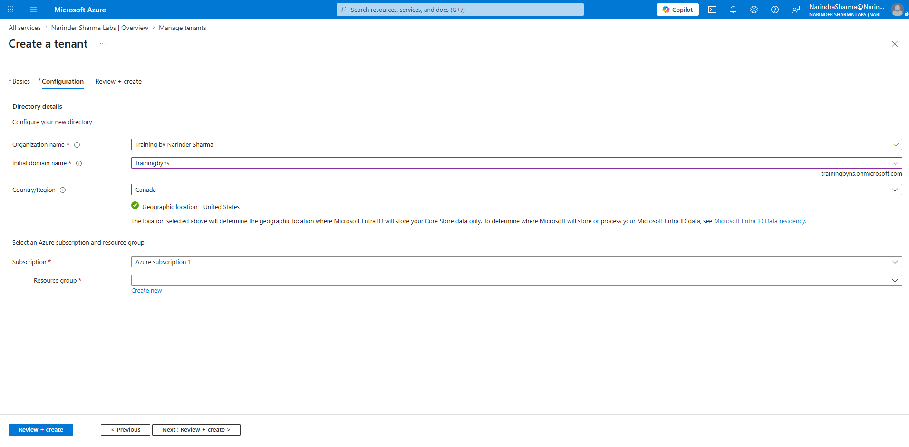
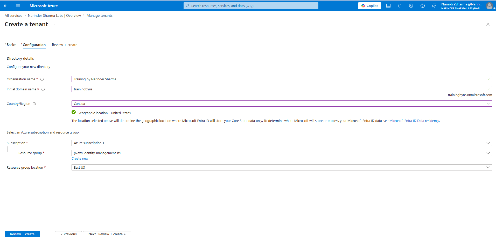
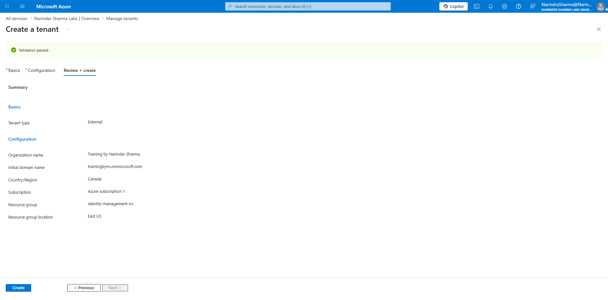
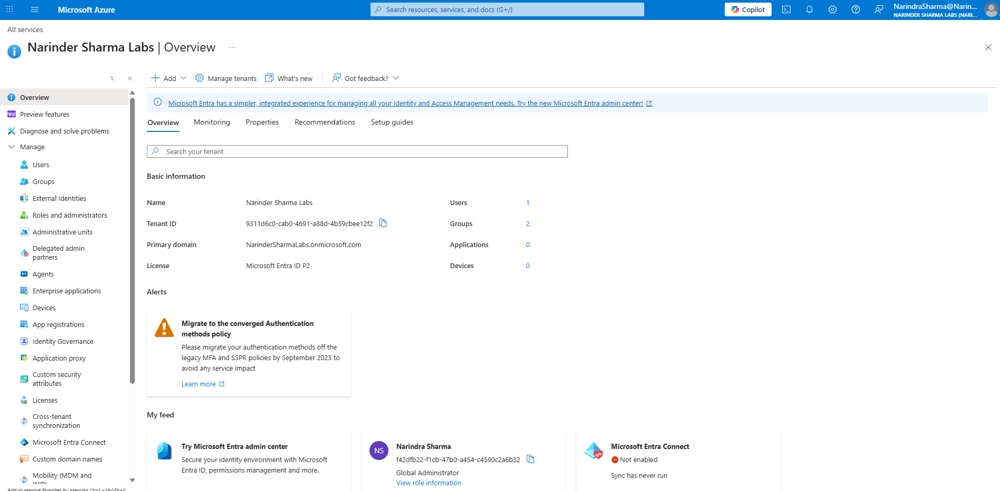
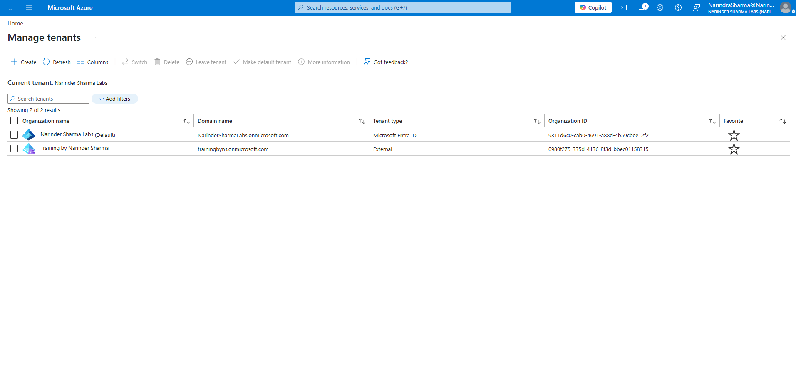
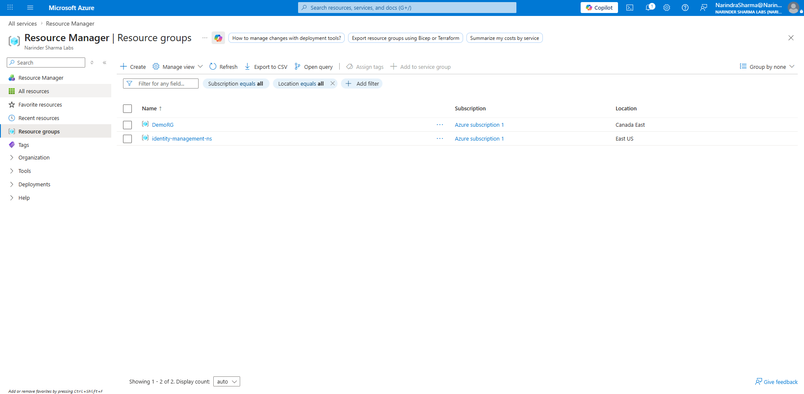
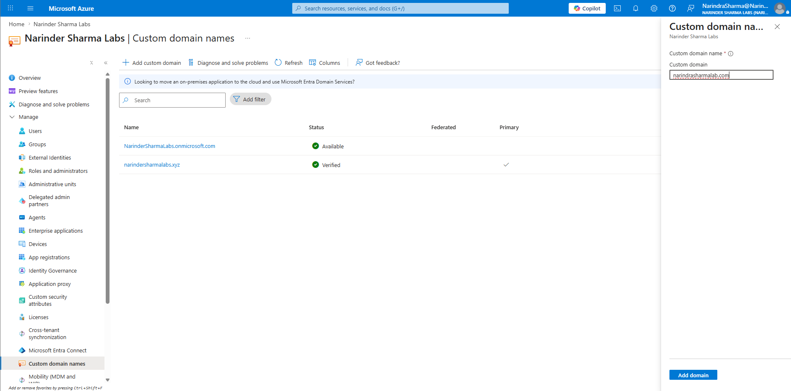
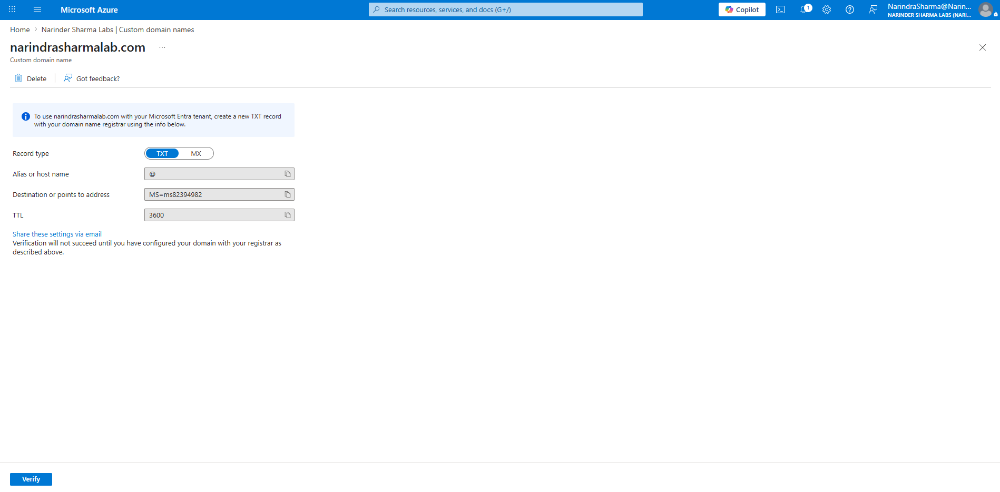
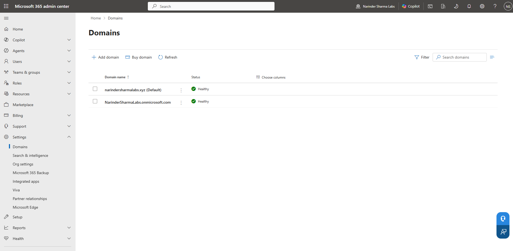

# Tenant Foundation & Domain Readiness

## Administrative Objective

Establish the Microsoft 365 and Microsoft Entra ID tenant foundation required for identity administration, collaboration, licensing, service visibility, and domain-based user management.

This workstream covers tenant creation, tenant validation, Microsoft 365 / Azure / Entra portal visibility, custom domain verification, and the administrative relationship between tenant readiness and later user, group, licensing, and support workflows.

---

## Work Completed

* Created and validated a non-production Microsoft 365 tenant.
* Confirmed tenant creation and portal access after setup.
* Reviewed tenant management views to understand where tenant and directory information appears.
* Checked Azure resource group visibility connected to tenant-backed services.
* Added and verified a custom domain workflow for Microsoft 365 identity and email readiness.
* Confirmed domain readiness from the Microsoft 365 / Azure administrative surfaces.

---

## Evidence Walkthrough

### 1. Started Microsoft 365 tenant creation

The tenant creation workflow was started to build the non-production Microsoft 365 environment used throughout the portfolio.

### 2. Entered tenant configuration details

Tenant setup details were configured as part of the initial Microsoft 365 environment creation.

### 3. Confirmed successful tenant creation

The tenant creation workflow completed successfully, confirming the base environment was available for administration practice.

### 4. Validated tenant creation result

The validation screen confirmed the tenant creation workflow passed and the environment was ready for further configuration.

### 5. Confirmed tenant portal access

The created tenant was visible from the administrative portal, confirming that the environment could be accessed for follow-up configuration.

### 6. Reviewed tenant management view

The tenant management view was checked to understand where tenant-level information appears in the Microsoft cloud administrative experience.

### 7. Checked Azure resource group visibility

Azure resource group visibility was reviewed to understand how tenant-backed services and Azure portal objects can appear during Microsoft 365 administration.

### 8. Started custom domain workflow

The custom domain workflow was started to support domain-based identity and email readiness.

### 9. Continued domain verification workflow

The domain verification workflow was continued from the Azure / Microsoft 365 administrative surface.

### 10. Verified custom domain status

The custom domain verification screen confirmed that the domain workflow reached a verified state.

### 11. Confirmed domain readiness

The verified domain was confirmed as part of the tenant readiness workflow for identity and email-related administration.

---

## Support Relevance

Tenant and domain readiness affects user principal names, email addressing, licensing, collaboration, sign-in behavior, and identity troubleshooting.

In a support environment, understanding where tenant and domain settings are checked helps reduce confusion when troubleshooting account creation, sign-in, mailbox access, email address formatting, or domain-related user issues.

---

## Outcome

The Microsoft 365 tenant foundation was created and validated in a non-production environment.

The custom domain workflow was completed to the point of verified domain readiness, creating the base environment for user provisioning, external collaboration, group administration, licensing review, service visibility, backup readiness, PowerShell administration, and delegated role workflows.
