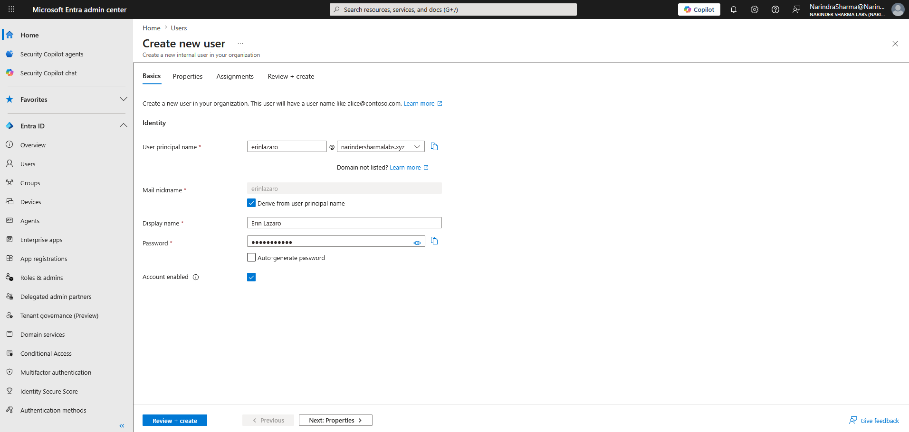
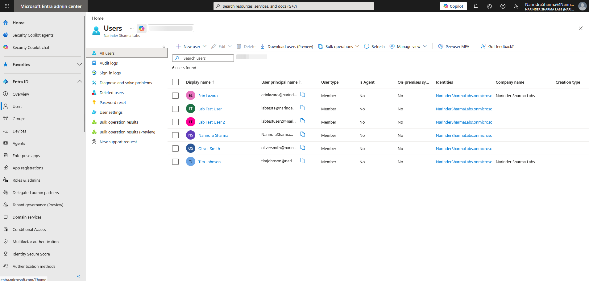
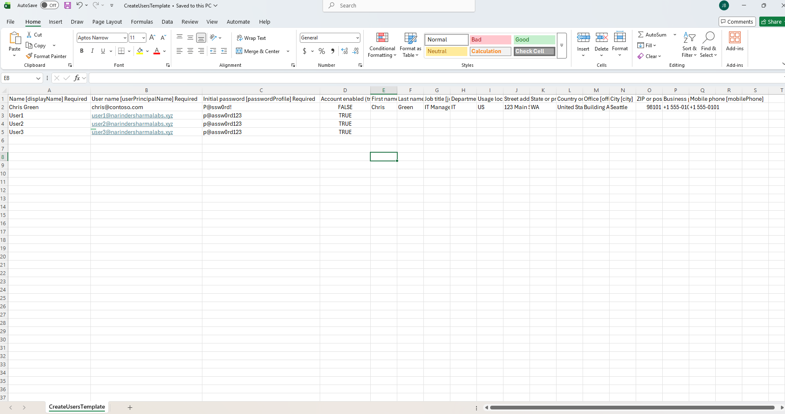

# User Lifecycle Administration

This work covers individual user creation through Microsoft 365 and Microsoft Entra, cross-portal validation, and CSV-based bulk provisioning.

## Work Completed

- Created internal member users through Microsoft 365 and Microsoft Entra.
- Reviewed account basics, profile details, password options, account state, user type, and licensing options.
- Verified created identities across the administrative portals.
- Completed a CSV-based bulk user workflow and protected temporary password output before publishing.

## Phase 1 — Microsoft 365 User Creation

I configured the account details in the Microsoft 365 admin center and confirmed the completed user in Microsoft Entra.

  
  

_Left: Account name, username, domain, and password options. Right: The created account listed in Microsoft Entra._

## Phase 2 — Microsoft Entra User Creation

I completed a second user workflow from Microsoft Entra, including identity, profile, and account-state settings, then verified the new account.

  
  

_Left: Identity, username, password, and account-state controls. Right: The new account visible in the Entra users list._

## Phase 3 — CSV-Based Bulk Provisioning

I prepared structured user data, completed the bulk-user workflow, and verified the newly created accounts. Temporary passwords were redacted from the completion screen.

  
  

_Left: The CSV input containing the lab user records. Right: Five users were added and temporary passwords were redacted._

## Skills Demonstrated

- Microsoft 365 and Microsoft Entra user provisioning
- User profile and account-state configuration
- Cross-portal identity verification
- CSV-based bulk user creation
- Secure handling of temporary credentials

## Result

Internal users were created and verified through both administration surfaces, and the bulk workflow created five additional lab accounts from structured input.

The complete screenshot sequence is available in [`screenshots/03-user-provisioning`](../screenshots/03-user-provisioning).
