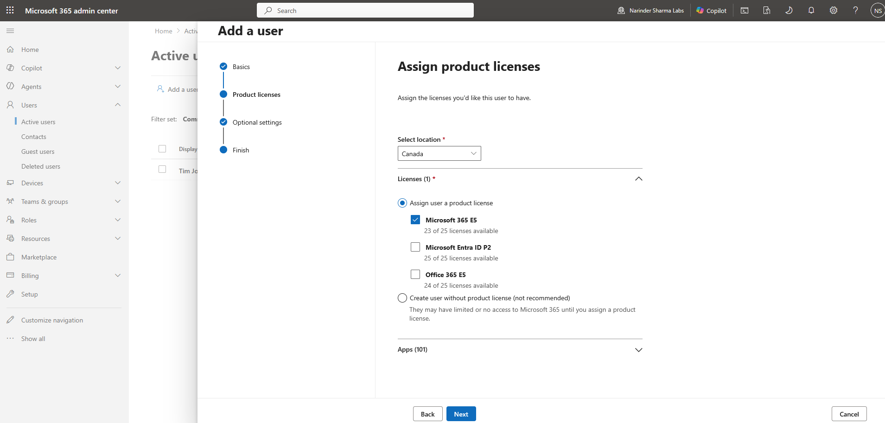
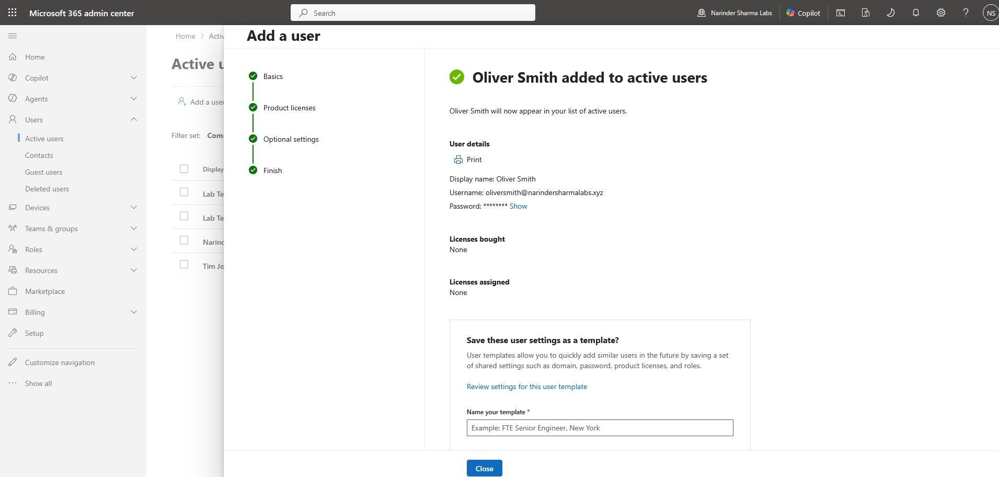
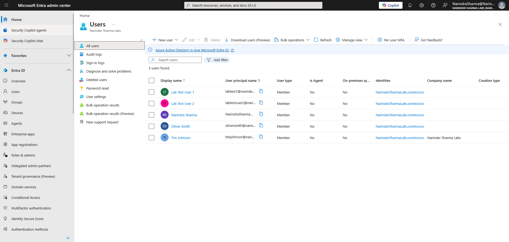
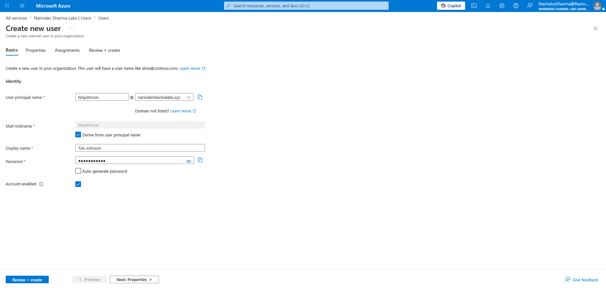
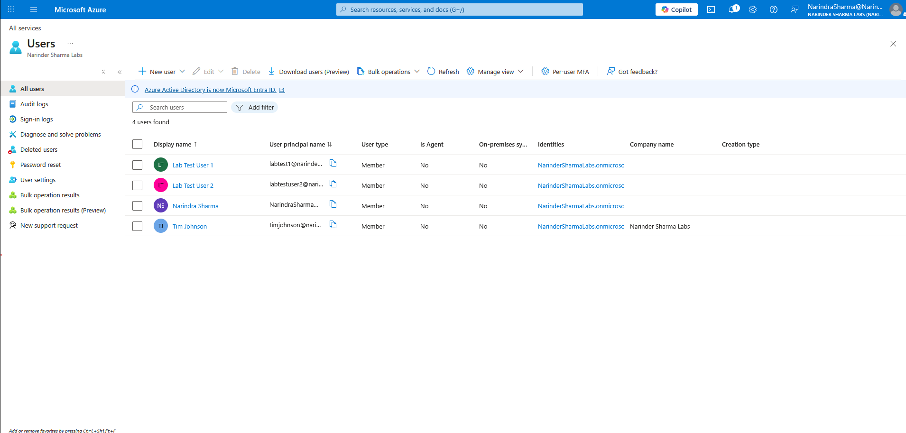
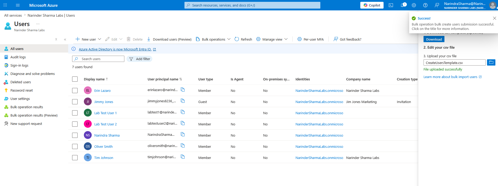
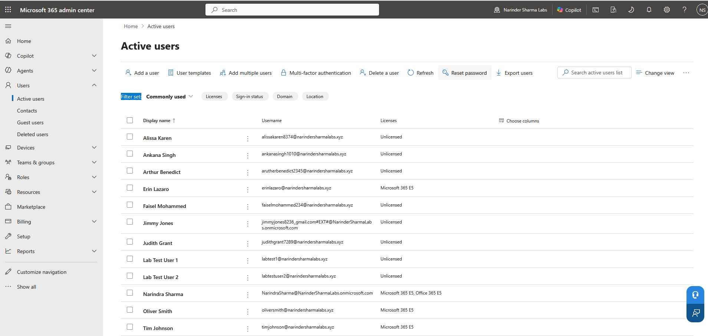

# User Lifecycle Administration

## Administrative Objective

Provision and validate internal Microsoft 365 users through multiple administrative portals and a CSV-based bulk user workflow.

## Work Completed

* Created internal member users from Microsoft 365 and Entra administration surfaces.
* Reviewed account basics, profile details, password options, account state, user type, and license options.
* Verified created user objects across Microsoft 365, Azure, and Microsoft Entra views.
* Completed and verified CSV-based bulk user provisioning.
* Redacted temporary password output before publishing.

## Evidence Walkthrough

### Microsoft 365 user creation and cross-portal verification

I created an internal user through the Microsoft 365 admin center, reviewed license options, completed the account workflow, and verified the same identity from Azure and Microsoft Entra administration views.

### Azure and Entra user creation

I also completed the user creation workflow from the Azure and Entra administration surface and confirmed the account was created successfully.

### CSV-based bulk provisioning

I used the Microsoft 365 bulk user workflow to create multiple accounts from structured input, handled the generated temporary password output as sensitive, and verified the new users in the active users list.

## Skills Demonstrated

* Microsoft 365 and Entra user provisioning
* User property and account-state review
* License-option review during account creation
* Cross-portal identity verification
* CSV-based bulk user creation
* Secure handling of temporary credentials

## Support Relevance

User creation affects sign-in, email, licensing, groups, and downstream access. Verifying the identity across portals helps confirm that the account exists and is available for the next administration step.

## Outcome

Internal users were created and verified through Microsoft 365, Azure, and Microsoft Entra administration workflows. The bulk provisioning process was completed and validated with temporary credentials protected in the published evidence.
